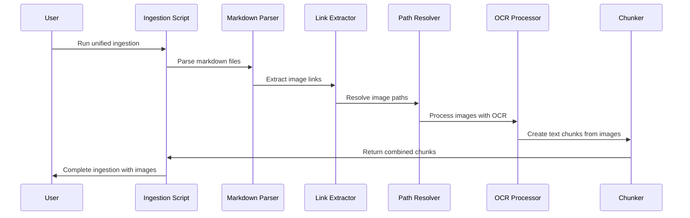

# Feature Plan: Unified Multi-Modal Ingestion with Embedded Image Following

## Design Sketch

### Overview
Consolidate the existing `ingest-obsidian.ts` and `ingest-multi-modal.ts` scripts into a single unified ingestion pipeline that automatically discovers and processes embedded images from markdown files.

### Architecture

```
┌─────────────────┐    ┌──────────────────┐    ┌─────────────────┐
│   Markdown      │───▶│  Image Link      │───▶│   Image         │
│   Files         │    │  Extraction      │    │   Processing    │
│                 │    │                  │    │                 │
└─────────────────┘    └──────────────────┘    └─────────────────┘
         │                       │                       │
         ▼                       ▼                       ▼
┌─────────────────┐    ┌──────────────────┐    ┌─────────────────┐
│   Text          │    │   Path           │    │   OCR Text      │
│   Chunking      │    │   Resolution     │    │   Extraction    │
│                 │    │                  │    │                 │
└─────────────────┘    └──────────────────┘    └─────────────────┘
```

### Sequence Diagram



### API Changes

#### Enhanced ObsidianDocument Interface
```typescript
interface ObsidianDocument {
  // existing fields...
  embeddedImages?: Array<{
    link: string;
    alt: string;
    resolvedPath?: string;
    contentType?: string;
    extractedText?: string;
    ocrConfidence?: number;
    processingError?: string;
  }>;
}
```

#### New Image Link Extraction
```typescript
interface ImageLink {
  original: string;        // e.g., ""
  alt: string;            // Alt text
  src: string;            // Source path
  isWikilink: boolean;    // [[image.png]] vs 
}

function extractImageLinks(content: string): ImageLink[]
```

## Test Matrix

### Unit Tests

| Component | Test Case | Edge Cases | Property Tests |
|-----------|-----------|------------|----------------|
| ImageLinkExtractor | Basic markdown image syntax | Empty alt text, special characters | Regex patterns |
| PathResolver | Relative path resolution | Missing files, absolute paths | Path normalization |
| ImageProcessor | OCR processing | Unsupported formats, corrupted images | Confidence scoring |
| UnifiedIngestion | Pipeline integration | Mixed content types, errors | Performance regression |

### Integration Tests

| Flow | Description | Data Setup |
|------|-------------|------------|
| A1 | Markdown with embedded images | Sample vault with images |
| A2 | Markdown-only vault (backwards compatibility) | Existing test vault |
| A3 | Mixed content vault | Various file types |
| A4 | Error handling | Missing/broken image references |

### E2E Tests

| User Journey | Steps | Assertions |
|-------------|-------|------------|
| Full ingestion | Run unified script | All images processed, text searchable |
| Search with images | Query for image content | Results include OCR text |
| Error recovery | Process vault with missing images | Main ingestion continues |

## Data Plan

### Test Data Structure
```typescript
interface TestVault {
  markdownFiles: Array<{
    content: string;
    images: Array<{
      filename: string;
      content: Buffer;
      expectedText: string;
    }>;
  }>;
  expectedChunks: Array<{
    source: 'markdown' | 'image';
    text: string;
    metadata: Object;
  }>;
}
```

### Sample Data
- Markdown files with various image link formats
- Image files (PNG, JPEG, GIF) with embedded text
- Mixed content vaults for integration testing

## Observability Plan

### Logging
- `image_link_extraction` - Number of links found per file
- `image_path_resolution` - Success/failure rates
- `ocr_processing` - Processing time and confidence scores
- `chunk_generation` - Combined text and image chunks

### Metrics
- Images processed per ingestion
- OCR confidence distribution
- Image processing failure rate
- Text extraction yield (characters/images)

### Traces
- Full pipeline trace from markdown parsing to chunk storage
- Image processing spans with timing
- Error spans for failed image processing

## Implementation Plan

### Phase 1: Image Link Extraction (Week 1)
- [ ] Implement ImageLinkExtractor utility
- [ ] Add path resolution logic
- [ ] Create test suite for link extraction
- [ ] Update ObsidianDocument schema

### Phase 2: OCR Integration (Week 1)
- [ ] Integrate with existing OCR processor
- [ ] Add image metadata to chunks
- [ ] Implement error handling
- [ ] Create integration tests

### Phase 3: Unified Pipeline (Week 2)
- [ ] Consolidate ingestion scripts
- [ ] Update CLI interface
- [ ] Add configuration options
- [ ] Performance testing

### Phase 4: Validation & Polish (Week 2)
- [ ] End-to-end testing
- [ ] Documentation updates
- [ ] Performance benchmarking
- [ ] Backwards compatibility verification

## Risk Assessment

### Technical Risks
- **Performance**: Image processing may slow down ingestion
  - Mitigation: Configurable processing, batch limits
- **Memory Usage**: Loading large images
  - Mitigation: File size limits, streaming processing
- **Path Resolution**: Complex vault structures
  - Mitigation: Robust path normalization, error handling

### Business Risks
- **Breaking Changes**: Existing workflows
  - Mitigation: Feature flags, backwards compatibility tests
- **User Expectations**: Automatic processing may surprise users
  - Mitigation: Clear documentation, opt-in configuration

### Mitigation Strategies
- Feature flag for image processing
- Comprehensive error handling
- Progress indicators during processing
- Configurable limits and thresholds

## Success Metrics

- 100% backwards compatibility with existing ingestion
- 95%+ image link detection accuracy
- <10% performance regression on text-only vaults
- 80%+ OCR text extraction success rate
- Zero breaking changes in existing API

## Known Limitations

- Only processes local images within vault
- No support for external URLs
- GIF animation text extraction limited to first frame
- No image caption processing (beyond alt text)
- Batch size may need tuning for large vaults

## Future Enhancements

- Support for external image URLs
- Advanced image analysis (object detection, captioning)
- Image similarity search
- Video thumbnail extraction
- Audio transcription from embedded media
