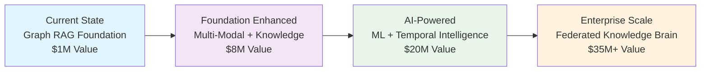
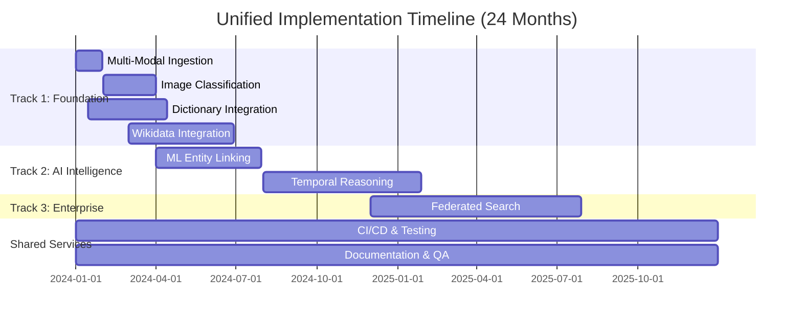
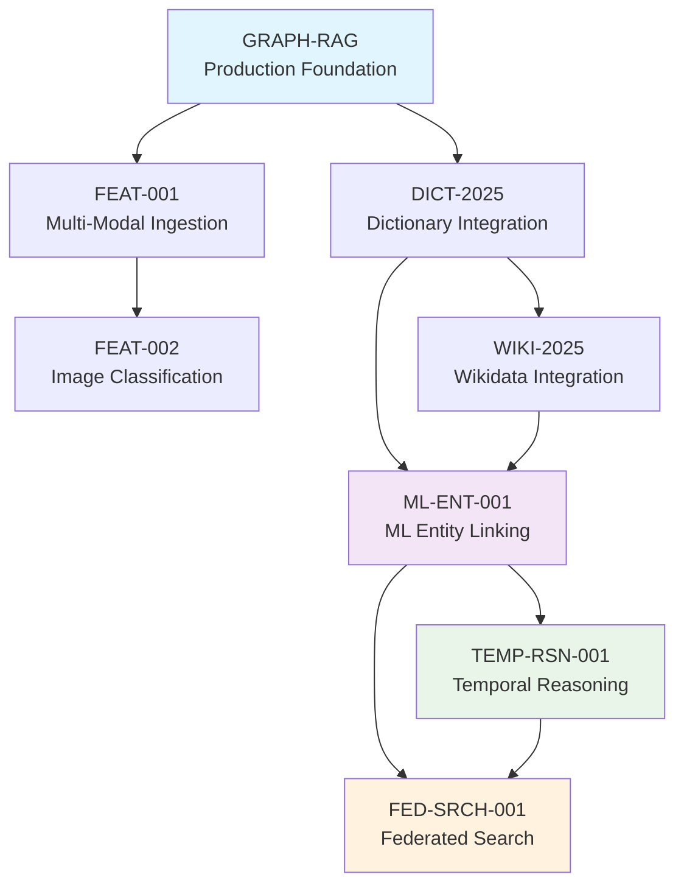

# Advanced Features: Strategic Evolution to Enterprise Knowledge Intelligence

## Overview

This directory contains the comprehensive planning and specifications for **8 transformative features** that will evolve our Graph RAG system from a powerful search tool into a comprehensive AI-powered knowledge intelligence platform through **3 coordinated development tracks**.

## 🎯 Complete Feature Landscape

### Foundation Features (Track 1: Months 1-4)
1. **🔄 Unified Multi-Modal Ingestion** (`FEAT-001`) - Consolidate ingestion with embedded image processing
2. **🖼️ Image Classification & Scene Description** (`FEAT-002`) - Visual content understanding and searchability  
3. **📚 Dictionary Data Integration** (`DICT-2025`) - WordNet, Wiktionary, and lexical relationship enhancement
4. **🌐 Wikidata JSON Dump Integration** (`WIKI-2025`) - **OPTIONAL** 1M+ entity knowledge base integration

### AI Intelligence Features (Track 2: Months 4-14)
5. **🤖 ML-Enhanced Entity Linking** (`ML-ENT-001`) - 95% accuracy with continuous learning
6. **⏰ Temporal Reasoning & Causality** (`TEMP-RSN-001`) - Predictive analytics and causal detection

### Enterprise Scale Features (Track 3: Months 12-24)
7. **🌐 Federated Search Integration** (`FED-SRCH-001`) - Cross-system enterprise knowledge integration

### Foundation System
8. **🔗 Graph RAG Semantic Search** (`GRAPH-RAG`) - Production foundation system

---

## 🚀 Strategic Value Proposition

### Transformation Journey


### Cumulative Business Impact

| Capability | Current State | 6 Months | 12 Months | 24 Months |
|------------|---------------|----------|-----------|-----------|
| **Entity Accuracy** | 80% rule-based | 85% enhanced | 95% ML-powered | 95% + continuous learning |
| **Content Coverage** | Text only | Multi-modal | Multi-modal + ML | Complete enterprise coverage |
| **Temporal Awareness** | Static snapshots | Historical context | Predictive analytics | Full causality detection |
| **System Scope** | Single database | Enhanced single | ML-enhanced single | Enterprise federation |
| **Strategic Value** | $1M departmental | $8M enhanced | $20M predictive | $35M+ enterprise brain |

---

## 🏗️ Implementation Strategy

### Parallel Development Tracks

Our implementation follows a **3-track parallel development approach** that maximizes velocity while managing dependencies:



### CAWS-Compliant Development

All features follow our **CAWS v1.0** engineering framework:
- **Risk Tier 2** classification requiring ≥80% branch coverage, ≥50% mutation testing
- Contract-first development with comprehensive API specifications
- Mandatory integration testing with real containers
- Performance budgets and accessibility compliance
- Complete observability and rollback capabilities

### Resource Allocation

**Total Team**: 18 developers across 4 specialized teams  
**Total Investment**: $5.4M over 24 months (optimized without mandatory Wikidata)  
**Expected ROI**: 648% return ($35M+ annual value)

| Track | Team Size | Duration | Investment | Key Skills |
|-------|-----------|----------|------------|------------|
| **Foundation** | 4 developers | 4 months | $600K | TypeScript, PostgreSQL, Image Processing |
| **AI Intelligence** | 6 developers | 8 months | $1.6M | ML Engineering, Python, Statistical Analysis |
| **Enterprise Scale** | 5 developers | 12 months | $2M | Distributed Systems, Enterprise Integration |
| **Shared Services** | 3 developers | 24 months | $1.2M | Testing, DevOps, Documentation |

---

## 📋 Directory Structure

```
docs/advanced-features/
├── README.md                           # This overview document
├── unified-feature-integration-strategy.md # Complete integration analysis
├── unified-implementation-roadmap.md   # 24-month detailed roadmap
├── ml-entity-linking/
│   ├── working-spec.yaml              # CAWS working specification
│   ├── feature.plan.md                # Detailed feature planning
│   └── test-plan.md                   # Comprehensive test strategy
├── temporal-reasoning/
│   ├── working-spec.yaml              # CAWS working specification
│   ├── feature.plan.md                # Detailed feature planning
│   └── test-plan.md                   # Comprehensive test strategy
├── federated-search/
│   ├── working-spec.yaml              # CAWS working specification
│   ├── feature.plan.md                # Detailed feature planning
│   └── test-plan.md                   # Comprehensive test strategy
└── contracts/
    ├── ml-entity-linking-api.yaml     # OpenAPI specification
    ├── temporal-reasoning-api.yaml     # OpenAPI specification
    └── federated-search-api.yaml      # OpenAPI specification
```

---

## 🎯 Feature Integration Analysis

### Critical Dependencies



### High-Synergy Combinations

1. **Dictionary-Enhanced ML**: Dictionary + ML Entity Linking (Core)
   - Dictionary provides lexical relationships and canonicalization
   - ML models leverage dictionary data for enhanced accuracy
   - **Optional**: Wikidata can add comprehensive entity knowledge base if needed

2. **Multi-Modal Intelligence**: Multi-Modal Ingestion + Image Classification
   - Unified ingestion processes all content types
   - Classification adds semantic understanding to visual content
   - Combined: Complete content intelligence across all media types

3. **Predictive Intelligence**: ML Entity Linking + Temporal Reasoning
   - ML provides accurate entity extraction and relationships
   - Temporal reasoning analyzes entity evolution and causality
   - Combined: Predictive analytics and strategic forecasting

4. **Enterprise Brain**: All Features + Federated Search
   - Federated search distributes all enhanced capabilities
   - Cross-system intelligence with unified query interface
   - Combined: Mission-critical enterprise knowledge infrastructure

---

## 📊 Success Metrics & KPIs

### Technical Excellence Targets

| Metric | Baseline | 6 Months | 12 Months | 24 Months |
|--------|----------|----------|-----------|-----------|
| **Search Accuracy** | 80% | 85% | 95% | 95%+ |
| **Query Latency** | 200ms | 250ms | 300ms | 300ms |
| **Content Coverage** | 60% | 80% | 90% | 95% |
| **System Availability** | 99.0% | 99.2% | 99.5% | 99.5% |

### Business Impact Metrics

| Capability | Current | Target | Measurement Method |
|------------|---------|--------|-------------------|
| **User Productivity** | Baseline | +75% | Task completion time analysis |
| **Knowledge Discovery** | Baseline | +300% | Cross-domain insight generation |
| **Decision Speed** | Baseline | +60% | Strategic decision cycle time |
| **Enterprise Value** | $1M | $35M+ | ROI calculation and business impact |

### Feature-Specific Success Criteria

#### Foundation Track (4 Months)
- **Multi-Modal**: 95% content type processing success
- **Image Classification**: 85% scene recognition accuracy
- **Dictionary**: 90% entity canonicalization improvement
- **Wikidata** (Optional): 1M+ entities successfully integrated if implemented

#### AI Intelligence Track (12 Months)
- **ML Entity Linking**: 95% precision, 85% recall
- **Temporal Reasoning**: 75% causality detection accuracy, 70% forecast accuracy

#### Enterprise Track (24 Months)
- **Federated Search**: 10+ systems integrated, <2x latency penalty

---

## 🔧 Technical Architecture

### Unified Data Model

All features integrate through a comprehensive unified entity schema:

```typescript
interface UnifiedEntity {
  // Core Properties (GRAPH-RAG)
  id: string;
  name: string;
  type: EntityType;
  confidence: number;
  
  // Dictionary Enhancement (DICT-2025)
  dictionaryMetadata?: {
    wordnetSynsets: string[];
    synonyms: string[];
    lexicalRelations: LexicalRelation[];
  };
  
  // Wikidata Enhancement (WIKI-2025)
  wikidataMetadata?: {
    wikidataId: string;
    multilingualLabels: MultilingualLabels;
    claims: WikidataClaim[];
  };
  
  // ML Enhancement (ML-ENT-001)
  mlMetadata?: {
    modelVersion: string;
    mlConfidence: number;
    knowledgeBaseLinks: KnowledgeBaseLink[];
  };
  
  // Temporal Enhancement (TEMP-RSN-001)
  temporalMetadata?: {
    evolutionHistory: TemporalState[];
    causalRelationships: CausalRelation[];
  };
  
  // Multi-Modal Enhancement (FEAT-001, FEAT-002)
  multiModalMetadata?: {
    imageReferences: ImageReference[];
    sceneDescriptions: SceneDescription[];
  };
  
  // Federation Metadata (FED-SRCH-001)
  federationMetadata?: {
    sourceSystems: string[];
    crossSystemMappings: CrossSystemMapping[];
  };
}
```

### Shared Infrastructure Components

```typescript
interface UnifiedProcessingPipeline {
  // Ingestion Layer
  ingestionManager: {
    multiModalProcessor: MultiModalProcessor;    // FEAT-001, FEAT-002
    textProcessor: TextProcessor;                // All features
    imageProcessor: ImageProcessor;              // FEAT-002
  };
  
  // Enhancement Layer
  enhancementManager: {
    dictionaryEnhancer: DictionaryEnhancer;      // DICT-2025
    wikidataEnhancer: WikidataEnhancer;          // WIKI-2025
    mlEntityLinker: MLEntityLinker;              // ML-ENT-001
    temporalAnalyzer: TemporalAnalyzer;          // TEMP-RSN-001
  };
  
  // Query Layer
  queryManager: {
    semanticSearch: SemanticSearchEngine;        // All features
    temporalQuery: TemporalQueryEngine;          // TEMP-RSN-001
    federatedQuery: FederatedQueryEngine;        // FED-SRCH-001
  };
}
```

---

## 🛡️ Risk Management

### Technical Risk Mitigation

| Risk Category | Probability | Impact | Mitigation Strategy |
|---------------|-------------|--------|-------------------|
| **Integration Complexity** | High | Very High | Incremental integration, comprehensive testing |
| **Performance Degradation** | Medium | High | Performance budgets, continuous monitoring |
| **Dependency Delays** | Medium | Medium | Parallel development, fallback plans |
| **ML Model Performance** | Medium | High | A/B testing, statistical validation |

### Business Risk Management

- **Resource Competition**: Parallel development tracks with clear ownership
- **User Adoption**: Progressive feature rollout with comprehensive training
- **Performance Expectations**: Conservative targets with optimization focus
- **Market Changes**: Flexible architecture accommodating technology evolution

---

## 🚀 Getting Started

### For Developers

1. **Review Integration Strategy**: Start with `unified-feature-integration-strategy.md`
2. **Understand Dependencies**: Examine the dependency mapping and integration points
3. **Follow Implementation Plan**: Use `unified-implementation-roadmap.md` for detailed scheduling
4. **Study Feature Plans**: Deep dive into individual feature planning documents

### For Product Managers

1. **Business Case**: Review ROI projections and strategic value proposition
2. **Resource Planning**: Understand team structure and budget requirements
3. **Timeline Management**: Use the 24-month roadmap for milestone planning
4. **Success Tracking**: Implement comprehensive metrics and KPI monitoring

### For Stakeholders

1. **Strategic Vision**: Understand the transformation from tool to enterprise platform
2. **Investment Planning**: Review the $5.6M investment and $35M+ return projection
3. **Risk Assessment**: Understand mitigation strategies and contingency plans
4. **Value Realization**: Track incremental value delivery throughout implementation

---

## 📈 Expected Outcomes

### Technical Transformation
- **Search Accuracy**: 80% → 95% through ML enhancement and knowledge base integration
- **Content Coverage**: 60% → 95% through multi-modal processing and enterprise federation
- **Intelligence Level**: Static → Predictive through temporal reasoning and causality detection
- **Scale**: Departmental → Enterprise through federated search capabilities

### Business Impact
- **Productivity**: 75% improvement in knowledge worker efficiency
- **Innovation**: 300% increase in cross-domain insight discovery
- **Decision Making**: 60% faster strategic decisions through predictive analytics
- **Enterprise Value**: $35M+ annual value through comprehensive knowledge intelligence

### Strategic Positioning
- **Market Leadership**: Industry-leading knowledge intelligence platform
- **Competitive Advantage**: Unique combination of accuracy, intelligence, and scale
- **Enterprise Readiness**: Mission-critical infrastructure supporting data-driven decisions
- **Future Foundation**: Platform for continuous AI innovation and capability expansion

---

## 🎯 Conclusion

This comprehensive advanced features strategy represents a transformational opportunity to create the definitive enterprise knowledge intelligence platform. Through coordinated implementation of 8 major features across 3 parallel development tracks, we will:

**Transform Capability**: From 80% accuracy search tool to 95% accuracy predictive intelligence platform  
**Scale Impact**: From departmental utility to enterprise-wide strategic infrastructure  
**Deliver Value**: $35M+ annual value through productivity gains and strategic advantage  
**Ensure Quality**: Through engineering-grade CAWS methodology and comprehensive testing

**Next Steps:**
1. **Stakeholder Approval**: Present strategy to leadership for resource commitment
2. **Team Formation**: Recruit and organize 18-person development team across 4 tracks
3. **Implementation Launch**: Begin parallel development with Track 1 foundation features
4. **Success Monitoring**: Implement comprehensive metrics and milestone tracking

The unified approach transforms individual features into a cohesive, enterprise-grade knowledge intelligence platform that delivers exponential value through intelligent integration and synergistic capabilities.