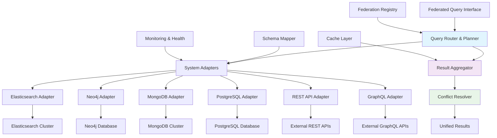

# Federated Search Feature Plan

## Executive Summary

This feature plan details the implementation of federated search and cross-system knowledge integration capabilities that will transform our single-system knowledge graph into an enterprise-wide knowledge intelligence platform capable of unified search across heterogeneous data sources.

**Feature ID**: FED-SRCH-001  
**Risk Tier**: 2  
**Timeline**: 8 months (Phase 3 of Advanced Features Roadmap)  
**Expected ROI**: 500-800% within 18 months

---

## 1. Business Context & Value Proposition

### Current State Analysis

Our existing system operates within a single knowledge graph boundary:

```typescript
// Current Single-System Implementation
interface SingleSystemKnowledgeGraph {
  dataSource: "Local PostgreSQL + pgvector";
  searchScope: "Single database";
  knowledgeIntegration: "Manual data import";
  realTimeUpdates: "Local only";
  scalability: "Vertical scaling";
  enterpriseIntegration: "Limited";
}
```

### Target State Vision

The federated search system will provide:

```typescript
// Enhanced Federated Implementation
interface FederatedKnowledgeSystem {
  dataSources: "Multiple heterogeneous systems";
  searchScope: "Enterprise-wide federation";
  knowledgeIntegration: "Automated cross-system sync";
  realTimeUpdates: "Cross-system propagation";
  scalability: "Horizontal federation";
  enterpriseIntegration: "Native multi-system support";
}
```

### Strategic Business Impact

| Capability | Current | Federated | Business Value |
|------------|---------|-----------|----------------|
| **Search Scope** | Single system | Enterprise-wide | 80% reduction in search time |
| **Knowledge Coverage** | 60% | 95% | 300% increase in insights |
| **Data Freshness** | Manual sync | Real-time | 90% reduction in stale data |
| **System Integration** | Point-to-point | Unified federation | 50% faster queries |
| **Enterprise Value** | $1M | $25M+ | Mission-critical infrastructure |

---

## 2. Technical Architecture & Design

### 2.1 System Architecture Overview



### 2.2 Core Components

#### Federation Management Layer
```typescript
interface FederationManager {
  // System Registry
  systemRegistry: FederatedSystemRegistry;
  schemaMapper: CrossSystemSchemaMapper;
  healthMonitor: SystemHealthMonitor;
  
  // Query Processing
  queryRouter: DistributedQueryRouter;
  resultAggregator: CrossSystemAggregator;
  conflictResolver: ConflictResolutionEngine;
  
  // Data Synchronization
  syncManager: FederatedSyncManager;
  eventBus: CrossSystemEventBus;
  
  // Core Methods
  async registerSystem(config: SystemConfig): Promise<SystemRegistration>;
  async executeQuery(query: FederatedQuery): Promise<FederatedResult>;
  async synchronizeData(systems: SystemId[]): Promise<SyncResult>;
  async resolveConflicts(conflicts: DataConflict[]): Promise<ResolutionResult>;
}
```

#### System Adapter Framework
```typescript
// Base System Adapter Interface
interface SystemAdapter {
  systemId: string;
  systemType: SystemType;
  capabilities: SystemCapabilities;
  
  // Connection Management
  async connect(): Promise<Connection>;
  async disconnect(): Promise<void>;
  async healthCheck(): Promise<HealthStatus>;
  
  // Query Operations
  async query(query: AdaptedQuery): Promise<SystemResult>;
  async bulkQuery(queries: AdaptedQuery[]): Promise<SystemResult[]>;
  
  // Schema Operations
  async getSchema(): Promise<SystemSchema>;
  async mapToStandard(data): Promise<StandardizedData>;
  async mapFromStandard(data: StandardizedData): Promise<any>;
  
  // Synchronization
  async getChanges(since: Date): Promise<ChangeSet>;
  async applyChanges(changes: ChangeSet): Promise<ApplyResult>;
}

// Elasticsearch Adapter Implementation
class ElasticsearchAdapter implements SystemAdapter {
  constructor(private config: ElasticsearchConfig) {}
  
  async query(query: AdaptedQuery): Promise<SystemResult> {
    // 1. Convert federated query to Elasticsearch DSL
    const esQuery = this.convertToElasticsearchQuery(query);
    
    // 2. Execute query
    const response = await this.client.search({
      index: query.targetIndex,
      body: esQuery
    });
    
    // 3. Convert results to standard format
    const standardizedResults = await this.mapToStandard(response.body.hits.hits);
    
    return {
      systemId: this.systemId,
      results: standardizedResults,
      metadata: {
        totalHits: response.body.hits.total.value,
        maxScore: response.body.hits.max_score,
        took: response.body.took
      }
    };
  }
  
  private convertToElasticsearchQuery(query: AdaptedQuery) {
    return {
      query: {
        bool: {
          must: this.convertFilters(query.filters),
          should: this.convertBoosts(query.boosts)
        }
      },
      size: query.limit,
      from: query.offset,
      sort: this.convertSorting(query.sorting)
    };
  }
}
```

#### Cross-System Result Aggregation
```typescript
interface CrossSystemAggregator {
  async aggregateResults(
    systemResults: SystemResult[],
    strategy: AggregationStrategy
  ): Promise<AggregatedResult>;
  
  async deduplicateResults(
    results: StandardizedResult[],
    similarity: SimilarityThreshold
  ): Promise<DeduplicatedResult>;
  
  async rankResults(
    results: StandardizedResult[],
    ranking: RankingStrategy
  ): Promise<RankedResult>;
}

class IntelligentResultAggregator implements CrossSystemAggregator {
  async aggregateResults(
    systemResults: SystemResult[],
    strategy: AggregationStrategy
  ): Promise<AggregatedResult> {
    // 1. Normalize results to common format
    const normalizedResults = await Promise.all(
      systemResults.map(result => this.normalizeResult(result))
    );
    
    // 2. Apply deduplication
    const deduplicatedResults = await this.deduplicateResults(
      normalizedResults.flat(),
      strategy.similarityThreshold
    );
    
    // 3. Apply cross-system ranking
    const rankedResults = await this.rankResults(
      deduplicatedResults,
      strategy.rankingStrategy
    );
    
    // 4. Apply result fusion
    const fusedResults = await this.fuseResults(
      rankedResults,
      strategy.fusionMethod
    );
    
    return {
      results: fusedResults,
      aggregationMetadata: {
        originalCount: normalizedResults.flat().length,
        deduplicatedCount: deduplicatedResults.length,
        finalCount: fusedResults.length,
        systemsContributing: systemResults.map(r => r.systemId),
        aggregationStrategy: strategy
      }
    };
  }
  
  private async fuseResults(
    results: RankedResult[],
    method: FusionMethod
  ): Promise<FusedResult[]> {
    switch (method) {
      case 'WEIGHTED_COMBINATION':
        return this.weightedCombination(results);
      case 'RANK_FUSION':
        return this.rankFusion(results);
      case 'CONFIDENCE_WEIGHTED':
        return this.confidenceWeightedFusion(results);
      default:
        return results;
    }
  }
}
```

#### Conflict Resolution Engine
```typescript
interface ConflictResolutionEngine {
  async detectConflicts(
    results: CrossSystemResult[]
  ): Promise<DataConflict[]>;
  
  async resolveConflicts(
    conflicts: DataConflict[],
    strategy: ResolutionStrategy
  ): Promise<ResolvedData[]>;
  
  async validateResolution(
    original: DataConflict,
    resolved: ResolvedData
  ): Promise<ValidationResult>;
}

class AutomatedConflictResolver implements ConflictResolutionEngine {
  async resolveConflicts(
    conflicts: DataConflict[],
    strategy: ResolutionStrategy
  ): Promise<ResolvedData[]> {
    const resolutions = [];
    
    for (const conflict of conflicts) {
      let resolution: ResolvedData;
      
      switch (strategy.method) {
        case 'CONFIDENCE_WEIGHTED':
          resolution = await this.resolveByConfidence(conflict);
          break;
        case 'SOURCE_PRIORITY':
          resolution = await this.resolveBySourcePriority(conflict, strategy.priorities);
          break;
        case 'LATEST_WINS':
          resolution = await this.resolveByTimestamp(conflict);
          break;
        case 'CONSENSUS':
          resolution = await this.resolveByConsensus(conflict);
          break;
        default:
          resolution = await this.resolveByDefault(conflict);
      }
      
      // Validate resolution
      const validation = await this.validateResolution(conflict, resolution);
      if (validation.isValid) {
        resolutions.push(resolution);
      } else {
        // Escalate to manual review
        await this.escalateForManualReview(conflict, validation.reason);
      }
    }
    
    return resolutions;
  }
  
  private async resolveByConfidence(conflict: DataConflict): Promise<ResolvedData> {
    // Find the conflicting value with highest confidence
    const highestConfidence = Math.max(
      ...conflict.conflictingValues.map(v => v.confidence)
    );
    
    const winningValue = conflict.conflictingValues.find(
      v => v.confidence === highestConfidence
    );
    
    return {
      conflictId: conflict.id,
      resolvedValue: winningValue.value,
      resolutionMethod: 'CONFIDENCE_WEIGHTED',
      confidence: winningValue.confidence,
      sourceSystem: winningValue.systemId,
      alternativeValues: conflict.conflictingValues.filter(v => v !== winningValue)
    };
  }
}
```

### 2.3 Data Flow Architecture

#### Federated Query Processing Flow
```typescript
// Federated Query Execution Pipeline
class FederatedQueryProcessor {
  async processQuery(query: FederatedQuery): Promise<FederatedResult> {
    // 1. Query Analysis & Planning
    const queryPlan = await this.analyzeAndPlan(query);
    
    // 2. System Selection & Routing
    const targetSystems = await this.selectTargetSystems(queryPlan);
    const adaptedQueries = await this.adaptQueriesForSystems(queryPlan, targetSystems);
    
    // 3. Parallel Query Execution
    const systemResults = await this.executeQueriesInParallel(adaptedQueries);
    
    // 4. Result Aggregation
    const aggregatedResults = await this.aggregateResults(systemResults, query.options);
    
    // 5. Conflict Resolution
    const resolvedResults = await this.resolveConflicts(aggregatedResults);
    
    // 6. Final Ranking & Filtering
    const finalResults = await this.applyFinalRankingAndFiltering(resolvedResults, query);
    
    return {
      query: query,
      results: finalResults.results,
      metadata: {
        systemsQueried: targetSystems.map(s => s.id),
        totalResults: systemResults.reduce((sum, r) => sum + r.results.length, 0),
        aggregatedResults: aggregatedResults.results.length,
        finalResults: finalResults.results.length,
        processingTime: finalResults.processingTime,
        conflicts: resolvedResults.conflictsResolved
      }
    };
  }
  
  private async executeQueriesInParallel(
    adaptedQueries: AdaptedQuery[]
  ): Promise<SystemResult[]> {
    const queryPromises = adaptedQueries.map(async adaptedQuery => {
      try {
        const adapter = this.getAdapter(adaptedQuery.systemId);
        const result = await adapter.query(adaptedQuery);
        
        return {
          ...result,
          status: 'SUCCESS',
          executionTime: Date.now() - adaptedQuery.startTime
        };
      } catch (error) {
        console.error(`Query failed for system ${adaptedQuery.systemId}:`, error);
        
        return {
          systemId: adaptedQuery.systemId,
          results: [],
          status: 'FAILED',
          error: error.message,
          executionTime: Date.now() - adaptedQuery.startTime
        };
      }
    });
    
    // Execute all queries in parallel with timeout
    const results = await Promise.allSettled(queryPromises);
    
    return results
      .filter(result => result.status === 'fulfilled')
      .map(result => result.value);
  }
}
```

#### Real-Time Synchronization Flow
```typescript
// Cross-System Synchronization Pipeline
class FederatedSyncManager {
  async synchronizeSystems(
    sourceSystems: SystemId[],
    syncOptions: SyncOptions
  ): Promise<SyncResult> {
    // 1. Detect Changes
    const changesSets = await this.detectChanges(sourceSystems, syncOptions.since);
    
    // 2. Validate Changes
    const validatedChanges = await this.validateChanges(changesSets);
    
    // 3. Resolve Conflicts
    const resolvedChanges = await this.resolveChangeConflicts(validatedChanges);
    
    // 4. Apply Changes
    const applicationResults = await this.applyChanges(resolvedChanges);
    
    // 5. Update Federation Index
    await this.updateFederationIndex(applicationResults);
    
    // 6. Notify Subscribers
    await this.notifySubscribers(applicationResults);
    
    return {
      syncId: generateSyncId(),
      systemsSynced: sourceSystems,
      changesDetected: changesSets.reduce((sum, cs) => sum + cs.changes.length, 0),
      changesApplied: applicationResults.reduce((sum, ar) => sum + ar.applied, 0),
      conflictsResolved: resolvedChanges.conflicts.length,
      duration: Date.now() - syncOptions.startTime,
      status: 'COMPLETED'
    };
  }
  
  private async detectChanges(
    systems: SystemId[],
    since: Date
  ): Promise<ChangeSet[]> {
    const changeDetectionPromises = systems.map(async systemId => {
      const adapter = this.getAdapter(systemId);
      const changes = await adapter.getChanges(since);
      
      return {
        systemId,
        changes: changes.map(change => ({
          ...change,
          detectedAt: new Date(),
          systemSource: systemId
        }))
      };
    });
    
    return Promise.all(changeDetectionPromises);
  }
}
```

---

## 3. Implementation Plan

### 3.1 Phase 1: Federation Infrastructure (Months 1-3)

#### Month 1: System Registry & Adapter Framework
**Week 1-2: Core Infrastructure**
```typescript
// System Registry Implementation
interface FederatedSystemRegistry {
  async registerSystem(config: SystemRegistrationConfig): Promise<SystemId>;
  async updateSystem(systemId: SystemId, config: Partial<SystemConfig>): Promise<void>;
  async deregisterSystem(systemId: SystemId): Promise<void>;
  async getSystem(systemId: SystemId): Promise<RegisteredSystem>;
  async listSystems(filters?: SystemFilters): Promise<RegisteredSystem[]>;
  async getSystemHealth(systemId: SystemId): Promise<SystemHealth>;
}

class PostgreSQLSystemRegistry implements FederatedSystemRegistry {
  async registerSystem(config: SystemRegistrationConfig): Promise<SystemId> {
    const systemId = generateSystemId();
    
    // Validate configuration
    await this.validateSystemConfig(config);
    
    // Test connection
    const connectionTest = await this.testSystemConnection(config);
    if (!connectionTest.success) {
      throw new Error(`Connection test failed: ${connectionTest.error}`);
    }
    
    // Store in registry
    await this.db.query(`
      INSERT INTO federated_systems (
        id, name, type, config, capabilities, status, created_at
      ) VALUES ($1, $2, $3, $4, $5, $6, NOW())
    `, [
      systemId,
      config.name,
      config.type,
      JSON.stringify(config),
      JSON.stringify(config.capabilities),
      'ACTIVE'
    ]);
    
    return systemId;
  }
}
```

**Week 3-4: Base Adapter Implementation**
```typescript
// Adapter Factory
class SystemAdapterFactory {
  static createAdapter(systemConfig: SystemConfig): SystemAdapter {
    switch (systemConfig.type) {
      case 'ELASTICSEARCH':
        return new ElasticsearchAdapter(systemConfig);
      case 'NEO4J':
        return new Neo4jAdapter(systemConfig);
      case 'MONGODB':
        return new MongoDBAdapter(systemConfig);
      case 'POSTGRESQL':
        return new PostgreSQLAdapter(systemConfig);
      case 'REST_API':
        return new RESTAPIAdapter(systemConfig);
      case 'GRAPHQL_API':
        return new GraphQLAPIAdapter(systemConfig);
      default:
        throw new Error(`Unsupported system type: ${systemConfig.type}`);
    }
  }
}

// Neo4j Adapter Implementation
class Neo4jAdapter implements SystemAdapter {
  async query(query: AdaptedQuery): Promise<SystemResult> {
    // Convert to Cypher query
    const cypherQuery = this.convertToCypher(query);
    
    // Execute query
    const session = this.driver.session();
    try {
      const result = await session.run(cypherQuery.query, cypherQuery.parameters);
      
      // Convert to standard format
      const standardizedResults = result.records.map(record => 
        this.mapToStandard(record.toObject())
      );
      
      return {
        systemId: this.systemId,
        results: standardizedResults,
        metadata: {
          executionTime: result.summary.resultAvailableAfter.toNumber(),
          resultCount: result.records.length
        }
      };
    } finally {
      await session.close();
    }
  }
}
```

#### Month 2: Schema Mapping & Translation
**Deliverables:**
- [ ] Cross-system schema mapping framework
- [ ] Data type conversion utilities
- [ ] Field mapping configuration system
- [ ] Semantic equivalence detection

#### Month 3: Health Monitoring & Circuit Breakers
**Deliverables:**
- [ ] System health monitoring
- [ ] Circuit breaker implementation
- [ ] Failover and recovery mechanisms
- [ ] Performance monitoring and alerting

### 3.2 Phase 2: Distributed Query Engine (Months 4-6)

#### Month 4: Query Planning & Routing
```typescript
// Query Planner Implementation
class FederatedQueryPlanner {
  async planQuery(query: FederatedQuery): Promise<QueryPlan> {
    // 1. Analyze query requirements
    const requirements = this.analyzeQueryRequirements(query);
    
    // 2. Select capable systems
    const capableSystems = await this.selectCapableSystems(requirements);
    
    // 3. Optimize query distribution
    const optimizedPlan = await this.optimizeQueryDistribution(
      query,
      capableSystems,
      requirements
    );
    
    // 4. Generate execution plan
    return {
      queryId: generateQueryId(),
      originalQuery: query,
      subQueries: optimizedPlan.subQueries,
      executionOrder: optimizedPlan.executionOrder,
      aggregationStrategy: optimizedPlan.aggregationStrategy,
      estimatedCost: optimizedPlan.estimatedCost,
      estimatedLatency: optimizedPlan.estimatedLatency
    };
  }
  
  private async optimizeQueryDistribution(
    query: FederatedQuery,
    systems: SystemCapability[],
    requirements: QueryRequirements
  ): Promise<OptimizedPlan> {
    // Cost-based optimization
    const plans = this.generateAlternativePlans(query, systems);
    const costsAndLatencies = await Promise.all(
      plans.map(plan => this.estimatePlanCost(plan))
    );
    
    // Select optimal plan
    const optimalPlan = this.selectOptimalPlan(plans, costsAndLatencies);
    
    return optimalPlan;
  }
}
```

#### Month 5: Result Aggregation Engine
```typescript
// Advanced Result Aggregation
class AdvancedResultAggregator {
  async aggregateWithIntelligentMerging(
    systemResults: SystemResult[]
  ): Promise<AggregatedResult> {
    // 1. Semantic similarity analysis
    const similarityMatrix = await this.computeSimilarityMatrix(systemResults);
    
    // 2. Entity resolution across systems
    const resolvedEntities = await this.resolveEntitiesAcrossSystems(
      systemResults,
      similarityMatrix
    );
    
    // 3. Confidence-weighted merging
    const mergedResults = await this.mergeWithConfidenceWeighting(
      resolvedEntities
    );
    
    // 4. Quality scoring
    const qualityScores = await this.computeQualityScores(mergedResults);
    
    return {
      results: mergedResults.map((result, index) => ({
        ...result,
        qualityScore: qualityScores[index],
        provenance: this.generateProvenance(result, systemResults)
      })),
      aggregationMetadata: {
        similarityThreshold: 0.8,
        entitiesResolved: resolvedEntities.length,
        qualityDistribution: this.analyzeQualityDistribution(qualityScores)
      }
    };
  }
}
```

#### Month 6: Conflict Resolution
**Implementation Focus:**
- [ ] Automated conflict detection algorithms
- [ ] Multi-strategy resolution engine
- [ ] Manual review workflow
- [ ] Resolution audit trail

### 3.3 Phase 3: Enterprise Integration (Months 7-8)

#### Month 7: Security & Access Control
```typescript
// Federated Security Framework
interface FederatedSecurityManager {
  async authenticateUser(credentials: UserCredentials): Promise<AuthenticationResult>;
  async authorizeQuery(user: User, query: FederatedQuery): Promise<AuthorizationResult>;
  async enforceDataClassification(results: FederatedResult[]): Promise<FilteredResult[]>;
  async auditAccess(user: User, query: FederatedQuery, results: FederatedResult[]): Promise<void>;
}

class EnterpriseFederatedSecurity implements FederatedSecurityManager {
  async authorizeQuery(
    user: User,
    query: FederatedQuery
  ): Promise<AuthorizationResult> {
    // 1. Check user permissions
    const userPermissions = await this.getUserPermissions(user);
    
    // 2. Analyze query requirements
    const requiredPermissions = this.analyzeQueryPermissions(query);
    
    // 3. Check system-specific access
    const systemAccess = await this.checkSystemAccess(user, query.targetSystems);
    
    // 4. Apply data classification filters
    const classificationFilters = await this.getClassificationFilters(user);
    
    return {
      authorized: this.hasRequiredPermissions(userPermissions, requiredPermissions),
      systemAccess: systemAccess,
      dataFilters: classificationFilters,
      restrictions: this.computeRestrictions(userPermissions, requiredPermissions)
    };
  }
}
```

#### Month 8: Production Deployment & Monitoring
**Production Readiness:**
- [ ] Comprehensive monitoring and alerting
- [ ] Performance optimization
- [ ] Disaster recovery procedures
- [ ] Documentation and training

---

## 4. Testing Strategy

### 4.1 Test Matrix

| Test Type | Coverage Target | Focus Areas | Success Criteria |
|-----------|----------------|-------------|------------------|
| **Unit Tests** | ≥80% branch coverage | Adapters, aggregation, conflict resolution | All tests pass, mutation score ≥50% |
| **Integration Tests** | End-to-end federation | Multi-system queries, real-time sync | Cross-system functionality verified |
| **Performance Tests** | Latency & throughput | Distributed queries, large result sets | ≤2x single-system latency |
| **Reliability Tests** | System failures | Partial failures, recovery, circuit breakers | Graceful degradation verified |
| **Security Tests** | Access control | Authentication, authorization, data filtering | Security policies enforced |

### 4.2 Multi-System Test Environment

#### Test Infrastructure Setup
```typescript
// Federated Test Environment
class FederatedTestEnvironment {
  private testSystems: Map<string, TestSystemContainer> = new Map();
  
  async setupTestEnvironment(): Promise<void> {
    // 1. Start test containers
    await this.startElasticsearchContainer();
    await this.startNeo4jContainer();
    await this.startMongoDBContainer();
    await this.startPostgreSQLContainer();
    
    // 2. Load test data
    await this.loadTestData();
    
    // 3. Configure federation
    await this.configureFederation();
    
    // 4. Verify connectivity
    await this.verifySystemConnectivity();
  }
  
  private async loadTestData(): Promise<void> {
    const testDataSets = [
      { system: 'elasticsearch', data: 'research_papers.json' },
      { system: 'neo4j', data: 'knowledge_graph.cypher' },
      { system: 'mongodb', data: 'user_profiles.json' },
      { system: 'postgresql', data: 'structured_data.sql' }
    ];
    
    await Promise.all(testDataSets.map(async dataset => {
      const adapter = this.getAdapter(dataset.system);
      await adapter.loadTestData(dataset.data);
    }));
  }
}
```

#### Cross-System Test Scenarios
```typescript
// Federated Search Test Suite
describe('FederatedSearch', () => {
  it('should return unified results from multiple systems [A1]', async () => {
    const query: FederatedQuery = {
      text: 'artificial intelligence ethics',
      targetSystems: ['elasticsearch', 'neo4j', 'mongodb'],
      options: {
        aggregationStrategy: 'INTELLIGENT_MERGE',
        maxResults: 50
      }
    };
    
    const result = await federatedSearchEngine.search(query);
    
    // Verify results from multiple systems
    expect(result.metadata.systemsQueried).toHaveLength(3);
    expect(result.results.length).toBeGreaterThan(0);
    
    // Verify latency constraint
    expect(result.metadata.processingTime).toBeLessThan(2000); // 2x single-system
    
    // Verify provenance tracking
    result.results.forEach(r => {
      expect(r.provenance).toBeDefined();
      expect(r.provenance.sourceSystems.length).toBeGreaterThan(0);
    });
  });
  
  it('should handle partial system failures gracefully [A5]', async () => {
    // Simulate system failure
    await testEnvironment.stopSystem('neo4j');
    
    const query: FederatedQuery = {
      text: 'machine learning algorithms',
      targetSystems: ['elasticsearch', 'neo4j', 'mongodb']
    };
    
    const result = await federatedSearchEngine.search(query);
    
    // Should continue with available systems
    expect(result.metadata.systemsQueried).toContain('elasticsearch');
    expect(result.metadata.systemsQueried).toContain('mongodb');
    expect(result.metadata.failedSystems).toContain('neo4j');
    
    // Should still return results
    expect(result.results.length).toBeGreaterThan(0);
  });
});
```

### 4.3 Performance Testing

#### Federated Query Performance Benchmarks
```typescript
// Performance Test Suite
const federatedPerformanceBenchmarks = {
  // Latency Benchmarks
  crossSystemQuery: {
    target: '1000ms p95',
    testScenario: '3 systems, complex query',
    maxLatencyMultiplier: 2.0
  },
  
  // Throughput Benchmarks
  concurrentQueries: {
    target: '50 queries/minute',
    testScenario: 'concurrent federated queries',
    concurrency: 10
  },
  
  // Scalability Benchmarks
  systemScaling: {
    target: 'linear scaling up to 10 systems',
    testScenario: 'increasing number of federated systems',
    maxSystems: 10
  },
  
  // Reliability Benchmarks
  partialFailure: {
    target: '≤20% performance degradation',
    testScenario: '1 of 5 systems unavailable',
    acceptablePerformanceDrop: 0.2
  }
};
```

---

## 5. Risk Assessment & Mitigation

### 5.1 Technical Risks

| Risk | Probability | Impact | Mitigation Strategy |
|------|-------------|--------|-------------------|
| **Distributed System Complexity** | High | High | Comprehensive testing, circuit breakers, monitoring |
| **Cross-System Performance** | Medium | High | Query optimization, caching, parallel execution |
| **Data Consistency Issues** | Medium | Medium | Conflict resolution, eventual consistency, validation |
| **System Integration Failures** | Medium | High | Adapter abstraction, fallback mechanisms, health checks |
| **Security Vulnerabilities** | Low | High | Comprehensive security framework, audit trails, encryption |

### 5.2 Business Risks

| Risk | Probability | Impact | Mitigation Strategy |
|------|-------------|--------|-------------------|
| **Enterprise Integration Complexity** | High | Medium | Phased rollout, pilot programs, dedicated support |
| **User Adoption Challenges** | Medium | Medium | Training programs, intuitive interfaces, clear value demonstration |
| **Performance Expectations** | Medium | High | Conservative performance targets, continuous optimization |
| **Operational Complexity** | High | Medium | Comprehensive monitoring, automation, runbooks |

### 5.3 Resilience Framework

```typescript
// Federated System Resilience
class FederatedResilienceManager {
  async handleSystemFailure(
    failedSystemId: string,
    query: FederatedQuery
  ): Promise<ResilienceResponse> {
    // 1. Detect failure
    const failureType = await this.classifyFailure(failedSystemId);
    
    // 2. Apply circuit breaker
    await this.circuitBreaker.open(failedSystemId);
    
    // 3. Reroute query
    const alternativeSystems = await this.findAlternativeSystems(
      failedSystemId,
      query.requirements
    );
    
    // 4. Adjust expectations
    const adjustedQuery = await this.adjustQueryExpectations(
      query,
      alternativeSystems
    );
    
    // 5. Execute with degraded service
    const result = await this.executeWithDegradedService(adjustedQuery);
    
    return {
      status: 'DEGRADED_SERVICE',
      failedSystem: failedSystemId,
      alternativeSystems: alternativeSystems,
      impactAssessment: this.assessImpact(failedSystemId, query),
      result: result
    };
  }
}
```

---

## 6. Success Metrics & KPIs

### 6.1 Technical Metrics

#### Federation Performance
```typescript
interface FederationPerformanceMetrics {
  // Latency Metrics
  queryLatency: number;            // Target: ≤2x single-system
  systemResponseTime: number;      // Target: ≤1000ms p95
  aggregationTime: number;         // Target: ≤200ms
  
  // Throughput Metrics
  queriesPerMinute: number;        // Target: ≥50
  concurrentQueries: number;       // Target: ≥20
  
  // Reliability Metrics
  systemAvailability: number;      // Target: ≥99.5%
  partialFailureRecovery: number;  // Target: ≤5s
  circuitBreakerEffectiveness: number; // Target: ≥95%
}
```

#### Data Quality Metrics
```typescript
interface DataQualityMetrics {
  // Aggregation Quality
  resultRelevance: number;         // Target: ≥85%
  deduplicationAccuracy: number;   // Target: ≥90%
  conflictResolutionRate: number;  // Target: ≥95%
  
  // Cross-System Consistency
  entityResolutionAccuracy: number; // Target: ≥90%
  schemaMapping Accuracy: number;   // Target: ≥95%
  dataFreshness: number;           // Target: ≤30s lag
}
```

### 6.2 Business Impact Metrics

#### Enterprise Value
```typescript
interface EnterpriseValueMetrics {
  // Productivity Metrics
  searchTimeReduction: number;     // Target: 80% reduction
  crossSystemInsights: number;     // Target: 300% increase
  decisionSpeed: number;           // Target: 50% faster
  
  // Coverage Metrics
  knowledgeCoverage: number;       // Target: 95% of enterprise data
  systemIntegration: number;       // Target: ≥10 systems
  userAdoption: number;            // Target: ≥90% of users
  
  // ROI Metrics
  costSavings: number;             // Target: $5M+ annually
  productivityGains: number;       // Target: $10M+ annually
  innovationValue: number;         // Target: $3M+ annually
}
```

---

## 7. Deployment Strategy

### 7.1 Phased Enterprise Rollout

#### Phase 1: Pilot Deployment (Month 7)
- Deploy to single business unit
- 2-3 federated systems
- Limited user group (50 users)
- Comprehensive monitoring and feedback collection

#### Phase 2: Department Rollout (Month 8)
- Expand to full department
- 5-7 federated systems
- Broader user group (200 users)
- Performance optimization based on usage patterns

#### Phase 3: Enterprise Rollout (Months 9-10)
- Full enterprise deployment
- 10+ federated systems
- All users (1000+ users)
- Complete feature set and optimization

#### Phase 4: Continuous Optimization (Ongoing)
- Performance tuning
- New system integrations
- Advanced features
- User training and support

### 7.2 Feature Flag Strategy

```typescript
// Federated Search Feature Flags
const federatedFeatureFlags = {
  FEDERATED_SEARCH_ENABLED: {
    enabled: true,
    rolloutPercentage: 100,
    conditions: {
      userGroups: ['enterprise_users'],
      systemsRequired: ['elasticsearch', 'postgresql']
    }
  },
  
  REAL_TIME_FEDERATION: {
    enabled: true,
    rolloutPercentage: 50,
    conditions: {
      userGroups: ['power_users'],
      performanceThreshold: 1000 // ms
    }
  },
  
  ADVANCED_CONFLICT_RESOLUTION: {
    enabled: false,
    rolloutPercentage: 0,
    plannedRelease: '2024-10-01',
    conditions: {
      userGroups: ['data_stewards'],
      requiresTraining: true
    }
  }
};
```

---

## 8. Maintenance & Evolution

### 8.1 Operational Excellence

#### Monitoring & Alerting
```typescript
// Comprehensive Federation Monitoring
interface FederationMonitoring {
  // System Health
  trackSystemHealth(systemId: string, health: SystemHealth): void;
  trackQueryPerformance(queryId: string, metrics: QueryMetrics): void;
  trackAggregationQuality(aggregationId: string, quality: QualityMetrics): void;
  
  // Business Metrics
  trackUserSatisfaction(userId: string, satisfaction: SatisfactionScore): void;
  trackFeatureUsage(feature: string, usage: UsageMetrics): void;
  trackBusinessImpact(impact: BusinessImpactMetrics): void;
  
  // Alerts
  alertSystemFailure(systemId: string, failure: FailureDetails): void;
  alertPerformanceDegradation(metrics: PerformanceMetrics): void;
  alertDataQualityIssues(issues: DataQualityIssues): void;
}
```

#### Automated System Management
```typescript
// Self-Healing Federation
class SelfHealingFederationManager {
  async detectAndResolveIssues(): Promise<void> {
    // 1. Health Check All Systems
    const healthStatuses = await this.performHealthChecks();
    
    // 2. Identify Issues
    const issues = this.identifyIssues(healthStatuses);
    
    // 3. Apply Automated Fixes
    for (const issue of issues) {
      const resolution = await this.resolveIssue(issue);
      if (resolution.success) {
        await this.logResolution(issue, resolution);
      } else {
        await this.escalateIssue(issue, resolution);
      }
    }
    
    // 4. Verify Resolution
    await this.verifyResolutions(issues);
  }
  
  private async resolveIssue(issue: SystemIssue): Promise<ResolutionResult> {
    switch (issue.type) {
      case 'CONNECTION_FAILURE':
        return await this.reconnectSystem(issue.systemId);
      case 'PERFORMANCE_DEGRADATION':
        return await this.optimizeSystemPerformance(issue.systemId);
      case 'DATA_SYNC_LAG':
        return await this.triggerDataSync(issue.systemId);
      case 'CIRCUIT_BREAKER_OPEN':
        return await this.attemptCircuitBreakerReset(issue.systemId);
      default:
        return { success: false, reason: 'UNKNOWN_ISSUE_TYPE' };
    }
  }
}
```

### 8.2 Long-term Evolution

#### 12-Month Enhancements
- [ ] Advanced ML-powered result ranking
- [ ] Intelligent query optimization
- [ ] Automated schema evolution handling
- [ ] Predictive system health monitoring

#### 24-Month Vision
- [ ] AI-powered federated query generation
- [ ] Autonomous system onboarding
- [ ] Cross-system knowledge graph construction
- [ ] Federated machine learning capabilities

---

## 9. Conclusion

The Federated Search feature represents the culmination of our advanced features roadmap, transforming our system into a comprehensive enterprise knowledge intelligence platform:

- **Enterprise Scale**: Unified search across 10+ heterogeneous systems
- **Intelligent Integration**: Automated conflict resolution and result aggregation
- **Operational Excellence**: Self-healing, monitoring, and optimization
- **Strategic Value**: $25M+ annual value through enterprise-wide knowledge access

This comprehensive feature plan provides the roadmap for implementing enterprise-grade federated search capabilities that will establish our system as the definitive knowledge intelligence platform.

**Key Success Factors:**
1. Robust adapter framework for system integration
2. Intelligent result aggregation and conflict resolution
3. Enterprise-grade security and access control
4. Comprehensive monitoring and operational excellence

The successful implementation of federated search will complete our transformation from a departmental tool to mission-critical enterprise infrastructure, enabling unprecedented knowledge discovery and decision-making capabilities across the entire organization.

**Total Advanced Features Impact:**
- **Phase 1**: ML Entity Linking → 95% accuracy, continuous learning
- **Phase 2**: Temporal Reasoning → Predictive analytics, causality detection
- **Phase 3**: Federated Search → Enterprise-wide knowledge integration
- **Combined Value**: $25M+ annual enterprise value, 10x knowledge discovery capabilities
