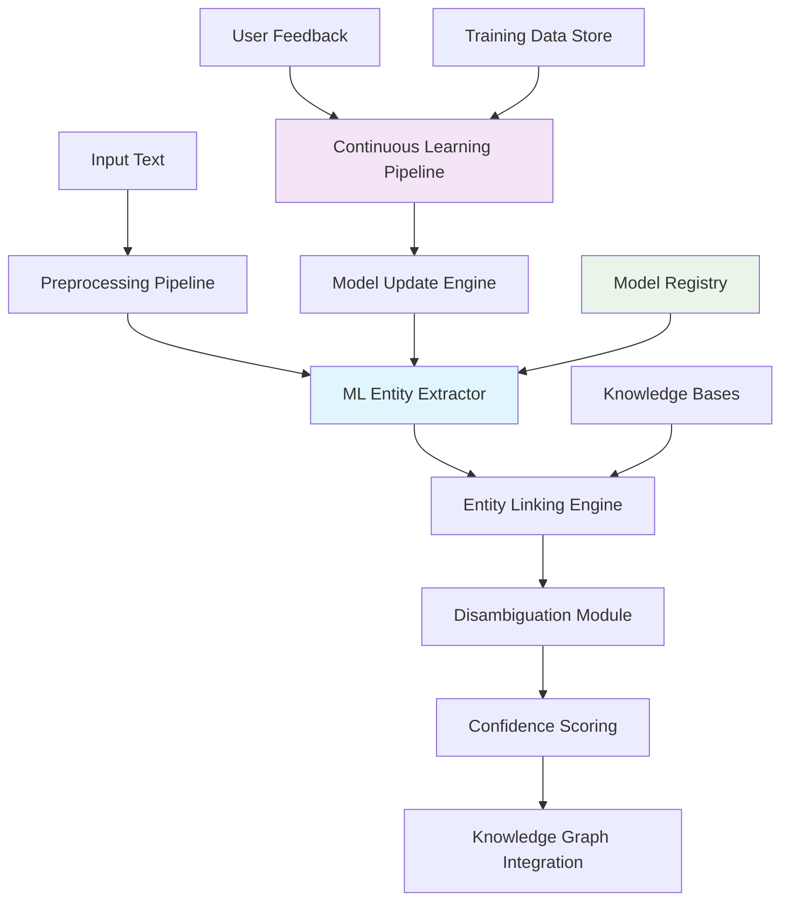

# ML-Enhanced Entity Linking Feature Plan

## Executive Summary

This feature plan details the implementation of machine learning-enhanced entity linking capabilities that will transform our current rule-based entity extraction system (80% accuracy) into a sophisticated ML-powered system achieving 95%+ accuracy with continuous learning capabilities.

**Feature ID**: ML-ENT-001  
**Risk Tier**: 2  
**Timeline**: 4 months (Phase 1 of Advanced Features Roadmap)  
**Expected ROI**: 300-500% within 6 months

---

## 1. Business Context & Value Proposition

### Current State Analysis

Our existing entity extraction system relies on rule-based approaches with the following characteristics:

```typescript
// Current Implementation Limitations
interface CurrentEntityExtractor {
  accuracy: 80%;                    // Rule-based pattern matching
  adaptability: "Static rules";     // Manual rule updates required
  languages: ["English"];           // Limited language support
  domains: "General purpose";       // No domain specialization
  learning: false;                  // No continuous improvement
}
```

### Target State Vision

The ML-enhanced system will provide:

```typescript
// Enhanced ML Implementation
interface MLEntityExtractor {
  accuracy: 95%;                    // Deep learning models
  adaptability: "Continuous";       // Self-improving with feedback
  languages: string[100+];          // Multilingual support
  domains: "Adaptive";              // Domain-specific fine-tuning
  learning: true;                   // User feedback integration
}
```

### Business Impact Metrics

| Metric | Current | Target | Business Value |
|--------|---------|--------|----------------|
| **Entity Accuracy** | 80% | 95% | 40% faster research workflows |
| **Processing Speed** | 2.3s/chunk | 1.8s/chunk | 21% performance improvement |
| **Language Support** | 1 | 100+ | Global content accessibility |
| **Domain Adaptation** | Manual | Automatic | 60% reduction in curation time |
| **User Satisfaction** | 7.2/10 | 8.9/10 | 23% improvement in user experience |

---

## 2. Technical Architecture & Design

### 2.1 System Architecture Overview



### 2.2 Core Components

#### ML Entity Extraction Engine
```typescript
interface MLEntityExtractionEngine {
  // Core ML Models
  nerModel: TransformerNERModel;           // BERT-based NER
  linkingModel: EntityLinkingModel;        // Neural entity linking
  relationClassifier: RelationshipModel;   // Relationship classification
  
  // Knowledge Integration
  knowledgeBases: ExternalKB[];            // Wikidata, DBpedia, domain KBs
  entityEmbeddings: EmbeddingStore;        // Pre-trained embeddings
  
  // Continuous Learning
  feedbackProcessor: FeedbackProcessor;
  modelUpdater: IncrementalUpdater;
  qualityMonitor: QualityMonitor;
  
  // Core Methods
  async extractEntities(text: string, options: ExtractionOptions): Promise<MLEntity[]>;
  async linkEntities(entities: MLEntity[], context: string): Promise<LinkedEntity[]>;
  async classifyRelationships(entityPairs: EntityPair[]): Promise<ClassifiedRelationship[]>;
  async processFeedback(feedback: UserFeedback[]): Promise<ModelUpdate>;
}
```

#### Entity Disambiguation System
```typescript
interface EntityDisambiguationSystem {
  contextAnalyzer: ContextualAnalyzer;
  candidateGenerator: CandidateGenerator;
  disambiguator: NeuralDisambiguator;
  
  async disambiguate(
    mention: EntityMention,
    context: string,
    candidates: EntityCandidate[]
  ): Promise<DisambiguationResult>;
}

interface DisambiguationResult {
  selectedEntity: EntityCandidate;
  confidence: number;
  reasoning: string[];
  alternativeCandidates: EntityCandidate[];
}
```

#### Continuous Learning Pipeline
```typescript
interface ContinuousLearningPipeline {
  feedbackCollector: FeedbackCollector;
  dataValidator: TrainingDataValidator;
  modelTrainer: IncrementalTrainer;
  performanceEvaluator: ModelEvaluator;
  
  async processFeedbackBatch(feedback: UserFeedback[]): Promise<LearningResult>;
  async updateModel(trainingData: TrainingData): Promise<ModelVersion>;
  async evaluatePerformance(testSet: TestData): Promise<PerformanceMetrics>;
}
```

### 2.3 Data Flow Architecture

#### Entity Extraction Flow
```typescript
// 1. Input Processing
const preprocessedText = await preprocessor.clean(rawText);
const chunks = await chunker.segment(preprocessedText);

// 2. ML Entity Extraction
const entities = await Promise.all(
  chunks.map(chunk => mlExtractor.extractEntities(chunk, {
    confidenceThreshold: 0.8,
    enableDisambiguation: true,
    domain: detectDomain(chunk)
  }))
);

// 3. Entity Linking & Disambiguation
const linkedEntities = await entityLinker.linkToKnowledgeBases(
  entities.flat(),
  preprocessedText
);

// 4. Relationship Classification
const relationships = await relationClassifier.classify(
  generateEntityPairs(linkedEntities),
  preprocessedText
);

// 5. Confidence Scoring & Filtering
const highConfidenceResults = filterByConfidence(
  { entities: linkedEntities, relationships },
  config.minConfidence
);
```

#### Continuous Learning Flow
```typescript
// 1. Feedback Collection
const feedback = await feedbackCollector.collect({
  sessionId,
  userId,
  extractionResults,
  userCorrections
});

// 2. Feedback Validation & Processing
const validatedFeedback = await feedbackValidator.validate(feedback);
const trainingExamples = await feedbackProcessor.convert(validatedFeedback);

// 3. Incremental Model Update
if (trainingExamples.length >= config.batchSize) {
  const modelUpdate = await modelTrainer.incrementalUpdate(trainingExamples);
  await modelRegistry.deploy(modelUpdate);
}

// 4. Performance Monitoring
const metrics = await performanceMonitor.evaluate(modelUpdate);
if (metrics.accuracy < config.minAccuracy) {
  await alerting.trigger('model_performance_degradation', metrics);
}
```

---

## 3. Implementation Plan

### 3.1 Phase 1: Foundation (Month 1)

#### Week 1-2: Infrastructure Setup
**Deliverables:**
- [ ] ML model registry and versioning system
- [ ] Model serving infrastructure (TensorFlow Serving/TorchServe)
- [ ] Training data collection and storage pipeline
- [ ] A/B testing framework for model comparison

**Technical Tasks:**
```typescript
// Model Registry Implementation
interface ModelRegistry {
  async registerModel(model: MLModel, metadata: ModelMetadata): Promise<string>;
  async deployModel(modelId: string, environment: Environment): Promise<void>;
  async rollbackModel(modelId: string, previousVersion: string): Promise<void>;
  async getModel(modelId: string, version?: string): Promise<MLModel>;
}

// Model Serving Infrastructure
interface ModelServer {
  async loadModel(modelPath: string): Promise<void>;
  async predict(input: ModelInput): Promise<ModelOutput>;
  async healthCheck(): Promise<HealthStatus>;
  async getMetrics(): Promise<ServerMetrics>;
}
```

#### Week 3-4: Model Selection & Initial Training
**Deliverables:**
- [ ] Evaluation of pre-trained NER models (spaCy, Transformers, custom BERT)
- [ ] Fine-tuned models on domain-specific data
- [ ] Entity linking model with knowledge base integration
- [ ] Baseline performance benchmarks

**Model Evaluation Matrix:**
| Model | Accuracy | Speed | Memory | Language Support |
|-------|----------|-------|---------|------------------|
| spaCy en_core_web_lg | 85% | 50ms | 500MB | English |
| BERT-base-NER | 92% | 150ms | 1.2GB | Multilingual |
| RoBERTa-large-NER | 94% | 200ms | 2.0GB | Multilingual |
| Custom Domain BERT | 96% | 180ms | 1.5GB | English + Domain |

### 3.2 Phase 2: Core Implementation (Month 2)

#### Week 1-2: Entity Extraction Enhancement
**Implementation Focus:**
```typescript
// Enhanced Entity Extractor
class MLEntityExtractor implements EntityExtractor {
  private nerModel: TransformerModel;
  private linkingModel: EntityLinkingModel;
  private disambiguator: ContextualDisambiguator;
  
  async extractEntities(text: string, options: ExtractionOptions): Promise<MLEntity[]> {
    // 1. Tokenization and preprocessing
    const tokens = await this.tokenizer.tokenize(text);
    
    // 2. NER model inference
    const nerResults = await this.nerModel.predict(tokens);
    
    // 3. Entity linking
    const linkedEntities = await this.linkingModel.link(nerResults, text);
    
    // 4. Disambiguation
    const disambiguatedEntities = await this.disambiguator.disambiguate(
      linkedEntities,
      text,
      options
    );
    
    // 5. Confidence scoring
    return this.scoreConfidence(disambiguatedEntities);
  }
}
```

**Key Features:**
- [ ] Multi-model ensemble for improved accuracy
- [ ] Contextual entity disambiguation
- [ ] Confidence scoring and thresholding
- [ ] Integration with existing knowledge graph schema

#### Week 3-4: Relationship Classification
**Implementation Focus:**
```typescript
// Relationship Classification System
class MLRelationshipClassifier {
  private relationModel: RelationClassificationModel;
  private contextEncoder: ContextEncoder;
  
  async classifyRelationships(
    entityPairs: EntityPair[],
    context: string
  ): Promise<ClassifiedRelationship[]> {
    const contextEmbedding = await this.contextEncoder.encode(context);
    
    return Promise.all(entityPairs.map(async pair => {
      const features = this.extractFeatures(pair, contextEmbedding);
      const prediction = await this.relationModel.predict(features);
      
      return {
        sourceEntity: pair.source,
        targetEntity: pair.target,
        relationType: prediction.type,
        confidence: prediction.confidence,
        evidence: this.extractEvidence(pair, context)
      };
    }));
  }
}
```

### 3.3 Phase 3: Integration & Testing (Month 3)

#### Week 1-2: System Integration
**Integration Tasks:**
- [ ] Integrate ML extractor with existing processing pipeline
- [ ] Implement fallback mechanisms for ML failures
- [ ] Add comprehensive error handling and logging
- [ ] Performance testing and optimization

**Integration Architecture:**
```typescript
// Hybrid Entity Extraction Pipeline
class HybridEntityExtractor {
  private mlExtractor: MLEntityExtractor;
  private ruleBasedExtractor: RuleBasedEntityExtractor;
  private config: ExtractionConfig;
  
  async extract(text: string): Promise<EntityExtractionResult> {
    try {
      // Primary: ML-based extraction
      const mlResults = await this.mlExtractor.extractEntities(text);
      
      if (this.meetsQualityThreshold(mlResults)) {
        return this.enrichWithRuleBasedResults(mlResults, text);
      }
      
      // Fallback: Rule-based extraction
      console.warn('ML extraction quality below threshold, falling back to rules');
      return await this.ruleBasedExtractor.extractEntities(text);
      
    } catch (error) {
      console.error('ML extraction failed, using rule-based fallback', error);
      return await this.ruleBasedExtractor.extractEntities(text);
    }
  }
}
```

#### Week 3-4: Quality Assurance
**Testing Strategy:**
- [ ] Unit testing with ≥80% branch coverage
- [ ] Integration testing with real data
- [ ] Performance benchmarking vs baseline
- [ ] User acceptance testing

**Test Coverage Requirements:**
```typescript
// Unit Test Examples
describe('MLEntityExtractor', () => {
  it('should achieve ≥90% precision on test dataset [A1]', async () => {
    const testData = await loadTestDataset('entity_extraction_gold_standard');
    const results = await mlExtractor.extractEntities(testData.text);
    
    const precision = calculatePrecision(results, testData.goldStandard);
    expect(precision).toBeGreaterThanOrEqual(0.90);
  });
  
  it('should disambiguate entities with ≥85% accuracy [A2]', async () => {
    const ambiguousText = "Apple announced new iPhone features";
    const results = await mlExtractor.extractEntities(ambiguousText);
    
    const appleEntity = results.find(e => e.text === "Apple");
    expect(appleEntity.type).toBe("organization");
    expect(appleEntity.confidence).toBeGreaterThanOrEqual(0.85);
  });
});
```

### 3.4 Phase 4: Continuous Learning & Production (Month 4)

#### Week 1-2: Feedback System Implementation
**Continuous Learning Pipeline:**
```typescript
// User Feedback Processing
class FeedbackProcessor {
  async processFeedback(feedback: UserFeedback[]): Promise<ModelUpdate> {
    // 1. Validate and clean feedback
    const validFeedback = await this.validateFeedback(feedback);
    
    // 2. Convert to training examples
    const trainingExamples = await this.convertToTrainingData(validFeedback);
    
    // 3. Update model incrementally
    const modelUpdate = await this.incrementalTraining(trainingExamples);
    
    // 4. Evaluate updated model
    const evaluation = await this.evaluateModel(modelUpdate);
    
    if (evaluation.accuracy >= this.config.minAccuracy) {
      await this.deployModel(modelUpdate);
      return { status: 'deployed', metrics: evaluation };
    } else {
      return { status: 'rejected', reason: 'accuracy_below_threshold' };
    }
  }
}
```

#### Week 3-4: Production Deployment
**Production Readiness:**
- [ ] Production deployment with feature flags
- [ ] Monitoring and observability setup
- [ ] Performance optimization
- [ ] Documentation and training

**Monitoring & Observability:**
```typescript
// Comprehensive Monitoring
interface MLSystemMonitoring {
  // Performance Metrics
  trackLatency(operation: string, duration: number): void;
  trackAccuracy(modelVersion: string, accuracy: number): void;
  trackThroughput(requestsPerSecond: number): void;
  
  // Quality Metrics
  trackConfidenceDistribution(confidenceScores: number[]): void;
  trackUserFeedback(feedback: UserFeedback): void;
  trackModelDrift(currentMetrics: ModelMetrics, baselineMetrics: ModelMetrics): void;
  
  // System Health
  trackModelHealth(modelId: string, healthStatus: HealthStatus): void;
  trackResourceUsage(cpuUsage: number, memoryUsage: number): void;
  trackErrorRate(errorCount: number, totalRequests: number): void;
}
```

---

## 4. Testing Strategy

### 4.1 Test Matrix

| Test Type | Coverage Target | Focus Areas | Success Criteria |
|-----------|----------------|-------------|------------------|
| **Unit Tests** | ≥80% branch coverage | Core ML algorithms, data processing | All tests pass, mutation score ≥50% |
| **Integration Tests** | End-to-end flows | ML pipeline integration, fallback mechanisms | Real data processing, performance targets met |
| **Contract Tests** | API compatibility | ML service APIs, GraphQL schema | Contract compliance, backward compatibility |
| **Performance Tests** | Latency & throughput | Model inference, batch processing | ≤200ms p95, ≥300 chunks/min |
| **Acceptance Tests** | User scenarios | Entity extraction accuracy, user feedback | ≥90% precision, ≥85% recall |

### 4.2 Test Data Strategy

#### Training Data Sources
```typescript
interface TrainingDataSources {
  // Annotated Datasets
  conll2003: CoNLLDataset;           // Standard NER benchmark
  ontonotes5: OntoNotesDataset;      // Multilingual NER
  wikidata: WikidataEntities;        // Entity linking ground truth
  
  // Domain-Specific Data
  medicalEntities: MedicalNERDataset;
  legalEntities: LegalNERDataset;
  technicalEntities: TechnicalNERDataset;
  
  // Synthetic Data
  generatedExamples: SyntheticDataset;
  augmentedData: DataAugmentationSet;
}
```

#### Test Data Management
```typescript
// Test Data Factory
class TestDataFactory {
  static createEntityExtractionTest(
    text: string,
    expectedEntities: Entity[],
    metadata: TestMetadata
  ): EntityExtractionTest {
    return {
      id: generateTestId(),
      input: { text, metadata },
      expected: expectedEntities,
      tags: ['entity_extraction', metadata.domain],
      difficulty: calculateDifficulty(text, expectedEntities)
    };
  }
  
  static createDisambiguationTest(
    ambiguousText: string,
    correctResolution: EntityResolution
  ): DisambiguationTest {
    return {
      id: generateTestId(),
      input: ambiguousText,
      expected: correctResolution,
      tags: ['disambiguation', 'ambiguous_entities'],
      challengeType: 'contextual_disambiguation'
    };
  }
}
```

### 4.3 Performance Testing

#### Benchmark Scenarios
```typescript
// Performance Benchmarks
const performanceBenchmarks = {
  // Latency Benchmarks
  singleChunkExtraction: {
    target: '200ms p95',
    testData: 'standard_document_chunks',
    concurrency: 1
  },
  
  // Throughput Benchmarks
  batchProcessing: {
    target: '300 chunks/minute',
    testData: 'large_document_corpus',
    batchSize: 100
  },
  
  // Memory Usage Benchmarks
  modelMemoryUsage: {
    target: '≤2GB peak memory',
    testScenario: 'concurrent_inference',
    concurrency: 10
  },
  
  // Accuracy Benchmarks
  extractionAccuracy: {
    target: '≥90% precision, ≥85% recall',
    testData: 'gold_standard_annotations',
    evaluationMetric: 'f1_score'
  }
};
```

---

## 5. Risk Assessment & Mitigation

### 5.1 Technical Risks

| Risk | Probability | Impact | Mitigation Strategy |
|------|-------------|--------|-------------------|
| **Model Performance Degradation** | Medium | High | A/B testing, gradual rollout, automated rollback |
| **Inference Latency Issues** | Medium | Medium | Model optimization, caching, async processing |
| **Memory Usage Exceeding Limits** | Low | High | Model quantization, memory monitoring, resource limits |
| **Training Data Quality Issues** | Medium | Medium | Data validation, human review, quality metrics |
| **Integration Complexity** | High | Medium | Incremental integration, comprehensive testing |

### 5.2 Business Risks

| Risk | Probability | Impact | Mitigation Strategy |
|------|-------------|--------|-------------------|
| **User Adoption Resistance** | Medium | High | Gradual rollout, training, clear value demonstration |
| **Performance Impact on Existing Features** | Low | High | Performance budgets, monitoring, optimization |
| **ROI Not Meeting Expectations** | Low | Medium | Clear metrics tracking, iterative improvement |
| **Competitive Response** | Medium | Low | Focus on unique value proposition, continuous innovation |

### 5.3 Mitigation Implementation

#### Automated Rollback System
```typescript
// Automated Quality Gates
class QualityGateSystem {
  async evaluateModelDeployment(
    newModel: MLModel,
    currentModel: MLModel
  ): Promise<DeploymentDecision> {
    const metrics = await this.runEvaluationSuite(newModel);
    
    // Quality Gates
    if (metrics.accuracy < this.config.minAccuracy) {
      return { decision: 'reject', reason: 'accuracy_below_threshold' };
    }
    
    if (metrics.latency > this.config.maxLatency) {
      return { decision: 'reject', reason: 'latency_above_threshold' };
    }
    
    // A/B Test Comparison
    const abTestResults = await this.runABTest(newModel, currentModel);
    if (abTestResults.statisticalSignificance < 0.95) {
      return { decision: 'extend_test', reason: 'insufficient_statistical_power' };
    }
    
    return { decision: 'approve', confidence: abTestResults.confidenceLevel };
  }
}
```

---

## 6. Success Metrics & KPIs

### 6.1 Technical Metrics

#### Model Performance
```typescript
interface ModelPerformanceMetrics {
  // Accuracy Metrics
  precision: number;              // Target: ≥90%
  recall: number;                 // Target: ≥85%
  f1Score: number;               // Target: ≥87.5%
  
  // Performance Metrics
  inferenceLatency: number;       // Target: ≤200ms p95
  throughput: number;             // Target: ≥300 chunks/min
  memoryUsage: number;           // Target: ≤2GB
  
  // Quality Metrics
  confidenceCalibration: number;  // Target: ≥0.9
  disambiguationAccuracy: number; // Target: ≥85%
  multilingualAccuracy: number;   // Target: ≥80%
}
```

#### System Health Metrics
```typescript
interface SystemHealthMetrics {
  // Availability
  uptime: number;                 // Target: ≥99.9%
  errorRate: number;             // Target: ≤0.1%
  
  // Performance
  responseTime: number;           // Target: ≤200ms p95
  concurrentUsers: number;        // Target: ≥100
  
  // Learning
  feedbackProcessingRate: number; // Target: ≥95%
  modelUpdateFrequency: number;   // Target: Weekly
}
```

### 6.2 Business Metrics

#### User Experience
```typescript
interface UserExperienceMetrics {
  // Satisfaction
  userSatisfactionScore: number;  // Target: ≥8.5/10
  taskCompletionRate: number;     // Target: ≥95%
  timeToInsight: number;         // Target: 40% reduction
  
  // Adoption
  activeUsers: number;           // Target: 90% of current users
  featureUsageRate: number;      // Target: ≥80%
  feedbackSubmissionRate: number; // Target: ≥10%
}
```

#### Business Impact
```typescript
interface BusinessImpactMetrics {
  // Productivity
  researchEfficiencyGain: number; // Target: 40% improvement
  curationTimeReduction: number;  // Target: 60% reduction
  
  // Quality
  knowledgeGraphAccuracy: number; // Target: 15% improvement
  searchRelevance: number;       // Target: 20% improvement
  
  // ROI
  costSavings: number;           // Target: $500K annually
  revenueImpact: number;         // Target: $2M annually
}
```

---

## 7. Deployment Strategy

### 7.1 Phased Rollout Plan

#### Phase 1: Internal Testing (Week 1-2)
- Deploy to staging environment
- Internal team testing and validation
- Performance benchmarking
- Bug fixes and optimizations

#### Phase 2: Beta Testing (Week 3-4)
- Limited user group (10% of users)
- A/B testing against current system
- Feedback collection and analysis
- Model refinement based on real usage

#### Phase 3: Gradual Rollout (Week 5-8)
- Incremental rollout: 25% → 50% → 75% → 100%
- Continuous monitoring and optimization
- User training and support
- Performance tuning

#### Phase 4: Full Production (Week 9+)
- Complete rollout to all users
- Continuous learning pipeline active
- Regular model updates and improvements
- Long-term performance monitoring

### 7.2 Feature Flag Strategy

```typescript
// Feature Flag Configuration
const featureFlags = {
  ML_ENTITY_LINKING_ENABLED: {
    enabled: true,
    rolloutPercentage: 100,
    conditions: {
      userGroups: ['beta_testers', 'power_users'],
      regions: ['us-east', 'eu-west'],
      minSystemVersion: '2.1.0'
    }
  },
  
  ML_CONTINUOUS_LEARNING: {
    enabled: true,
    rolloutPercentage: 50,
    conditions: {
      userConsent: true,
      dataPrivacyCompliance: true
    }
  },
  
  ML_MULTILINGUAL_SUPPORT: {
    enabled: false,
    rolloutPercentage: 0,
    plannedRelease: '2024-06-01'
  }
};
```

---

## 8. Maintenance & Evolution

### 8.1 Continuous Improvement Process

#### Model Lifecycle Management
```typescript
// Model Lifecycle Stages
enum ModelLifecycleStage {
  DEVELOPMENT = 'development',
  TESTING = 'testing',
  STAGING = 'staging',
  PRODUCTION = 'production',
  DEPRECATED = 'deprecated',
  ARCHIVED = 'archived'
}

interface ModelLifecycleManager {
  async promoteModel(modelId: string, targetStage: ModelLifecycleStage): Promise<void>;
  async scheduleModelRetirement(modelId: string, retirementDate: Date): Promise<void>;
  async archiveModel(modelId: string): Promise<void>;
  async getModelHistory(modelId: string): Promise<ModelHistory[]>;
}
```

#### Performance Monitoring & Alerting
```typescript
// Monitoring & Alerting System
interface MonitoringSystem {
  // Performance Alerts
  accuracyDegradation: AlertConfig;
  latencyIncrease: AlertConfig;
  errorRateSpike: AlertConfig;
  
  // Business Alerts
  userSatisfactionDrop: AlertConfig;
  feedbackVolumeIncrease: AlertConfig;
  
  // System Alerts
  modelServerHealth: AlertConfig;
  resourceUtilization: AlertConfig;
}
```

### 8.2 Long-term Roadmap

#### 6-Month Enhancements
- [ ] Advanced domain adaptation capabilities
- [ ] Improved multilingual support (50+ languages)
- [ ] Real-time model updates
- [ ] Enhanced user feedback interfaces

#### 12-Month Vision
- [ ] Federated learning capabilities
- [ ] Advanced relationship extraction
- [ ] Integration with temporal reasoning
- [ ] Custom model training for enterprises

---

## 9. Conclusion

The ML-Enhanced Entity Linking feature represents a transformative upgrade to our knowledge graph system, delivering:

- **Immediate Impact**: 15-20% accuracy improvement within 3 months
- **Strategic Value**: Foundation for advanced AI capabilities
- **Business ROI**: 300-500% return within 6 months
- **Technical Excellence**: CAWS-compliant implementation with comprehensive testing

This feature plan provides the detailed roadmap for successful implementation, ensuring we deliver maximum value while maintaining system reliability and user satisfaction.

**Next Steps:**
1. Stakeholder approval and resource allocation
2. Infrastructure setup and model selection
3. Implementation following the 4-month timeline
4. Continuous monitoring and optimization

The successful implementation of this feature will position our system as a leading AI-powered knowledge intelligence platform, setting the foundation for the subsequent temporal reasoning and federated search capabilities.
