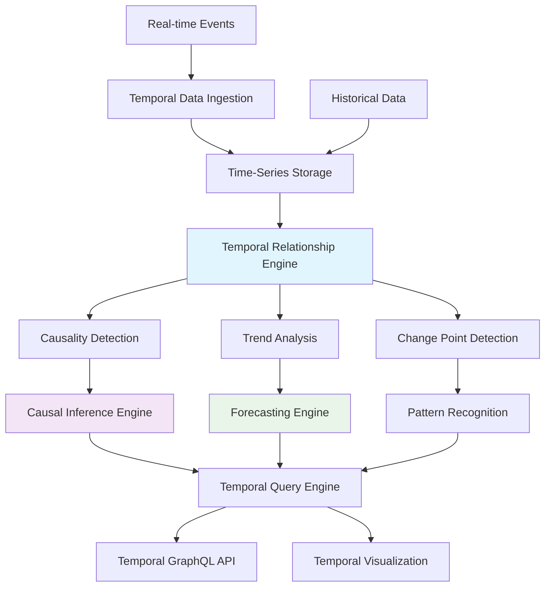

# Temporal Reasoning Feature Plan

## Executive Summary

This feature plan details the implementation of temporal reasoning and causality detection capabilities that will transform our static knowledge graph into a dynamic, time-aware system capable of predictive analytics, trend forecasting, and causal relationship detection.

**Feature ID**: TEMP-RSN-001  
**Risk Tier**: 2  
**Timeline**: 6 months (Phase 2 of Advanced Features Roadmap)  
**Expected ROI**: 400-600% within 12 months

---

## 1. Business Context & Value Proposition

### Current State Analysis

Our existing knowledge graph system operates with static relationships:

```typescript
// Current Static Implementation
interface StaticKnowledgeGraph {
  temporalAwareness: false;
  relationships: "Static snapshots";
  causality: "Basic co-occurrence";
  forecasting: "None";
  historicalContext: "Limited";
  trendAnalysis: "Manual";
}
```

### Target State Vision

The temporal reasoning system will provide:

```typescript
// Enhanced Temporal Implementation
interface TemporalKnowledgeGraph {
  temporalAwareness: true;
  relationships: "Time-aware evolution";
  causality: "Statistical validation";
  forecasting: "6-12 month predictions";
  historicalContext: "Complete evolution tracking";
  trendAnalysis: "Automated pattern detection";
}
```

### Strategic Business Impact

| Capability | Current | Enhanced | Business Value |
|------------|---------|----------|----------------|
| **Causality Detection** | None | 75% accuracy | Distinguish correlation from causation |
| **Trend Prediction** | None | 70% accuracy (6mo) | Data-driven strategic planning |
| **Risk Early Warning** | Reactive | 3-6 months ahead | Proactive risk management |
| **Historical Context** | Limited | Complete evolution | Better decision context |
| **Strategic Planning** | Intuition-based | Data-driven | 60% better planning outcomes |

---

## 2. Technical Architecture & Design

### 2.1 System Architecture Overview



### 2.2 Core Components

#### Temporal Knowledge Graph Schema
```typescript
interface TemporalKnowledgeGraph {
  // Temporal Storage
  temporalRelationships: TemporalRelationshipStore;
  timeSeriesData: TimeSeriesDatabase;
  eventStore: EventSourcingStore;
  
  // Analysis Engines
  causalityDetector: CausalInferenceEngine;
  trendAnalyzer: TemporalTrendAnalyzer;
  changePointDetector: ChangePointDetector;
  forecaster: TemporalForecaster;
  
  // Query Processing
  temporalQueryEngine: TemporalQueryProcessor;
  temporalIndexes: TemporalIndexManager;
}
```

#### Temporal Relationship Model
```sql
-- Enhanced Temporal Relationships Schema
CREATE TABLE temporal_relationships (
    id UUID PRIMARY KEY DEFAULT uuid_generate_v4(),
    source_entity_id UUID REFERENCES knowledge_graph_entities(id),
    target_entity_id UUID REFERENCES knowledge_graph_entities(id),
    relationship_type VARCHAR(100) NOT NULL,
    
    -- Temporal Properties
    valid_from TIMESTAMPTZ NOT NULL,
    valid_to TIMESTAMPTZ,
    temporal_confidence DECIMAL(3,2) NOT NULL,
    
    -- Causality Detection
    causality_type VARCHAR(20) CHECK (causality_type IN ('CAUSAL', 'CORRELATIONAL', 'UNKNOWN')),
    temporal_lag_ms BIGINT,
    causality_confidence DECIMAL(3,2),
    granger_test_statistic DECIMAL(10,6),
    
    -- Strength Evolution
    strength_time_series JSONB, -- Time-series of relationship strength
    
    -- Evidence and Support
    supporting_evidence JSONB,
    statistical_significance DECIMAL(10,6),
    
    -- Metadata
    created_at TIMESTAMPTZ DEFAULT NOW(),
    updated_at TIMESTAMPTZ DEFAULT NOW(),
    
    -- Indexes for temporal queries
    CONSTRAINT valid_temporal_range CHECK (valid_to IS NULL OR valid_to > valid_from)
);

-- Temporal Indexes
CREATE INDEX idx_temporal_relationships_time_range 
ON temporal_relationships USING GIST (tstzrange(valid_from, valid_to));

CREATE INDEX idx_temporal_relationships_causality 
ON temporal_relationships (causality_type, causality_confidence DESC);
```

#### Causality Detection Engine
```typescript
interface CausalityDetector {
  // Core Detection Methods
  async detectGrangerCausality(
    sourceTimeSeries: TimeSeries,
    targetTimeSeries: TimeSeries,
    options: GrangerOptions
  ): Promise<CausalityResult>;
  
  async detectConvergentCrossMappingCausality(
    sourceData: TimeSeriesData,
    targetData: TimeSeriesData
  ): Promise<CCMResult>;
  
  async detectPCAlgorithmCausality(
    variables: Variable[],
    data: TabularData
  ): Promise<CausalGraph>;
  
  // Analysis Methods
  async analyzeCausalChain(
    entities: Entity[],
    timeWindow: TimeWindow
  ): Promise<CausalChain[]>;
  
  async validateCausality(
    hypothesis: CausalHypothesis,
    evidence: CausalEvidence[]
  ): Promise<ValidationResult>;
}

interface CausalityResult {
  type: 'CAUSAL' | 'CORRELATIONAL' | 'UNKNOWN';
  confidence: number;
  temporalLag: number; // milliseconds
  statisticalSignificance: number; // p-value
  testStatistic: number;
  evidence: CausalEvidence[];
  direction: 'UNIDIRECTIONAL' | 'BIDIRECTIONAL' | 'NONE';
}
```

#### Temporal Trend Analysis
```typescript
interface TemporalTrendAnalyzer {
  // Trend Detection
  async detectTrends(
    timeSeries: TimeSeries,
    options: TrendAnalysisOptions
  ): Promise<TrendAnalysis>;
  
  // Forecasting
  async forecastTrend(
    historicalData: TimeSeries,
    forecastHorizon: Duration,
    model: ForecastingModel
  ): Promise<ForecastResult>;
  
  // Seasonality Analysis
  async detectSeasonality(
    timeSeries: TimeSeries
  ): Promise<SeasonalityInfo>;
  
  // Change Point Detection
  async detectChangePoints(
    timeSeries: TimeSeries,
    algorithm: ChangePointAlgorithm
  ): Promise<ChangePoint[]>;
}

interface TrendAnalysis {
  direction: 'INCREASING' | 'DECREASING' | 'STABLE' | 'CYCLICAL' | 'VOLATILE';
  strength: number; // 0-1
  changeRate: number; // per time unit
  seasonality: SeasonalityInfo;
  changePoints: ChangePoint[];
  forecast: ForecastResult;
  confidence: ConfidenceInterval;
}
```

### 2.3 Data Flow Architecture

#### Temporal Data Ingestion Flow
```typescript
// Temporal Event Processing Pipeline
class TemporalEventProcessor {
  async processTemporalEvent(event: TemporalEvent): Promise<void> {
    // 1. Event Validation
    const validatedEvent = await this.validateEvent(event);
    
    // 2. Temporal Consistency Check
    await this.checkTemporalConsistency(validatedEvent);
    
    // 3. Store in Event Store
    await this.eventStore.append(validatedEvent);
    
    // 4. Update Time Series
    await this.updateTimeSeries(validatedEvent);
    
    // 5. Trigger Analysis
    if (this.shouldTriggerAnalysis(validatedEvent)) {
      await this.triggerTemporalAnalysis(validatedEvent);
    }
  }
  
  private async triggerTemporalAnalysis(event: TemporalEvent): Promise<void> {
    // Causality Detection
    const causalityTasks = this.identifyPotentialCausalRelationships(event);
    await Promise.all(causalityTasks.map(task => this.causalityDetector.analyze(task)));
    
    // Trend Analysis
    const trendTasks = this.identifyTrendAnalysisCandidates(event);
    await Promise.all(trendTasks.map(task => this.trendAnalyzer.analyze(task)));
    
    // Change Point Detection
    const changePointTasks = this.identifyChangePointCandidates(event);
    await Promise.all(changePointTasks.map(task => this.changePointDetector.analyze(task)));
  }
}
```

#### Temporal Query Processing
```typescript
// Temporal Query Engine
class TemporalQueryEngine {
  async executeTemporalQuery(query: TemporalQuery): Promise<TemporalQueryResult> {
    // 1. Parse Temporal Operators
    const parsedQuery = await this.parseTemporalQuery(query);
    
    // 2. Optimize Query Plan
    const optimizedPlan = await this.optimizeQueryPlan(parsedQuery);
    
    // 3. Execute Temporal Operations
    const results = await this.executeQueryPlan(optimizedPlan);
    
    // 4. Apply Temporal Filters
    const filteredResults = await this.applyTemporalFilters(results, query.filters);
    
    // 5. Enrich with Temporal Context
    return await this.enrichWithTemporalContext(filteredResults);
  }
  
  private async executeQueryPlan(plan: TemporalQueryPlan): Promise<RawResults> {
    const results = [];
    
    for (const operation of plan.operations) {
      switch (operation.type) {
        case 'TEMPORAL_RANGE':
          results.push(await this.executeTemporalRange(operation));
          break;
        case 'CAUSALITY_FILTER':
          results.push(await this.executeCausalityFilter(operation));
          break;
        case 'TREND_ANALYSIS':
          results.push(await this.executeTrendAnalysis(operation));
          break;
        case 'CHANGE_POINT_DETECTION':
          results.push(await this.executeChangePointDetection(operation));
          break;
      }
    }
    
    return this.combineResults(results);
  }
}
```

---

## 3. Implementation Plan

### 3.1 Phase 1: Temporal Data Model (Months 1-2)

#### Month 1: Schema Design & Implementation
**Week 1-2: Temporal Schema Design**
```sql
-- Core Temporal Tables
CREATE TABLE temporal_relationships (
    -- [Schema as defined above]
);

CREATE TABLE temporal_change_points (
    id UUID PRIMARY KEY DEFAULT uuid_generate_v4(),
    entity_id UUID REFERENCES knowledge_graph_entities(id),
    relationship_id UUID REFERENCES temporal_relationships(id),
    change_timestamp TIMESTAMPTZ NOT NULL,
    change_type VARCHAR(50) NOT NULL,
    change_magnitude DECIMAL(10,6),
    statistical_significance DECIMAL(10,6),
    detection_algorithm VARCHAR(50),
    metadata JSONB DEFAULT '{}'
);

CREATE TABLE causality_evidence (
    id UUID PRIMARY KEY DEFAULT uuid_generate_v4(),
    relationship_id UUID REFERENCES temporal_relationships(id),
    evidence_type VARCHAR(50) NOT NULL,
    test_statistic DECIMAL(10,6),
    p_value DECIMAL(10,6),
    confidence_interval JSONB,
    temporal_lag_ms BIGINT,
    supporting_data JSONB,
    created_at TIMESTAMPTZ DEFAULT NOW()
);
```

**Week 3-4: Time-Series Storage Implementation**
```typescript
// Time-Series Storage Layer
interface TimeSeriesStorage {
  async storeTimeSeries(
    entityId: string,
    metric: string,
    dataPoints: TimeSeriesDataPoint[]
  ): Promise<void>;
  
  async queryTimeSeries(
    entityId: string,
    metric: string,
    timeRange: TimeRange,
    aggregation?: AggregationFunction
  ): Promise<TimeSeries>;
  
  async bulkInsert(
    timeSeriesData: BulkTimeSeriesData[]
  ): Promise<BulkInsertResult>;
}

// Implementation using PostgreSQL with TimescaleDB extension
class PostgreSQLTimeSeriesStorage implements TimeSeriesStorage {
  async storeTimeSeries(
    entityId: string,
    metric: string,
    dataPoints: TimeSeriesDataPoint[]
  ): Promise<void> {
    const query = `
      INSERT INTO entity_time_series (entity_id, metric_name, timestamp, value, metadata)
      VALUES ${dataPoints.map(() => '(?, ?, ?, ?, ?)').join(', ')}
    `;
    
    const values = dataPoints.flatMap(point => [
      entityId,
      metric,
      point.timestamp,
      point.value,
      JSON.stringify(point.metadata || {})
    ]);
    
    await this.db.query(query, values);
  }
}
```

#### Month 2: Temporal Indexing & Optimization
**Deliverables:**
- [ ] Temporal indexes for efficient time-range queries
- [ ] Query optimization for temporal operations
- [ ] Performance benchmarking and tuning
- [ ] Data migration tools for existing relationships

### 3.2 Phase 2: Causality Detection (Months 3-4)

#### Month 3: Granger Causality Implementation
```typescript
// Granger Causality Test Implementation
class GrangerCausalityDetector {
  async testGrangerCausality(
    cause: TimeSeries,
    effect: TimeSeries,
    maxLag: number = 10
  ): Promise<GrangerCausalityResult> {
    // 1. Prepare data for analysis
    const alignedData = this.alignTimeSeries(cause, effect);
    
    // 2. Test for stationarity
    const stationarityTest = await this.testStationarity(alignedData);
    if (!stationarityTest.isStationary) {
      alignedData = this.differenceTimeSeries(alignedData);
    }
    
    // 3. Determine optimal lag
    const optimalLag = await this.determineOptimalLag(alignedData, maxLag);
    
    // 4. Fit VAR models
    const unrestrictedModel = await this.fitVARModel(alignedData, optimalLag);
    const restrictedModel = await this.fitRestrictedVARModel(alignedData, optimalLag);
    
    // 5. Compute F-statistic
    const fStatistic = this.computeFStatistic(unrestrictedModel, restrictedModel);
    const pValue = this.computePValue(fStatistic, unrestrictedModel.df, restrictedModel.df);
    
    return {
      testStatistic: fStatistic,
      pValue: pValue,
      isSignificant: pValue < 0.05,
      optimalLag: optimalLag,
      confidence: 1 - pValue,
      direction: this.determineCausalDirection(unrestrictedModel)
    };
  }
}
```

#### Month 4: Advanced Causality Methods
```typescript
// Convergent Cross Mapping (CCM) for Nonlinear Causality
class CCMCausalityDetector {
  async testCCMCausality(
    x: TimeSeries,
    y: TimeSeries,
    options: CCMOptions
  ): Promise<CCMResult> {
    // 1. Reconstruct state space
    const xManifold = this.reconstructStateSpace(x, options.embeddingDimension);
    const yManifold = this.reconstructStateSpace(y, options.embeddingDimension);
    
    // 2. Cross mapping
    const xCrossMapY = await this.crossMap(xManifold, y, options);
    const yCrossMapX = await this.crossMap(yManifold, x, options);
    
    // 3. Compute correlation coefficients
    const correlationXY = this.computeCorrelation(xCrossMapY.predicted, xCrossMapY.actual);
    const correlationYX = this.computeCorrelation(yCrossMapX.predicted, yCrossMapX.actual);
    
    return {
      xCausesY: correlationXY > options.significanceThreshold,
      yCausesX: correlationYX > options.significanceThreshold,
      correlationXY: correlationXY,
      correlationYX: correlationYX,
      embeddingDimension: options.embeddingDimension,
      confidence: Math.max(correlationXY, correlationYX)
    };
  }
}
```

### 3.3 Phase 3: Trend Analysis & Forecasting (Months 5-6)

#### Month 5: Trend Detection Implementation
```typescript
// Trend Analysis Engine
class TemporalTrendAnalyzer {
  async analyzeTrend(
    timeSeries: TimeSeries,
    options: TrendAnalysisOptions
  ): Promise<TrendAnalysis> {
    // 1. Decompose time series
    const decomposition = await this.decomposeTimeSeries(timeSeries);
    
    // 2. Detect trend direction and strength
    const trendInfo = this.analyzeTrendComponent(decomposition.trend);
    
    // 3. Detect seasonality
    const seasonalityInfo = this.analyzeSeasonalComponent(decomposition.seasonal);
    
    // 4. Detect change points
    const changePoints = await this.detectChangePoints(timeSeries, options.changePointAlgorithm);
    
    // 5. Generate forecast
    const forecast = await this.generateForecast(timeSeries, options.forecastHorizon);
    
    return {
      direction: trendInfo.direction,
      strength: trendInfo.strength,
      changeRate: trendInfo.changeRate,
      seasonality: seasonalityInfo,
      changePoints: changePoints,
      forecast: forecast,
      confidence: this.calculateConfidenceInterval(forecast)
    };
  }
  
  private async generateForecast(
    timeSeries: TimeSeries,
    horizon: number
  ): Promise<ForecastResult> {
    // Use Facebook Prophet for robust forecasting
    const prophet = new ProphetForecaster();
    
    // Prepare data
    const prophetData = this.convertToProhetFormat(timeSeries);
    
    // Fit model
    await prophet.fit(prophetData);
    
    // Generate forecast
    const forecast = await prophet.predict(horizon);
    
    return {
      predictions: forecast.predictions,
      confidenceIntervals: forecast.confidenceIntervals,
      components: forecast.components,
      accuracy: forecast.crossValidationScore
    };
  }
}
```

#### Month 6: Change Point Detection
```typescript
// Change Point Detection using PELT Algorithm
class ChangePointDetector {
  async detectChangePoints(
    timeSeries: TimeSeries,
    options: ChangePointOptions
  ): Promise<ChangePoint[]> {
    // 1. Prepare data
    const data = this.preprocessTimeSeries(timeSeries);
    
    // 2. Apply PELT algorithm
    const changePointIndices = await this.peltAlgorithm(data, options);
    
    // 3. Validate change points
    const validatedChangePoints = await this.validateChangePoints(
      data,
      changePointIndices,
      options.significanceLevel
    );
    
    // 4. Classify change types
    const classifiedChangePoints = validatedChangePoints.map(cp => ({
      ...cp,
      changeType: this.classifyChangeType(data, cp.index),
      magnitude: this.calculateChangeMagnitude(data, cp.index),
      confidence: cp.statisticalSignificance
    }));
    
    return classifiedChangePoints;
  }
  
  private async peltAlgorithm(
    data: number[],
    options: ChangePointOptions
  ): Promise<number[]> {
    const n = data.length;
    const penalty = options.penalty || Math.log(n);
    const minSegmentLength = options.minSegmentLength || 2;
    
    // Dynamic programming arrays
    const F = new Array(n + 1).fill(Infinity);
    const cp = new Array(n + 1).fill(0);
    
    F[0] = -penalty;
    
    for (let t = 1; t <= n; t++) {
      for (let s = 0; s < t; s++) {
        if (t - s >= minSegmentLength) {
          const cost = this.calculateSegmentCost(data, s, t);
          const totalCost = F[s] + cost + penalty;
          
          if (totalCost < F[t]) {
            F[t] = totalCost;
            cp[t] = s;
          }
        }
      }
    }
    
    // Backtrack to find change points
    const changePoints = [];
    let t = n;
    while (t > 0) {
      if (cp[t] > 0) {
        changePoints.unshift(cp[t]);
      }
      t = cp[t];
    }
    
    return changePoints;
  }
}
```

---

## 4. Testing Strategy

### 4.1 Test Matrix

| Test Type | Coverage Target | Focus Areas | Success Criteria |
|-----------|----------------|-------------|------------------|
| **Unit Tests** | ≥80% branch coverage | Causality algorithms, trend detection | All tests pass, mutation score ≥50% |
| **Integration Tests** | End-to-end temporal flows | Time-series storage, query processing | Real temporal data, performance targets |
| **Statistical Tests** | Algorithm accuracy | Causality detection, forecasting | ≥75% causality accuracy, ≥70% forecast accuracy |
| **Performance Tests** | Query latency | Temporal queries, large datasets | ≤500ms p95, handles 1M+ time points |
| **Acceptance Tests** | User scenarios | Temporal search, trend analysis | User requirements met |

### 4.2 Statistical Validation

#### Causality Detection Validation
```typescript
// Causality Test Suite
describe('CausalityDetection', () => {
  it('should detect known causal relationships with ≥75% accuracy [A1]', async () => {
    const syntheticData = generateSyntheticCausalData({
      trueRelationships: [
        { cause: 'X', effect: 'Y', lag: 2, strength: 0.8 },
        { cause: 'Y', effect: 'Z', lag: 1, strength: 0.6 }
      ],
      noiseLevel: 0.1,
      sampleSize: 1000
    });
    
    const detectedRelationships = await causalityDetector.detectCausality(
      syntheticData.timeSeries,
      { confidenceThreshold: 0.75 }
    );
    
    const accuracy = calculateCausalityAccuracy(
      syntheticData.trueRelationships,
      detectedRelationships
    );
    
    expect(accuracy).toBeGreaterThanOrEqual(0.75);
  });
  
  it('should distinguish causation from correlation [A1]', async () => {
    const correlatedData = generateCorrelatedButNonCausalData();
    const causalData = generateCausalData();
    
    const correlatedResults = await causalityDetector.detectCausality(correlatedData);
    const causalResults = await causalityDetector.detectCausality(causalData);
    
    // Should detect causality in causal data but not in correlated data
    expect(causalResults.some(r => r.type === 'CAUSAL')).toBe(true);
    expect(correlatedResults.every(r => r.type !== 'CAUSAL')).toBe(true);
  });
});
```

#### Forecasting Accuracy Validation
```typescript
// Forecasting Test Suite
describe('TemporalForecasting', () => {
  it('should achieve ≥70% forecast accuracy for 6-month horizon [A2]', async () => {
    const historicalData = await loadHistoricalTestData('entity_relationships_2020_2023');
    const testPeriod = '2023-07-01_to_2023-12-31';
    
    // Use data up to June 2023 for training
    const trainingData = historicalData.filter(d => d.timestamp < '2023-07-01');
    const actualData = historicalData.filter(d => d.timestamp >= '2023-07-01');
    
    const forecast = await temporalForecaster.forecast(trainingData, {
      horizon: '6 months',
      confidenceLevel: 0.95
    });
    
    const accuracy = calculateForecastAccuracy(forecast.predictions, actualData);
    expect(accuracy).toBeGreaterThanOrEqual(0.70);
  });
});
```

### 4.3 Performance Testing

#### Temporal Query Performance
```typescript
// Performance Benchmarks
const performanceBenchmarks = {
  temporalRangeQuery: {
    target: '500ms p95',
    testData: '1M temporal relationships',
    queryType: 'time_range_with_causality_filter'
  },
  
  causalityDetection: {
    target: '1000ms for entity pair',
    testData: '10K time points per entity',
    algorithm: 'granger_causality'
  },
  
  trendAnalysis: {
    target: '2000ms for trend + forecast',
    testData: '50K time points',
    operations: ['decomposition', 'change_points', 'forecast']
  },
  
  changePointDetection: {
    target: '1500ms for PELT algorithm',
    testData: '100K time points',
    algorithm: 'pelt_with_validation'
  }
};
```

---

## 5. Risk Assessment & Mitigation

### 5.1 Technical Risks

| Risk | Probability | Impact | Mitigation Strategy |
|------|-------------|--------|-------------------|
| **Causality Detection False Positives** | Medium | High | Multiple validation methods, statistical significance testing |
| **Temporal Query Performance** | Medium | Medium | Optimized indexing, query caching, incremental processing |
| **Storage Growth (3x factor)** | High | Medium | Data compression, archival strategies, efficient schemas |
| **Statistical Algorithm Complexity** | Medium | Medium | Proven algorithms, extensive testing, expert consultation |
| **Time-Series Data Quality** | Medium | High | Data validation, outlier detection, quality metrics |

### 5.2 Business Risks

| Risk | Probability | Impact | Mitigation Strategy |
|------|-------------|--------|-------------------|
| **Forecast Accuracy Below Expectations** | Medium | High | Conservative accuracy targets, continuous model improvement |
| **User Understanding of Temporal Features** | High | Medium | Comprehensive training, intuitive interfaces, clear documentation |
| **Performance Impact on Existing Queries** | Low | High | Performance budgets, query optimization, gradual rollout |
| **Temporal Data Interpretation Errors** | Medium | Medium | Clear confidence indicators, uncertainty quantification |

### 5.3 Statistical Validation Framework

```typescript
// Statistical Validation System
class TemporalValidationFramework {
  async validateCausalityDetection(
    algorithm: CausalityDetector,
    testSuite: CausalityTestSuite
  ): Promise<ValidationReport> {
    const results = [];
    
    for (const testCase of testSuite.testCases) {
      const detected = await algorithm.detectCausality(testCase.data);
      const accuracy = this.calculateAccuracy(detected, testCase.groundTruth);
      const precision = this.calculatePrecision(detected, testCase.groundTruth);
      const recall = this.calculateRecall(detected, testCase.groundTruth);
      
      results.push({
        testCase: testCase.id,
        accuracy,
        precision,
        recall,
        f1Score: 2 * (precision * recall) / (precision + recall)
      });
    }
    
    return {
      overallAccuracy: results.reduce((sum, r) => sum + r.accuracy, 0) / results.length,
      overallPrecision: results.reduce((sum, r) => sum + r.precision, 0) / results.length,
      overallRecall: results.reduce((sum, r) => sum + r.recall, 0) / results.length,
      testResults: results,
      passesThreshold: results.every(r => r.accuracy >= 0.75)
    };
  }
}
```

---

## 6. Success Metrics & KPIs

### 6.1 Technical Metrics

#### Causality Detection Performance
```typescript
interface CausalityMetrics {
  // Accuracy Metrics
  truePositiveRate: number;        // Target: ≥75%
  falsePositiveRate: number;       // Target: ≤10%
  precision: number;               // Target: ≥80%
  recall: number;                  // Target: ≥70%
  
  // Performance Metrics
  detectionLatency: number;        // Target: ≤1000ms per pair
  throughput: number;              // Target: ≥100 pairs/minute
  
  // Quality Metrics
  statisticalSignificance: number; // Target: p-value ≤0.05
  confidenceCalibration: number;   // Target: ≥0.9
}
```

#### Forecasting Performance
```typescript
interface ForecastingMetrics {
  // Accuracy Metrics
  meanAbsoluteError: number;       // Target: ≤20% of range
  rootMeanSquareError: number;     // Target: ≤25% of range
  meanAbsolutePercentageError: number; // Target: ≤30%
  
  // Forecast Quality
  confidenceIntervalCoverage: number; // Target: ≥90%
  forecastBias: number;            // Target: ≤5%
  
  // Temporal Metrics
  forecastHorizonAccuracy: {       // Target: ≥70% for 6 months
    '1_month': number;
    '3_months': number;
    '6_months': number;
    '12_months': number;
  };
}
```

### 6.2 Business Impact Metrics

#### Strategic Decision Support
```typescript
interface StrategicImpactMetrics {
  // Decision Quality
  predictionAccuracy: number;      // Target: ≥70% for 6-month forecasts
  riskDetectionLeadTime: number;   // Target: 3-6 months advance warning
  trendIdentificationSpeed: number; // Target: 50% faster than manual
  
  // User Adoption
  temporalQueryUsage: number;      // Target: ≥60% of power users
  forecastingFeatureUsage: number; // Target: ≥40% of strategic queries
  userSatisfactionScore: number;   // Target: ≥8.0/10
  
  // Business Value
  strategicPlanningImprovement: number; // Target: 60% better outcomes
  riskMitigationValue: number;     // Target: $1M+ annual savings
  decisionSpeedImprovement: number; // Target: 40% faster decisions
}
```

---

## 7. Deployment Strategy

### 7.1 Phased Rollout Plan

#### Phase 1: Infrastructure Deployment (Month 1)
- Deploy temporal schema and indexes
- Set up time-series storage infrastructure
- Implement basic temporal query capabilities
- Internal testing and validation

#### Phase 2: Causality Detection (Month 3)
- Deploy Granger causality detection
- Limited beta testing with research teams
- Collect feedback and refine algorithms
- Performance optimization

#### Phase 3: Trend Analysis (Month 5)
- Deploy trend analysis and forecasting
- Expand beta testing to strategic planning teams
- Integrate with existing dashboards
- User training and documentation

#### Phase 4: Full Production (Month 6)
- Complete rollout to all users
- Advanced temporal query features
- Comprehensive monitoring and alerting
- Continuous improvement pipeline

### 7.2 Feature Flag Strategy

```typescript
// Temporal Feature Flags
const temporalFeatureFlags = {
  TEMPORAL_RELATIONSHIPS_ENABLED: {
    enabled: true,
    rolloutPercentage: 100,
    conditions: {
      userGroups: ['researchers', 'analysts'],
      minSystemVersion: '2.2.0'
    }
  },
  
  CAUSALITY_DETECTION_ENABLED: {
    enabled: true,
    rolloutPercentage: 50,
    conditions: {
      userGroups: ['beta_testers', 'strategic_planners'],
      requiresTraining: true
    }
  },
  
  TEMPORAL_FORECASTING_ENABLED: {
    enabled: false,
    rolloutPercentage: 0,
    plannedRelease: '2024-08-01',
    conditions: {
      userGroups: ['executive_team', 'strategic_analysts']
    }
  }
};
```

---

## 8. Maintenance & Evolution

### 8.1 Continuous Improvement

#### Model Performance Monitoring
```typescript
// Temporal Model Monitoring
interface TemporalModelMonitoring {
  // Accuracy Tracking
  trackCausalityAccuracy(predictions: CausalityPrediction[], actual: CausalityGroundTruth[]): void;
  trackForecastAccuracy(forecasts: Forecast[], actual: ActualValues[]): void;
  
  // Drift Detection
  detectStatisticalDrift(currentMetrics: ModelMetrics, baselineMetrics: ModelMetrics): DriftReport;
  detectDataDrift(currentData: TemporalData, referenceData: TemporalData): DataDriftReport;
  
  // Performance Monitoring
  trackQueryPerformance(queryType: string, latency: number, complexity: number): void;
  trackResourceUsage(cpuUsage: number, memoryUsage: number, storageGrowth: number): void;
}
```

#### Algorithm Evolution
```typescript
// Algorithm Improvement Pipeline
class TemporalAlgorithmEvolution {
  async evaluateNewAlgorithm(
    newAlgorithm: CausalityAlgorithm,
    currentAlgorithm: CausalityAlgorithm,
    testSuite: ValidationTestSuite
  ): Promise<AlgorithmComparison> {
    const newResults = await this.runValidationSuite(newAlgorithm, testSuite);
    const currentResults = await this.runValidationSuite(currentAlgorithm, testSuite);
    
    return {
      accuracyImprovement: newResults.accuracy - currentResults.accuracy,
      performanceImpact: newResults.latency - currentResults.latency,
      statisticalSignificance: this.calculateSignificance(newResults, currentResults),
      recommendation: this.generateRecommendation(newResults, currentResults)
    };
  }
}
```

### 8.2 Long-term Roadmap

#### 12-Month Enhancements
- [ ] Advanced causal discovery algorithms (PC, FCI)
- [ ] Multi-variate time series analysis
- [ ] Temporal graph neural networks
- [ ] Real-time temporal event processing

#### 24-Month Vision
- [ ] Causal machine learning integration
- [ ] Temporal knowledge graph embeddings
- [ ] Automated hypothesis generation
- [ ] Temporal reasoning explanations

---

## 9. Conclusion

The Temporal Reasoning feature represents a strategic transformation of our knowledge graph system, enabling:

- **Predictive Intelligence**: 6-12 month trend forecasting with 70%+ accuracy
- **Causal Understanding**: Distinguish correlation from causation with statistical validation
- **Strategic Advantage**: Data-driven decision making with temporal context
- **Business Impact**: 400-600% ROI through improved strategic planning

This comprehensive feature plan provides the roadmap for implementing sophisticated temporal reasoning capabilities that will position our system as a leading predictive analytics platform.

**Key Success Factors:**
1. Rigorous statistical validation of all algorithms
2. Performance optimization for large-scale temporal data
3. User-friendly interfaces for complex temporal concepts
4. Continuous monitoring and improvement of prediction accuracy

The successful implementation of temporal reasoning will enable the subsequent federated search capabilities and complete our transformation into an enterprise-grade knowledge intelligence platform.
