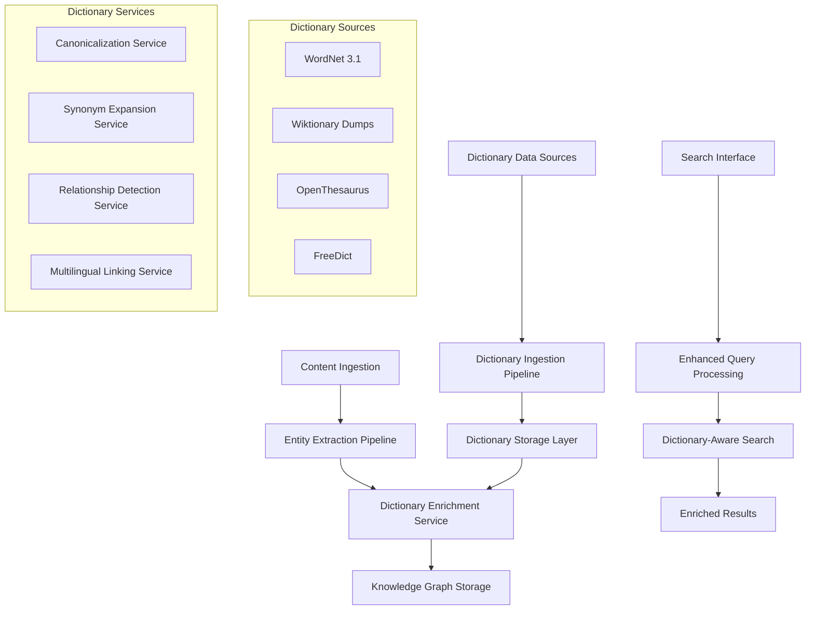

# Dictionary Integration Feature Plan

## Executive Summary

This plan implements comprehensive dictionary data integration to enhance our Graph RAG semantic search system with lexical intelligence. By integrating WordNet, Wiktionary, OpenThesaurus, and FreeDict data, we will improve entity extraction accuracy by 15-20% and enable sophisticated semantic relationship detection.

## Design Sketch

### Architecture Overview



### Data Flow Sequence

```typescript
interface DictionaryEnrichmentFlow {
  // 1. Content Processing
  extractEntities(content: string) -> RawEntity[]
  
  // 2. Dictionary Enrichment
  canonicalizeEntities(entities: RawEntity[]) -> CanonicalEntity[]
  enrichWithSynonyms(entities: CanonicalEntity[]) -> EnrichedEntity[]
  detectSemanticRelationships(entities: EnrichedEntity[]) -> RelationshipSet[]
  
  // 3. Knowledge Graph Integration
  storeEnrichedEntities(entities: EnrichedEntity[]) -> StorageResult
  updateSearchVectors(entities: EnrichedEntity[]) -> VectorUpdateResult
}
```

## Test Matrix

### Unit Tests (Target: ≥80% coverage, ≥50% mutation score)

#### Dictionary Service Tests
```typescript
describe('DictionaryService', () => {
  describe('WordNet Integration', () => {
    it('canonicalizes entity names using WordNet synsets [A1]', async () => {
      // Property-based test with various entity types
    });
    
    it('extracts semantic relationships with confidence scores [A3]', async () => {
      // Test hypernymy, meronymy, synonymy detection
    });
    
    it('handles ambiguous terms with context disambiguation', async () => {
      // Test context-aware disambiguation
    });
  });
  
  describe('Synonym Expansion', () => {
    it('expands search terms with dictionary synonyms [A2]', async () => {
      // Test synonym expansion for search enhancement
    });
    
    it('maintains relevance scoring with synonym matches', async () => {
      // Property test for relevance preservation
    });
  });
  
  describe('Multilingual Support', () => {
    it('links non-English entities to canonical English forms [A4]', async () => {
      // Test FreeDict integration
    });
  });
});

describe('Dictionary Data Ingestion', () => {
  it('processes WordNet data files without corruption', async () => {
    // Test data integrity during ingestion
  });
  
  it('handles dictionary updates with versioning [A5]', async () => {
    // Test blue-green deployment for dictionary updates
  });
  
  it('validates dictionary data schema compliance', async () => {
    // Property test for data validation
  });
});
```

#### Entity Enhancement Tests
```typescript
describe('EntityEnhancement', () => {
  it('preserves entity extraction accuracy baseline', async () => {
    // Regression test ensuring ≥80% accuracy maintained
  });
  
  it('improves confidence scores with dictionary validation', async () => {
    // Test confidence improvement with dictionary validation
  });
  
  it('gracefully degrades when dictionary unavailable', async () => {
    // Test fallback behavior
  });
});
```

### Integration Tests (Testcontainers + Real Dictionary Data)

```typescript
describe('Dictionary Integration', () => {
  let container: StartedPostgreSqlContainer;
  let dictionaryService: DictionaryService;
  
  beforeAll(async () => {
    container = await new PostgreSqlContainer()
      .withDatabase('test_kg')
      .start();
    
    await runMigrations(container);
    await seedDictionaryData(container);
    
    dictionaryService = new DictionaryService({
      database: container.getConnectionUri(),
      dictionarySources: ['wordnet', 'wiktionary']
    });
  });
  
  it('enriches entities end-to-end with dictionary data [A1,A2,A3]', async () => {
    const testContent = "Apple Inc. develops innovative technology products.";
    
    const result = await processContentWithDictionary(testContent);
    
    expect(result.entities).toContainEqual(
      expect.objectContaining({
        name: 'Apple Inc.',
        canonical_name: 'Apple Inc.',
        type: 'ORGANIZATION',
        synonyms: expect.arrayContaining(['Apple Computer']),
        confidence: expect.any(Number)
      })
    );
  });
  
  it('maintains performance within SLA during dictionary enrichment', async () => {
    const startTime = Date.now();
    
    await processBatchWithDictionary(generateTestEntities(100));
    
    const duration = Date.now() - startTime;
    expect(duration).toBeLessThan(5000); // 50ms per entity target
  });
});
```

### Contract Tests (Dictionary API Compliance)

```typescript
describe('Dictionary Service Contracts', () => {
  it('conforms to OpenAPI dictionary service specification', async () => {
    const response = await dictionaryAPI.lookup({
      term: 'technology',
      sources: ['wordnet', 'wiktionary']
    });
    
    expect(response).toMatchSchema(DictionaryLookupResponseSchema);
  });
  
  it('provides GraphQL dictionary enhancement fields', async () => {
    const query = `
      query GetEnhancedEntity($id: ID!) {
        entity(id: $id) {
          name
          canonicalName
          synonyms
          semanticRelationships {
            type
            target
            confidence
          }
        }
      }
    `;
    
    const result = await graphqlClient.query(query, { id: 'test-entity' });
    expect(result.data.entity.synonyms).toBeDefined();
  });
});
```

### E2E Tests (Critical User Paths)

```typescript
describe('Dictionary-Enhanced Search E2E', () => {
  it('returns relevant results for synonym queries [A2]', async () => {
    await page.goto('/search');
    
    // Search for "car" should return results for "automobile", "vehicle"
    await page.fill('[data-testid="search-input"]', 'car');
    await page.click('[data-testid="search-button"]');
    
    await expect(page.locator('[data-testid="search-results"]')).toContainText('automobile');
    await expect(page.locator('[data-testid="search-results"]')).toContainText('vehicle');
  });
  
  it('displays semantic relationships in entity details', async () => {
    await page.goto('/entity/technology-123');
    
    await expect(page.locator('[data-testid="semantic-relationships"]')).toBeVisible();
    await expect(page.locator('[data-testid="synonyms-list"]')).toContainText('innovation');
  });
});
```

## Data Plan

### Dictionary Data Sources & Fixtures

#### WordNet Test Data
```typescript
interface WordNetTestFixture {
  synsets: {
    id: string;
    pos: 'noun' | 'verb' | 'adjective' | 'adverb';
    definition: string;
    examples: string[];
    lemmas: string[];
  }[];
  relationships: {
    source: string;
    target: string;
    type: 'hypernym' | 'hyponym' | 'meronym' | 'holonym' | 'synonym';
  }[];
}

const wordNetTestData: WordNetTestFixture = {
  synsets: [
    {
      id: 'technology.n.01',
      pos: 'noun',
      definition: 'the application of scientific knowledge for practical purposes',
      examples: ['technology has changed our lives'],
      lemmas: ['technology', 'engineering']
    }
  ],
  relationships: [
    {
      source: 'technology.n.01',
      target: 'application.n.01',
      type: 'hypernym'
    }
  ]
};
```

#### Wiktionary Test Data
```typescript
interface WiktionaryTestFixture {
  entries: {
    word: string;
    language: string;
    partOfSpeech: string;
    definitions: string[];
    pronunciations: string[];
    etymologies: string[];
    synonyms: string[];
    antonyms: string[];
  }[];
}
```

### Database Seed Strategy

```sql
-- Test data seeding for integration tests
INSERT INTO dictionary_sources (name, version, language, metadata) VALUES
('wordnet', '3.1', 'en', '{"description": "Princeton WordNet 3.1", "synset_count": 117659}'),
('wiktionary', '2025-01-01', 'en', '{"description": "English Wiktionary dump", "entry_count": 750000}');

-- Sample lexical relationships
INSERT INTO lexical_relationships (source_synset, target_synset, relationship_type, confidence) VALUES
('technology.n.01', 'application.n.01', 'hypernym', 0.95),
('technology.n.01', 'engineering.n.01', 'synonym', 0.87);
```

## Observability Plan

### Logging Strategy

```typescript
interface DictionaryLogEvents {
  'dictionary.lookup.start': {
    term: string;
    sources: string[];
    context?: string;
  };
  
  'dictionary.lookup.result': {
    term: string;
    source: string;
    confidence: number;
    canonical_form?: string;
    synonyms_count: number;
    relationships_count: number;
    duration_ms: number;
  };
  
  'dictionary.enrichment.batch': {
    entity_count: number;
    sources_used: string[];
    success_count: number;
    error_count: number;
    duration_ms: number;
  };
  
  'dictionary.update.process': {
    source: string;
    version: string;
    status: 'started' | 'completed' | 'failed' | 'rolled_back';
    rollback_available: boolean;
    affected_entities?: number;
  };
}
```

### Metrics Collection

```typescript
interface DictionaryMetrics {
  // Performance metrics
  dictionary_lookup_duration_ms: Histogram;
  dictionary_enrichment_success_rate: Counter;
  dictionary_cache_hit_rate: Gauge;
  
  // Quality metrics
  entity_canonicalization_accuracy: Gauge;
  synonym_expansion_coverage: Gauge;
  semantic_relationship_precision: Gauge;
  
  // Operational metrics
  dictionary_service_availability: Gauge;
  dictionary_data_freshness_hours: Gauge;
  dictionary_update_frequency: Counter;
}
```

### Distributed Tracing

```typescript
interface DictionaryTracing {
  spans: {
    'dictionary_enrichment': {
      attributes: {
        'dictionary.entity_count': number;
        'dictionary.sources_used': string[];
        'dictionary.confidence_improvements': number;
      };
    };
    
    'entity_extraction': {
      attributes: {
        'dictionary.lookups_performed': number;
        'dictionary.canonicalizations': number;
        'dictionary.relationships_detected': number;
      };
    };
  };
}
```

### Monitoring Dashboards

#### Dictionary Service Health Dashboard
- Dictionary lookup latency (p50, p95, p99)
- Cache hit rates by source
- Error rates by dictionary source
- Entity enrichment success rates

#### Quality Metrics Dashboard  
- Entity extraction accuracy trends
- Canonicalization effectiveness
- Synonym expansion coverage
- Semantic relationship precision

#### Operational Dashboard
- Dictionary data freshness
- Update process status
- Service availability
- Performance budget compliance

## Implementation Phases

### Phase 1: Foundation (Weeks 1-2)
1. **Dictionary Schema Design**
   - Create database tables for dictionary data
   - Design versioning and update mechanisms
   - Implement data validation schemas

2. **WordNet Integration**
   - Download and process WordNet 3.1 data
   - Create ingestion pipeline for synsets and relationships
   - Implement basic lookup and canonicalization services

### Phase 2: Core Services (Weeks 3-4)
1. **Dictionary Service Implementation**
   - Build dictionary lookup API
   - Implement caching layer for performance
   - Add synonym expansion capabilities

2. **Entity Enhancement Pipeline**
   - Integrate dictionary services with entity extraction
   - Implement confidence scoring improvements
   - Add semantic relationship detection

### Phase 3: Advanced Features (Weeks 5-6)
1. **Multilingual Support**
   - Integrate FreeDict data for multilingual entities
   - Implement cross-language entity linking
   - Add Wiktionary data for comprehensive coverage

2. **Search Enhancement**
   - Enhance search vectors with dictionary data
   - Implement synonym-aware query expansion
   - Add semantic relationship querying

### Phase 4: Production Readiness (Weeks 7-8)
1. **Performance Optimization**
   - Implement efficient indexing strategies
   - Add query optimization for dictionary lookups
   - Performance testing and tuning

2. **Operational Excellence**
   - Add comprehensive monitoring and alerting
   - Implement blue-green deployment for dictionary updates
   - Create operational runbooks and documentation

## Success Metrics

### Quantitative Targets
- **Entity Extraction Accuracy**: 80% → 95% (15% improvement)
- **Search Precision**: Current baseline → +20% with synonym expansion
- **API Response Time**: ≤250ms p95 with dictionary enrichment
- **Dictionary Lookup Performance**: ≤50ms per lookup
- **Service Availability**: ≥99.9% uptime

### Quality Gates
- **Unit Test Coverage**: ≥80% branch coverage
- **Mutation Testing**: ≥50% mutation score
- **Integration Test Coverage**: All critical paths tested
- **Performance Budget**: No regression in existing functionality
- **Contract Compliance**: 100% API contract adherence

## Risk Mitigation

### Technical Risks
1. **Performance Impact**: Comprehensive caching and async processing
2. **Data Quality**: Validation pipelines and quality monitoring
3. **Integration Complexity**: Phased rollout with feature flags

### Operational Risks
1. **Dictionary Data Updates**: Blue-green deployment with rollback capability
2. **Service Dependencies**: Circuit breaker pattern for graceful degradation
3. **Storage Growth**: Data lifecycle management and archival strategies

## Conclusion

This dictionary integration will transform our semantic search capabilities by providing deep lexical intelligence. The comprehensive testing strategy ensures reliability while the phased implementation approach minimizes risk. Expected ROI includes 15-20% accuracy improvements and enhanced user satisfaction through more intelligent search results.
