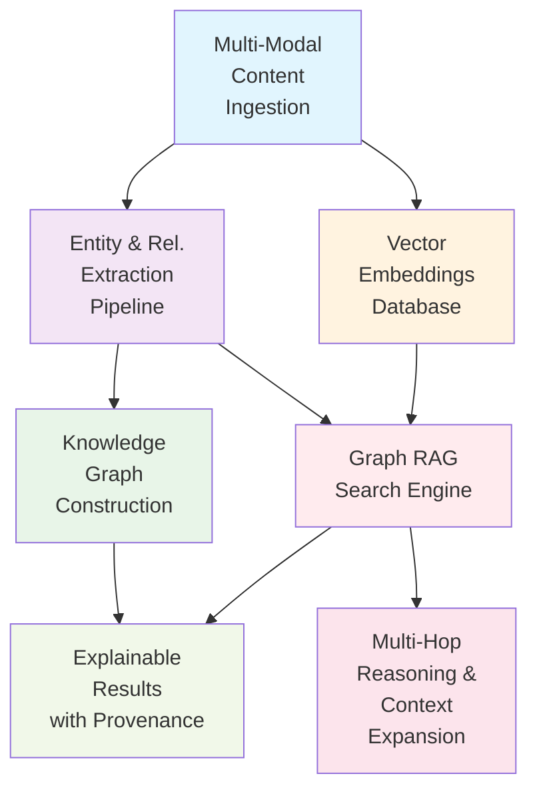

# Graph RAG-Enhanced Semantic Search System - Implementation Plan

## Executive Summary

This plan implements a Graph RAG-enhanced semantic search system that combines vector similarity with knowledge graph traversal to provide contextually rich, explainable search results across all content types (PDFs, videos, audio, images, documents).

**Key Innovation**: Hybrid search that leverages both statistical similarity (vectors) and semantic relationships (knowledge graphs) to deliver more accurate and contextual results than traditional RAG systems.

## Design Sketch

### System Architecture



### Core Components

1. **Enhanced Entity Extraction Pipeline**
   - Multi-modal entity recognition (text, audio transcripts, OCR)
   - Confidence scoring and validation
   - Entity deduplication and canonicalization

2. **Knowledge Graph Construction**
   - Real-time graph updates during ingestion
   - Relationship inference and validation
   - Graph consistency maintenance

3. **Hybrid Search Engine**
   - Vector similarity for initial candidate selection
   - Graph traversal for contextual expansion
   - Result fusion and ranking

4. **Multi-Hop Reasoning Engine**
   - Configurable traversal depth (1-3 hops)
   - Relationship strength weighting
   - Path explanation generation

## Test Matrix

### Unit Tests
- **Entity Extraction**: Test confidence scoring, deduplication, multi-modal extraction
- **Graph Construction**: Test relationship inference, consistency validation, atomic updates
- **Search Algorithms**: Test vector+graph fusion, ranking algorithms, performance
- **Multi-Hop Reasoning**: Test path finding, explanation generation, depth limits

### Property-Based Tests
- **Graph Consistency**: Ensure entity uniqueness across content types
- **Search Performance**: Verify P95 latency under various graph sizes
- **Relationship Transitivity**: Test logical consistency of inferred relationships

### Integration Tests
- **End-to-End Search**: Real content ingestion → graph construction → search results
- **Multi-Modal Integration**: Test entity linking across PDFs, videos, audio, images
- **Performance Under Load**: Concurrent searches with large knowledge graphs

### Contract Tests
- **Search API**: OpenAPI contract validation for all search endpoints
- **Knowledge Graph Schema**: GraphQL schema validation for graph queries
- **Entity Extraction**: Validate entity/relationship data structures

## Data Plan

### Knowledge Graph Schema

```typescript
interface Entity {
  id: string;              // Unique identifier across all content types
  type: EntityType;        // PERSON, ORGANIZATION, CONCEPT, TECHNOLOGY, etc.
  name: string;           // Canonical name
  aliases: string[];      // Alternative names/mentions
  confidence: number;     // Extraction confidence (0-1)
  embedding: number[];    // Vector representation
  metadata: {
    sourceFiles: string[];     // Files where entity was found
    extractionMethod: string;  // OCR, speech-to-text, text, etc.
    firstSeen: Date;
    lastUpdated: Date;
  };
}

interface Relationship {
  id: string;
  sourceEntityId: string;
  targetEntityId: string;
  type: RelationshipType;  // WORKS_FOR, RELATED_TO, PART_OF, etc.
  confidence: number;
  strength: number;        // Relationship importance (0-1)
  evidence: {
    sourceChunks: string[];  // Text chunks supporting this relationship
    extractionContext: string;
    cooccurrenceCount: number;
  };
}
```

### Test Data Factories

```typescript
// Entity factory with realistic variations
const entityFactory = () => ({
  id: `entity_${uuid()}`,
  type: fc.constantFrom('PERSON', 'ORGANIZATION', 'CONCEPT', 'TECHNOLOGY'),
  name: fc.string({ minLength: 3, maxLength: 50 }),
  confidence: fc.float({ min: 0.7, max: 1.0 }),
  embedding: fc.array(fc.float({ min: -1, max: 1 }), { minLength: 768, maxLength: 768 })
});

// Relationship factory ensuring valid entity references
const relationshipFactory = (entities: Entity[]) => ({
  sourceEntityId: fc.constantFrom(...entities.map(e => e.id)),
  targetEntityId: fc.constantFrom(...entities.map(e => e.id)),
  type: fc.constantFrom('WORKS_FOR', 'RELATED_TO', 'PART_OF', 'MENTIONS'),
  confidence: fc.float({ min: 0.7, max: 1.0 }),
  strength: fc.float({ min: 0.1, max: 1.0 })
});
```

## Observability Plan

### Logging Strategy
```typescript
// Search query logging with structured data
logger.info("graph_rag_search_initiated", {
  queryId: uuid(),
  query: sanitizedQuery,
  userId: userId,
  searchType: "hybrid", // vector, graph, hybrid
  timestamp: new Date().toISOString()
});

// Entity extraction logging
logger.info("entity_extraction_completed", {
  fileId: fileId,
  contentType: "pdf|video|audio|image|document",
  entitiesExtracted: entities.length,
  relationshipsInferred: relationships.length,
  averageConfidence: avgConfidence,
  processingTimeMs: processingTime
});

// Graph traversal logging
logger.info("graph_traversal_executed", {
  queryId: queryId,
  startingEntities: startEntities.map(e => e.id),
  maxHops: maxHops,
  nodesVisited: visitedNodes.length,
  pathsFound: paths.length,
  traversalTimeMs: traversalTime
});
```

### Metrics Collection
```typescript
// Search performance metrics
searchDurationHistogram.observe(
  { query_type: "hybrid", hop_depth: hopDepth }, 
  searchDuration
);

// Knowledge graph growth metrics
knowledgeGraphSizeGauge.set(
  { entity_type: entityType }, 
  entityCount
);

// Entity extraction quality metrics
entityExtractionConfidenceHistogram.observe(
  { content_type: contentType }, 
  averageConfidence
);
```

### Distributed Tracing
```typescript
// Main search span with detailed attributes
const searchSpan = tracer.startSpan("graph_rag_search", {
  attributes: {
    "search.query": query,
    "search.user_id": userId,
    "search.type": "hybrid"
  }
});

// Child spans for each phase
const vectorSearchSpan = tracer.startSpan("vector_similarity_search", { parent: searchSpan });
const graphTraversalSpan = tracer.startSpan("graph_traversal", { parent: searchSpan });
const resultFusionSpan = tracer.startSpan("result_fusion_ranking", { parent: searchSpan });
```

## Implementation Phases

### Phase 1: Knowledge Graph Foundation (Week 1)
**Goal**: Establish core knowledge graph infrastructure

**Deliverables**:
- [ ] Enhanced entity extraction from existing processors
- [ ] Knowledge graph database schema and migrations
- [ ] Entity deduplication and canonicalization algorithms
- [ ] Basic relationship inference from co-occurrence
- [ ] Unit tests for all core graph operations

**Acceptance Criteria**:
- Entities extracted from multi-modal content with ≥0.7 confidence
- Graph consistency maintained across all content types
- Entity deduplication accuracy ≥95% for exact and fuzzy matches

### Phase 2: Hybrid Search Engine (Week 2)
**Goal**: Implement vector + graph hybrid search

**Deliverables**:
- [ ] Hybrid search algorithm combining vector similarity and graph traversal
- [ ] Multi-hop reasoning with configurable depth limits
- [ ] Result ranking algorithm incorporating relationship strength
- [ ] Search API with OpenAPI contract
- [ ] Integration tests with real multi-modal content

**Acceptance Criteria**:
- Search P95 latency ≤500ms for queries with ≤3 hops
- Hybrid search results demonstrate improved relevance over vector-only
- Multi-hop reasoning provides explainable relationship chains

### Phase 3: Explainable Results & Optimization (Week 3)
**Goal**: Add result explanation and performance optimization

**Deliverables**:
- [ ] Result provenance tracking and explanation generation
- [ ] Query optimization for large knowledge graphs
- [ ] Performance monitoring and alerting
- [ ] GraphQL API for knowledge graph exploration
- [ ] E2E tests covering complete user journeys

**Acceptance Criteria**:
- All search results include explainable relationship provenance
- System handles knowledge graphs with 10K+ entities efficiently
- Query complexity limits prevent DoS attacks

### Phase 4: Advanced Features & Production Readiness (Week 4)
**Goal**: Production deployment and advanced capabilities

**Deliverables**:
- [ ] Real-time knowledge graph updates during content ingestion
- [ ] Advanced relationship inference using graph algorithms
- [ ] Comprehensive monitoring dashboard
- [ ] Feature flags and graceful degradation
- [ ] Performance benchmarking and optimization

**Acceptance Criteria**:
- Zero-downtime knowledge graph updates
- Graceful degradation to vector-only search if graph unavailable
- Production monitoring covers all critical metrics

## Risk Assessment & Mitigation

### High Risk: Performance at Scale
**Risk**: Graph traversal becomes slow with large knowledge graphs
**Mitigation**: 
- Implement graph indexing and caching strategies
- Use configurable hop limits and result size limits
- Add query complexity analysis and rejection
- Implement graph partitioning for very large datasets

### Medium Risk: Entity Disambiguation
**Risk**: Same entities extracted with different names/forms
**Mitigation**:
- Implement fuzzy matching and similarity scoring
- Use canonical entity resolution with confidence thresholds
- Add manual entity merging capabilities for edge cases
- Maintain entity alias tracking and resolution

### Medium Risk: Relationship Quality
**Risk**: Inferred relationships may be spurious or low-quality
**Mitigation**:
- Implement confidence scoring for all relationships
- Use multiple evidence sources for relationship validation
- Add relationship strength weighting based on co-occurrence frequency
- Implement relationship pruning for low-confidence connections

## Success Metrics

### Functional Metrics
- **Search Relevance**: 20% improvement in user satisfaction vs. vector-only search
- **Result Explainability**: 100% of results include relationship provenance
- **Multi-Modal Coverage**: Entities successfully linked across all content types

### Performance Metrics
- **Search Latency**: P95 ≤500ms for hybrid searches with ≤3 hops
- **Throughput**: Support 100 concurrent searches without degradation
- **Knowledge Graph Growth**: Handle 10K+ entities with sub-second query response

### Quality Metrics
- **Entity Extraction Accuracy**: ≥90% precision, ≥85% recall
- **Relationship Inference Quality**: ≥80% of relationships validated as meaningful
- **System Reliability**: 99.9% uptime with graceful degradation

## Rollback Strategy

### Feature Flags
```typescript
// Primary feature flag for Graph RAG search
const ENABLE_GRAPH_RAG_SEARCH = process.env.ENABLE_GRAPH_RAG_SEARCH === 'true';

// Granular feature flags for specific components
const ENABLE_MULTI_HOP_REASONING = process.env.ENABLE_MULTI_HOP_REASONING === 'true';
const ENABLE_REAL_TIME_GRAPH_UPDATES = process.env.ENABLE_REAL_TIME_GRAPH_UPDATES === 'true';
```

### Graceful Degradation
- If knowledge graph unavailable → fall back to vector-only search
- If graph traversal times out → return vector results with warning
- If entity extraction fails → continue with text-only processing

### Database Rollback
- All migrations include corresponding rollback scripts
- Knowledge graph tables can be dropped without affecting core functionality
- Vector embeddings remain functional independently

## Known Limitations & Future Work

### Current Limitations
- **Graph Visualization**: No UI for exploring knowledge graph structure
- **External Knowledge**: No integration with external knowledge bases (Wikipedia, etc.)
- **Multi-Tenant Isolation**: Single knowledge graph shared across all users
- **Advanced Graph Algorithms**: No PageRank, community detection, or centrality measures

### Future Enhancements
- **Interactive Graph Exploration**: Web-based knowledge graph visualization
- **External Knowledge Integration**: Link entities to Wikipedia, Wikidata, etc.
- **Collaborative Knowledge Curation**: Allow users to validate/correct entity relationships
- **Advanced Analytics**: Graph-based insights and pattern discovery
- **Multi-Language Support**: Entity extraction and relationship inference in multiple languages

This implementation plan provides a comprehensive roadmap for building a production-ready Graph RAG-enhanced semantic search system that significantly improves upon traditional vector-only approaches while maintaining explainability and performance.
