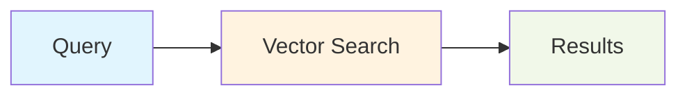
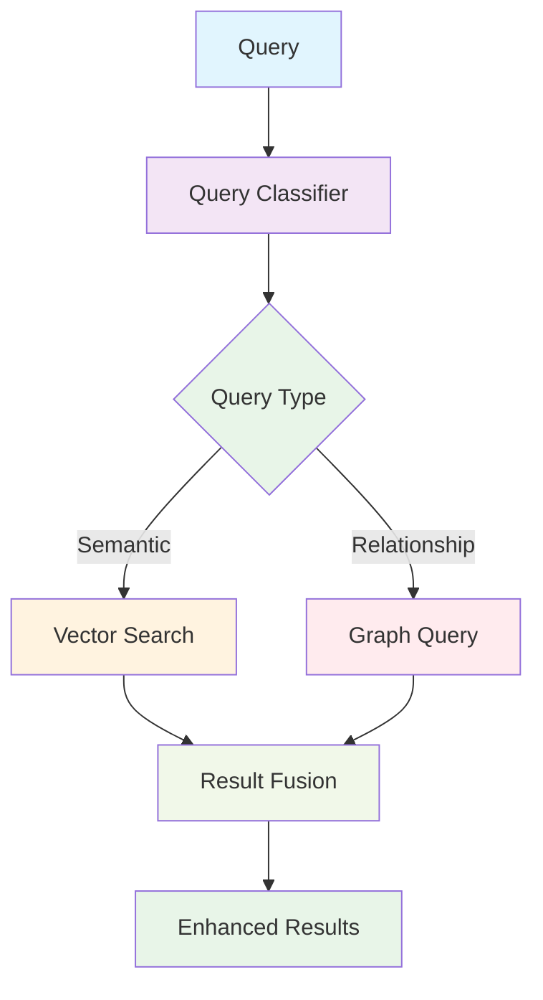

# Graph Query Patterns Implementation Guide

## Architecture Overview

### Integration with Current System

#### Current Search Pipeline


#### Enhanced Pipeline


### Component Architecture
```typescript
interface GraphQuerySystem {
  parser: QueryParser;
  classifier: QueryClassifier;
  executor: GraphQueryExecutor;
  enhancer: ResultEnhancer;
  cache: QueryCache;
  monitor: PerformanceMonitor;
}
```

## Implementation Phases

### Phase 1: Foundation (Query Classification)

#### Query Intent Classification
```typescript
class QueryClassifier {
  classifyIntent(query: string): QueryIntent {
    const features = this.extractFeatures(query);

    // Rule-based classification
    if (this.isRelationshipQuery(features)) {
      return { type: 'relationship', confidence: 0.8 };
    }

    if (this.isComparisonQuery(features)) {
      return { type: 'comparison', confidence: 0.7 };
    }

    if (this.isEntityQuery(features)) {
      return { type: 'entity', confidence: 0.6 };
    }

    return { type: 'semantic', confidence: 0.5 };
  }

  private extractFeatures(query: string): QueryFeatures {
    return {
      hasRelationshipKeywords: /\b(related|connected|works|uses|collaborates)\b/i.test(query),
      hasComparisonKeywords: /\b(compare|vs|versus|difference|similar)\b/i.test(query),
      hasEntityKeywords: /\b(what|who|show|find)\b/i.test(query),
      entityMentions: this.extractEntityMentions(query),
      relationshipIndicators: this.extractRelationshipIndicators(query)
    };
  }
}
```

#### Basic Query Parser
```typescript
class BasicQueryParser {
  parse(query: string, intent: QueryIntent): ParsedQuery {
    switch (intent.type) {
      case 'relationship':
        return this.parseRelationshipQuery(query);
      case 'comparison':
        return this.parseComparisonQuery(query);
      case 'entity':
        return this.parseEntityQuery(query);
      default:
        return { type: 'semantic', originalQuery: query };
    }
  }

  private parseRelationshipQuery(query: string): RelationshipQuery {
    // Extract entities and relationship types
    const entities = this.extractEntities(query);
    const relationshipType = this.inferRelationshipType(query);

    return {
      type: 'relationship',
      entities,
      relationshipType,
      direction: this.inferDirection(query)
    };
  }
}
```

### Phase 2: Core Graph Operations

#### Graph Data Structure
```typescript
class KnowledgeGraph {
  private entities: Map<string, Entity> = new Map();
  private relationships: Map<string, Relationship[]> = new Map();
  private indexes: GraphIndexes;

  constructor() {
    this.indexes = {
      byEntity: new Map(),
      byType: new Map(),
      byStrength: new SortedIndex()
    };
  }

  // Core graph operations
  addEntity(entity: Entity): void {
    this.entities.set(entity.id, entity);
    this.updateIndexes(entity);
  }

  addRelationship(relationship: Relationship): void {
    const sourceRels = this.relationships.get(relationship.sourceId) || [];
    sourceRels.push(relationship);
    this.relationships.set(relationship.sourceId, sourceRels);

    if (relationship.bidirectional) {
      const reverseRel = this.createReverseRelationship(relationship);
      const targetRels = this.relationships.get(relationship.targetId) || [];
      targetRels.push(reverseRel);
      this.relationships.set(relationship.targetId, targetRels);
    }

    this.updateRelationshipIndexes(relationship);
  }

  // Query operations
  getEntity(id: string): Entity | undefined {
    return this.entities.get(id);
  }

  getRelationships(entityId: string): Relationship[] {
    return this.relationships.get(entityId) || [];
  }

  findPath(startId: string, endId: string, maxDepth: number = 5): EntityPath[] {
    return this.bfs(startId, endId, maxDepth);
  }
}
```

#### Graph Query Executor
```typescript
class GraphQueryExecutor {
  constructor(private graph: KnowledgeGraph) {}

  async execute(query: ParsedQuery): Promise<QueryResult> {
    switch (query.type) {
      case 'relationship':
        return this.executeRelationshipQuery(query);
      case 'comparison':
        return this.executeComparisonQuery(query);
      case 'entity':
        return this.executeEntityQuery(query);
      default:
        throw new Error(`Unsupported query type: ${query.type}`);
    }
  }

  private async executeRelationshipQuery(query: RelationshipQuery): Promise<RelationshipResult> {
    const startEntity = await this.findEntity(query.entities[0]);

    if (query.relationshipType === 'path') {
      const endEntity = await this.findEntity(query.entities[1]);
      const paths = this.graph.findPath(startEntity.id, endEntity.id);
      return { type: 'paths', paths };
    }

    const relationships = this.graph.getRelationships(startEntity.id)
      .filter(rel => this.matchesRelationshipType(rel, query.relationshipType));

    return {
      type: 'relationships',
      entity: startEntity,
      relationships: this.sortByStrength(relationships)
    };
  }
}
```

### Phase 3: Result Enhancement & Integration

#### Result Fusion Engine
```typescript
class ResultFusionEngine {
  async fuseResults(
    vectorResults: SearchResult[],
    graphResults: GraphQueryResult[],
    originalQuery: string
  ): Promise<FusedResults> {
    // 1. Deduplicate results
    const deduplicated = this.deduplicateResults(vectorResults, graphResults);

    // 2. Calculate fusion scores
    const scored = await this.calculateFusionScores(deduplicated, originalQuery);

    // 3. Re-rank results
    const reranked = this.rerankResults(scored);

    // 4. Add relationship context
    const enhanced = await this.addRelationshipContext(reranked, graphResults);

    return {
      results: enhanced,
      fusionMetadata: {
        vectorResultCount: vectorResults.length,
        graphResultCount: graphResults.length,
        deduplicationRatio: deduplicated.length / (vectorResults.length + graphResults.length)
      }
    };
  }

  private async calculateFusionScores(
    results: SearchResult[],
    query: string
  ): Promise<ScoredResult[]> {
    return Promise.all(results.map(async result => ({
      ...result,
      fusionScore: await this.calculateScore(result, query)
    })));
  }

  private async calculateScore(result: SearchResult, query: string): Promise<number> {
    const vectorScore = result.cosineSimilarity || 0;
    const graphScore = await this.calculateGraphScore(result, query);
    const recencyScore = this.calculateRecencyScore(result);

    // Weighted combination
    return (
      vectorScore * 0.5 +
      graphScore * 0.3 +
      recencyScore * 0.2
    );
  }
}
```

#### Search Integration
```typescript
class EnhancedSearchService extends ObsidianSearchService {
  private graphQuerySystem: GraphQuerySystem;

  async search(query: string, options: SearchOptions = {}): Promise<SearchResponse> {
    // 1. Classify query intent
    const intent = this.graphQuerySystem.classifier.classifyIntent(query);

    // 2. Execute appropriate search strategy
    const [vectorResults, graphResults] = await Promise.all([
      this.shouldUseVectorSearch(intent) ?
        this.vectorSearch.search(query, options) :
        Promise.resolve([]),

      this.shouldUseGraphSearch(intent) ?
        this.graphQuerySystem.executor.execute(
          this.graphQuerySystem.parser.parse(query, intent)
        ) :
        Promise.resolve([])
    ]);

    // 3. Fuse and enhance results
    const fusedResults = await this.resultFusionEngine.fuseResults(
      vectorResults,
      graphResults,
      query
    );

    // 4. Generate response
    return {
      query,
      results: fusedResults.results,
      totalFound: fusedResults.results.length,
      latencyMs: Date.now() - startTime,
      facets: await this.generateFacets(fusedResults.results),
      graphInsights: await this.generateGraphInsights(query, fusedResults.results),
      fusionMetadata: fusedResults.fusionMetadata
    };
  }
}
```

## Performance Optimization

### Query Optimization
```typescript
class QueryOptimizer {
  optimize(query: ParsedQuery): OptimizedQuery {
    // 1. Analyze query complexity
    const complexity = this.analyzeComplexity(query);

    // 2. Apply optimization strategies
    if (complexity > this.complexityThreshold) {
      return this.applyApproximations(query);
    }

    // 3. Add execution hints
    return this.addExecutionHints(query);
  }

  private analyzeComplexity(query: ParsedQuery): number {
    let complexity = 1;

    // Factor in traversal depth
    if ('maxDepth' in query) {
      complexity *= query.maxDepth;
    }

    // Factor in result limits
    if ('limit' in query) {
      complexity *= Math.log(query.limit + 1);
    }

    // Factor in relationship types
    if ('relationshipTypes' in query) {
      complexity *= query.relationshipTypes.length;
    }

    return complexity;
  }
}
```

### Caching Strategy
```typescript
class GraphQueryCache {
  private cache = new Map<string, CachedResult>();

  async get(query: ParsedQuery): Promise<CachedResult | null> {
    const key = this.generateCacheKey(query);
    const cached = this.cache.get(key);

    if (cached && this.isValid(cached)) {
      return cached;
    }

    return null;
  }

  async set(query: ParsedQuery, result: QueryResult): Promise<void> {
    const key = this.generateCacheKey(query);
    const cachedResult: CachedResult = {
      result,
      timestamp: Date.now(),
      ttl: this.calculateTTL(query)
    };

    this.cache.set(key, cachedResult);

    // Evict expired entries
    this.evictExpired();
  }

  private generateCacheKey(query: ParsedQuery): string {
    // Create deterministic key from query properties
    return JSON.stringify(query, Object.keys(query).sort());
  }

  private calculateTTL(query: ParsedQuery): number {
    // Shorter TTL for time-sensitive queries
    if (query.type === 'recent-activity') {
      return 5 * 60 * 1000; // 5 minutes
    }

    // Longer TTL for stable relationship queries
    return 30 * 60 * 1000; // 30 minutes
  }
}
```

### Monitoring & Observability
```typescript
class GraphQueryMonitor {
  recordQuery(query: ParsedQuery, duration: number, resultCount: number): void {
    // Record metrics
    this.metrics.record('graph_query_duration', duration, {
      query_type: query.type,
      result_count: resultCount
    });

    // Log slow queries
    if (duration > this.slowQueryThreshold) {
      this.logger.warn('Slow graph query', {
        query,
        duration,
        resultCount
      });
    }
  }

  recordCacheHit(queryType: string): void {
    this.metrics.increment('graph_query_cache_hit', { query_type: queryType });
  }

  recordError(query: ParsedQuery, error: Error): void {
    this.logger.error('Graph query error', {
      query,
      error: error.message,
      stack: error.stack
    });

    this.metrics.increment('graph_query_error', {
      query_type: query.type,
      error_type: error.constructor.name
    });
  }
}
```

## Testing Strategy

### Unit Testing
```typescript
describe('GraphQueryParser', () => {
  it('parses relationship queries correctly', () => {
    const parser = new GraphQueryParser();

    const result = parser.parse("What projects use React?");

    expect(result).toEqual({
      type: 'entity-context',
      entity: 'React',
      relationship: 'uses',
      direction: 'incoming'
    });
  });

  it('handles ambiguous queries gracefully', () => {
    const parser = new GraphQueryParser();

    const result = parser.parse("Show me stuff");

    expect(result.type).toBe('semantic');
  });
});
```

### Integration Testing
```typescript
describe('Graph Query Integration', () => {
  let graph: KnowledgeGraph;
  let executor: GraphQueryExecutor;

  beforeEach(async () => {
    graph = new KnowledgeGraph();
    executor = new GraphQueryExecutor(graph);

    // Set up test data
    await setupTestGraph(graph);
  });

  it('finds relationships correctly', async () => {
    const query = {
      type: 'entity-relations',
      entity: 'React',
      maxDepth: 2
    };

    const result = await executor.execute(query);

    expect(result.relationships).toHaveLength(3);
    expect(result.relatedEntities).toContain('Frontend');
  });

  it('respects depth limits', async () => {
    const query = {
      type: 'entity-relations',
      entity: 'React',
      maxDepth: 1
    };

    const result = await executor.execute(query);

    // Ensure no deep relationships are returned
    const maxDepth = Math.max(...result.relationships.map(r => r.depth));
    expect(maxDepth).toBeLessThanOrEqual(1);
  });
});
```

### Performance Testing
```typescript
describe('Graph Query Performance', () => {
  it('executes simple queries within time limits', async () => {
    const query = createSimpleRelationshipQuery();

    const startTime = Date.now();
    const result = await executor.execute(query);
    const duration = Date.now() - startTime;

    expect(duration).toBeLessThan(100); // 100ms limit
    expect(result.relationships).toBeDefined();
  });

  it('handles complex queries efficiently', async () => {
    const query = createComplexPathQuery();

    const startTime = Date.now();
    const result = await executor.execute(query);
    const duration = Date.now() - startTime;

    expect(duration).toBeLessThan(500); // 500ms limit
  });

  it('scales with graph size', async () => {
    // Test with different graph sizes
    const sizes = [100, 1000, 10000];

    for (const size of sizes) {
      const testGraph = await createTestGraph(size);
      const query = createBenchmarkQuery();

      const startTime = Date.now();
      await executor.execute(query);
      const duration = Date.now() - startTime;

      // Duration should grow sub-linearly
      expect(duration).toBeLessThan(size * 0.1);
    }
  });
});
```

## Deployment & Rollback

### Gradual Rollout
1. **Feature Flag**: Enable graph queries for beta users only
2. **A/B Testing**: Compare search metrics with/without graph features
3. **Monitoring**: Track performance impact and error rates
4. **User Feedback**: Collect feedback on new query capabilities

### Rollback Strategy
- **Feature Flag**: Can disable graph features instantly
- **Fallback**: Automatic fallback to vector-only search
- **Data Cleanup**: Remove graph-specific caches and indexes
- **Monitoring**: Alert on any degradation after disabling

### Production Considerations
- **Resource Limits**: Set CPU and memory limits for graph operations
- **Timeout Handling**: Prevent runaway queries from affecting service
- **Error Boundaries**: Isolate graph failures from main search functionality
- **Metrics**: Comprehensive monitoring of graph query performance
