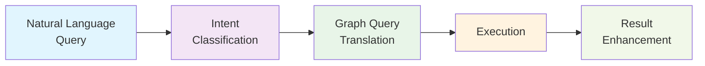

# Graph Query Patterns

## Purpose
Add natural language to graph query translation capabilities to enhance relationship discovery and navigation within the current vector-first search architecture.

## Current State
- **Query Processing**: Basic keyword and semantic search
- **Relationship Discovery**: Tag co-occurrence and wikilink analysis
- **Result Enhancement**: Related chunks and basic graph context
- **Navigation**: Limited to direct links and tag-based clustering

## Proposed Enhancements

### Natural Language Query Translation
- **Intent Recognition**: Understand user intent beyond keywords
- **Relationship Queries**: "What projects use React?" → graph traversals
- **Contextual Queries**: "Show me John's recent work" → temporal + relationship filtering
- **Comparative Queries**: "Compare approach A vs B" → multi-entity analysis

### Graph Traversal Capabilities
- **Multi-hop Navigation**: Find indirect relationships and connections
- **Path Finding**: Discover shortest paths between concepts
- **Subgraph Extraction**: Focus on relevant portions of the knowledge graph
- **Pattern Matching**: Find specific relationship patterns

### Enhanced Search Features
- **Relationship-Aware Ranking**: Boost results based on graph connections
- **Contextual Expansion**: Expand queries using related concepts
- **Knowledge Gap Detection**: Identify missing connections
- **Trend Analysis**: Track relationship changes over time

## Performance Considerations
- **Query Complexity**: Graph traversals can be computationally expensive
- **Result Boundedness**: Limit traversal depth and breadth
- **Caching Strategy**: Cache frequent relationship patterns
- **Incremental Updates**: Maintain graph consistency during updates

## Success Metrics
- **Query Understanding**: Percentage of queries successfully translated to graph operations
- **Result Quality**: Improvement in finding relevant related information
- **User Satisfaction**: Reduction in follow-up searches for related content
- **Performance**: Query latency for graph-enhanced searches

## Risk Assessment
**Tier**: 2 (Affects search functionality, data processing)
**Impact**: Medium - enhances search but maintains backward compatibility
**Complexity**: Medium - requires query parsing and graph algorithms

## Technical Approach

### Query Processing Pipeline

### Integration Strategy
1. **Non-disruptive**: Add graph query capabilities alongside existing search
2. **Progressive**: Start with simple relationship queries, expand to complex patterns
3. **Configurable**: Allow users to control graph query depth and complexity
4. **Fallback**: Maintain keyword search when graph queries aren't applicable

## Implementation Considerations

### Query Classification
- **Relationship Queries**: "who works with X", "what uses Y"
- **Comparative Queries**: "compare A and B", "differences between X and Y"
- **Contextual Queries**: "recent work on Z", "X's projects"
- **Navigation Queries**: "related to Y", "connected concepts"

### Graph Operations
- **Traversal Algorithms**: BFS/DFS for relationship exploration
- **Path Finding**: Shortest path between entities
- **Centrality Queries**: Find most important related entities
- **Pattern Matching**: Find specific relationship structures

## Next Steps
1. Analyze common query patterns in current usage
2. Design natural language to graph query mapping
3. Prototype simple relationship queries
4. Measure impact on search performance and user experience
