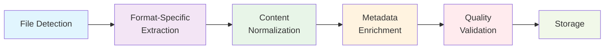

# Multi-Modal Data Handling

## Purpose
Extend the system to extract searchable content and metadata from diverse file types beyond markdown, ensuring all files contribute to the knowledge base regardless of format.

## Current State
- **Supported Formats**: Markdown files with text content
- **Processing**: Wikilink parsing, tag extraction, basic text chunking
- **Storage**: Text content and metadata in vector database
- **Search**: Semantic search across text content

## Proposed Enhancements

### Document Processing
- **Office Documents**: DOCX, XLSX, PPTX with text and table extraction
- **PDF Processing**: Text extraction, layout analysis, image OCR
- **Rich Text**: RTF, HTML content parsing
- **Structured Text**: JSON, XML, CSV data ingestion

### Visual Content Processing
- **Image Analysis**: OCR for text extraction, basic captioning
- **Chart Understanding**: Extract data from charts and graphs
- **Document Images**: Process scanned documents
- **Visual Metadata**: Extract colors, layout, visual features

### Audio & Video Processing
- **Speech Recognition**: Transcribe audio/video content to text
- **Audio Analysis**: Extract keywords, topics, speaker identification
- **Video Processing**: Scene detection, keyframe extraction
- **Multimedia Metadata**: Duration, format, quality information

### Universal Content Extraction
- **Format Detection**: Automatic file type identification
- **Content Classification**: Categorize content by type and purpose
- **Metadata Enrichment**: Extract and normalize metadata across formats
- **Quality Assessment**: Evaluate extraction confidence and completeness

## Performance Considerations
- **Processing Overhead**: Content extraction adds computational cost
- **Storage Impact**: Rich metadata increases storage requirements
- **Search Complexity**: Multi-modal results require specialized ranking
- **Resource Management**: Balance extraction quality vs. processing speed

## Success Metrics
- **Content Coverage**: Percentage of files successfully processed
- **Extraction Accuracy**: Quality of text and metadata extraction
- **Search Enhancement**: Improvement in finding content across formats
- **Processing Efficiency**: Time and resources required for content extraction

## Risk Assessment
**Tier**: 2 (Data processing, affects content ingestion)
**Impact**: Medium - enhances content accessibility but may increase processing time
**Complexity**: High - requires multiple extraction libraries and processing pipelines

## Technical Approach

### Content Processing Pipeline

### Integration Strategy
1. **Modular**: Add content extractors without disrupting existing markdown processing
2. **Progressive**: Start with high-value formats, expand coverage over time
3. **Configurable**: Allow users to control extraction depth and formats
4. **Fallback**: Graceful handling when extraction fails for specific files

## Implementation Considerations

### Content Type Detection
- **MIME Type Analysis**: File extension and content-based detection
- **Format Validation**: Ensure files match expected formats before processing
- **Version Handling**: Support different versions of document formats
- **Corruption Detection**: Identify and skip corrupted files

### Processing Architecture
- **Worker Pool**: Parallel processing of multiple files
- **Batch Processing**: Group similar file types for efficiency
- **Resource Limits**: Control memory and CPU usage per extraction
- **Timeout Handling**: Prevent hanging on problematic files

### Quality Assurance
- **Extraction Validation**: Verify extracted content matches original
- **Confidence Scoring**: Rate extraction quality and reliability
- **Error Recovery**: Handle partial failures gracefully
- **User Feedback**: Allow reporting and correction of extraction issues

## Next Steps
1. Identify most valuable file types in typical Obsidian vaults
2. Evaluate content extraction libraries for TypeScript/Node.js
3. Prototype PDF and Office document processing
4. Measure performance impact on ingestion pipeline
