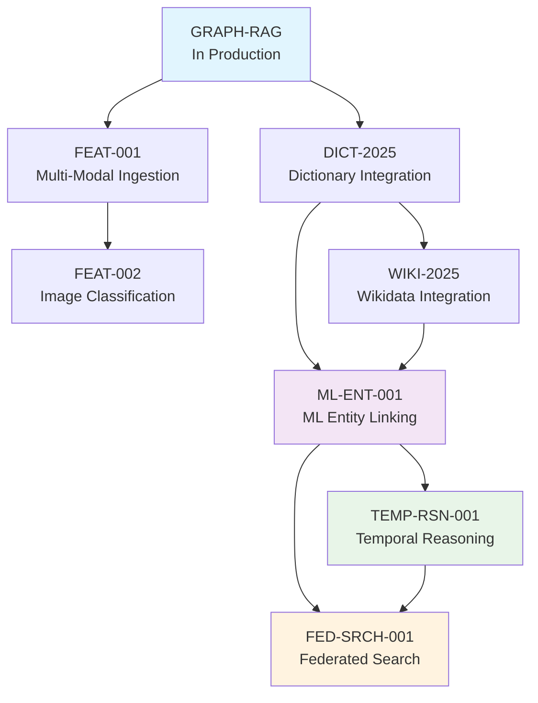
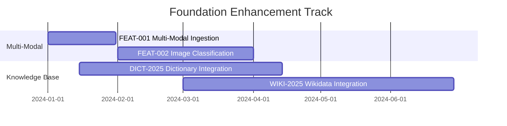
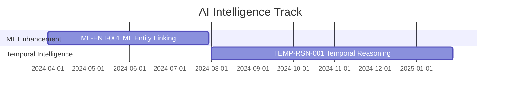
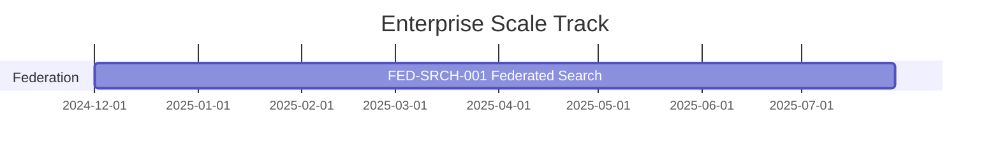

# Unified Feature Integration Strategy

## Executive Summary

We have identified **8 major features** across multiple development tracks that need coordinated implementation to maximize synergies and minimize conflicts. This document provides a comprehensive integration strategy that optimizes the implementation sequence, resource allocation, and technical dependencies.

**Total Features**: 8 features across 3 categories  
**Timeline**: 24 months with parallel development tracks  
**Total Investment**: ~$4-6M development costs  
**Expected ROI**: $35M+ annual value for large enterprises

---

## 1. Complete Feature Landscape

### 1.1 Foundation Features (Tier 2)
These features enhance the core system capabilities:

| Feature ID | Title | Timeline | Dependencies | Risk Level | Status |
|------------|-------|----------|--------------|------------|--------|
| **FEAT-001** | Unified Multi-Modal Ingestion | 1 month | None | Low | **Required** |
| **FEAT-002** | Image Classification & Scene Description | 2 months | FEAT-001 | Medium | **Required** |
| **DICT-2025** | Dictionary Data Integration | 3 months | None | Medium | **Required** |
| **WIKI-2025** | Wikidata JSON Dump Integration | 4 months | DICT-2025 | High | **Optional** |

### 1.2 Advanced Intelligence Features (Tier 2)
These features transform the system into an AI-powered platform:

| Feature ID | Title | Timeline | Dependencies | Risk Level | Status |
|------------|-------|----------|--------------|------------|--------|
| **ML-ENT-001** | ML-Enhanced Entity Linking | 4 months | DICT-2025 (WIKI-2025 optional) | High | **Required** |
| **TEMP-RSN-001** | Temporal Reasoning & Causality | 6 months | ML-ENT-001 | High | **Required** |

### 1.3 Enterprise Scale Features (Tier 2)
These features enable enterprise-wide deployment:

| Feature ID | Title | Timeline | Dependencies | Risk Level | Status |
|------------|-------|----------|--------------|------------|--------|
| **FED-SRCH-001** | Federated Search Integration | 8 months | ML-ENT-001, TEMP-RSN-001 | Very High | **Required** |

### 1.4 Existing Graph RAG Enhancement
| Feature ID | Title | Status | Integration Points |
|------------|-------|--------|-------------------|
| **GRAPH-RAG** | Graph RAG Semantic Search | In Production | Foundation for all features |

---

## 2. Feature Integration Analysis

### 2.1 Dependency Mapping



### 2.2 Integration Synergies

#### High-Synergy Combinations
1. **Dictionary + ML Entity Linking** (Core Enhancement)
   - Dictionary provides lexical relationships and canonicalization
   - ML models leverage dictionary data for enhanced accuracy
   - **Optional**: Wikidata can add comprehensive entity knowledge base if needed

2. **Multi-Modal + Image Classification**
   - Unified ingestion processes images
   - Classification adds semantic understanding
   - Combined: Complete visual content intelligence

3. **ML Entity Linking + Temporal Reasoning**
   - ML provides accurate entity extraction
   - Temporal reasoning analyzes entity evolution
   - Combined: Predictive entity intelligence

4. **All Required Features + Federated Search**
   - Federated search leverages all enhanced capabilities
   - Distributes intelligence across enterprise systems
   - Combined: Enterprise knowledge brain

### 2.3 Potential Conflicts & Resolutions

#### Technical Conflicts
| Conflict | Features | Resolution Strategy |
|----------|----------|-------------------|
| **Entity Schema Evolution** | DICT-2025, ML-ENT-001 (WIKI-2025 optional) | Unified entity schema design upfront |
| **Performance Impact** | All features | Staged rollout with performance budgets |
| **Storage Growth** | TEMP-RSN-001 (WIKI-2025 if implemented) | Tiered storage and archival strategies |
| **Processing Complexity** | FEAT-002, ML-ENT-001 | Resource pooling and queue management |

#### Business Conflicts
| Conflict | Impact | Resolution Strategy |
|----------|--------|-------------------|
| **Resource Competition** | Development velocity | Parallel development tracks with shared components |
| **User Experience Complexity** | Adoption | Progressive feature exposure with training |
| **Performance Expectations** | User satisfaction | Clear performance communication and optimization |

---

## 3. Optimized Implementation Strategy

### 3.1 Parallel Development Tracks

#### Track 1: Foundation Enhancement (Months 1-6)
**Goal**: Enhance core ingestion and knowledge capabilities



#### Track 2: AI Intelligence (Months 4-12)
**Goal**: Transform system with ML and temporal capabilities



#### Track 3: Enterprise Scale (Months 12-24)
**Goal**: Enable enterprise-wide deployment



### 3.2 Resource Allocation Strategy

#### Development Team Structure
```typescript
interface UnifiedDevelopmentTeams {
  foundationTrack: {
    teamSize: 4,
    skills: ['TypeScript', 'PostgreSQL', 'Image Processing', 'Data Engineering'],
    features: ['FEAT-001', 'FEAT-002', 'DICT-2025', 'WIKI-2025']
  },
  
  aiIntelligenceTrack: {
    teamSize: 6,
    skills: ['ML Engineering', 'Python', 'Statistical Analysis', 'Time Series'],
    features: ['ML-ENT-001', 'TEMP-RSN-001']
  },
  
  enterpriseTrack: {
    teamSize: 5,
    skills: ['Distributed Systems', 'Enterprise Integration', 'Security', 'DevOps'],
    features: ['FED-SRCH-001']
  },
  
  sharedServices: {
    teamSize: 3,
    skills: ['Testing', 'DevOps', 'Documentation', 'Quality Assurance'],
    responsibilities: ['CI/CD', 'Testing Infrastructure', 'Documentation', 'Integration Testing']
  }
}
```

#### Budget Allocation
| Track | Team Size | Duration | Cost | ROI Timeline |
|-------|-----------|----------|------|--------------|
| **Foundation** | 4 developers | 6 months | $800K | 6 months |
| **AI Intelligence** | 6 developers | 8 months | $1.6M | 12 months |
| **Enterprise Scale** | 5 developers | 12 months | $2M | 18 months |
| **Shared Services** | 3 developers | 24 months | $1.2M | Ongoing |
| **Total** | 18 developers | 24 months | $5.6M | $35M+ annual value |

---

## 4. Technical Integration Architecture

### 4.1 Unified Data Model

```typescript
// Unified Entity Schema Supporting All Features
interface UnifiedEntity {
  // Core Properties (GRAPH-RAG)
  id: string;
  name: string;
  type: EntityType;
  confidence: number;
  
  // Dictionary Enhancement (DICT-2025)
  dictionaryMetadata?: {
    wordnetSynsets: string[];
    synonyms: string[];
    definitions: string[];
    lexicalRelations: LexicalRelation[];
  };
  
  // Wikidata Enhancement (WIKI-2025)
  wikidataMetadata?: {
    wikidataId: string;
    labels: MultilingualLabels;
    descriptions: MultilingualDescriptions;
    claims: WikidataClaim[];
  };
  
  // ML Enhancement (ML-ENT-001)
  mlMetadata?: {
    modelVersion: string;
    mlConfidence: number;
    disambiguationContext: string;
    knowledgeBaseLinks: KnowledgeBaseLink[];
  };
  
  // Temporal Enhancement (TEMP-RSN-001)
  temporalMetadata?: {
    firstSeen: Date;
    lastSeen: Date;
    evolutionHistory: TemporalState[];
    causalRelationships: CausalRelation[];
  };
  
  // Multi-Modal Enhancement (FEAT-001, FEAT-002)
  multiModalMetadata?: {
    imageReferences: ImageReference[];
    sceneDescriptions: SceneDescription[];
    ocrText: string[];
  };
  
  // Federation Metadata (FED-SRCH-001)
  federationMetadata?: {
    sourceSystems: string[];
    crossSystemMappings: CrossSystemMapping[];
    conflictResolutions: ConflictResolution[];
  };
}
```

### 4.2 Shared Infrastructure Components

```typescript
// Unified Processing Pipeline
interface UnifiedProcessingPipeline {
  // Ingestion Layer
  ingestionManager: {
    multiModalProcessor: MultiModalProcessor;    // FEAT-001, FEAT-002
    textProcessor: TextProcessor;                // All features
    imageProcessor: ImageProcessor;              // FEAT-002
  };
  
  // Enhancement Layer
  enhancementManager: {
    dictionaryEnhancer: DictionaryEnhancer;      // DICT-2025
    wikidataEnhancer: WikidataEnhancer;          // WIKI-2025
    mlEntityLinker: MLEntityLinker;              // ML-ENT-001
    temporalAnalyzer: TemporalAnalyzer;          // TEMP-RSN-001
  };
  
  // Storage Layer
  storageManager: {
    knowledgeGraph: KnowledgeGraphStore;         // All features
    vectorStore: VectorStore;                    // All features
    timeSeriesStore: TimeSeriesStore;            // TEMP-RSN-001
    federationIndex: FederationIndex;            // FED-SRCH-001
  };
  
  // Query Layer
  queryManager: {
    semanticSearch: SemanticSearchEngine;        // All features
    graphTraversal: GraphTraversalEngine;        // All features
    temporalQuery: TemporalQueryEngine;          // TEMP-RSN-001
    federatedQuery: FederatedQueryEngine;        // FED-SRCH-001
  };
}
```

### 4.3 Integration Testing Strategy

```typescript
// Comprehensive Integration Test Suite
interface IntegrationTestSuite {
  // Feature Interaction Tests
  foundationIntegration: {
    multiModalWithDictionary: TestSuite;
    dictionaryWithWikidata: TestSuite;
    imageClassificationWithSearch: TestSuite;
  };
  
  // AI Intelligence Integration
  mlWithKnowledgeBases: {
    mlWithDictionary: TestSuite;
    mlWithWikidata: TestSuite;
    mlWithTemporal: TestSuite;
  };
  
  // Enterprise Integration
  federationWithAllFeatures: {
    federatedMLSearch: TestSuite;
    federatedTemporalQueries: TestSuite;
    crossSystemEntityResolution: TestSuite;
  };
  
  // End-to-End Scenarios
  completeWorkflows: {
    documentIngestionToFederatedSearch: TestSuite;
    multiModalAnalysisToTemporalInsights: TestSuite;
    entityEvolutionAcrossSystems: TestSuite;
  };
}
```

---

## 5. Risk Management & Mitigation

### 5.1 Integration Risk Assessment

| Risk Category | Probability | Impact | Mitigation Strategy |
|---------------|-------------|--------|-------------------|
| **Technical Complexity** | High | Very High | Incremental integration, comprehensive testing |
| **Performance Degradation** | Medium | High | Performance budgets, optimization sprints |
| **Resource Conflicts** | Medium | Medium | Clear team boundaries, shared component ownership |
| **Timeline Dependencies** | High | Medium | Parallel development, flexible sequencing |
| **User Experience Complexity** | Medium | High | Progressive feature rollout, training programs |

### 5.2 Mitigation Strategies

#### Technical Risk Mitigation
```typescript
// Risk Mitigation Framework
interface RiskMitigationFramework {
  // Performance Protection
  performanceGuards: {
    featureFlags: FeatureFlagManager;
    circuitBreakers: CircuitBreakerManager;
    resourceLimits: ResourceLimitManager;
    performanceMonitoring: PerformanceMonitor;
  };
  
  // Quality Assurance
  qualityGates: {
    integrationTesting: IntegrationTestSuite;
    performanceTesting: PerformanceTestSuite;
    compatibilityTesting: CompatibilityTestSuite;
    regressionTesting: RegressionTestSuite;
  };
  
  // Rollback Capabilities
  rollbackStrategies: {
    featureRollback: FeatureRollbackManager;
    dataRollback: DataRollbackManager;
    schemaRollback: SchemaRollbackManager;
    configRollback: ConfigRollbackManager;
  };
}
```

#### Business Risk Mitigation
- **Phased Value Delivery**: Each track delivers value independently
- **User Training Programs**: Comprehensive onboarding for new capabilities
- **Performance Communication**: Clear expectations and progress tracking
- **Stakeholder Alignment**: Regular reviews and adjustment opportunities

---

## 6. Success Metrics & KPIs

### 6.1 Integrated System Metrics

#### Technical Performance
| Metric | Baseline | Target | Measurement |
|--------|----------|--------|-------------|
| **Search Accuracy** | 80% | 95% | Human evaluation |
| **Query Latency** | 200ms | 300ms | P95 response time |
| **System Availability** | 99.0% | 99.5% | Uptime monitoring |
| **Storage Efficiency** | 100% | 150% | Data compression ratio |

#### Business Impact
| Metric | Current | 6 Months | 12 Months | 24 Months |
|--------|---------|----------|-----------|-----------|
| **Knowledge Coverage** | 60% | 75% | 85% | 95% |
| **User Productivity** | Baseline | +25% | +50% | +75% |
| **Decision Speed** | Baseline | +20% | +40% | +60% |
| **Enterprise Value** | $1M | $8M | $20M | $35M+ |

### 6.2 Feature-Specific Success Criteria

#### Foundation Track Success
- **Multi-Modal**: 95% image processing success rate
- **Dictionary**: 90% entity canonicalization accuracy
- **Wikidata**: 1M+ entities successfully integrated

#### AI Intelligence Track Success
- **ML Entity Linking**: 95% precision, 85% recall
- **Temporal Reasoning**: 75% causality detection accuracy

#### Enterprise Track Success
- **Federated Search**: 10+ systems integrated, <2x latency penalty

---

## 7. Implementation Recommendations

### 7.1 Immediate Actions (Next 30 Days)

1. **Team Formation**
   - [ ] Assemble three parallel development tracks
   - [ ] Define shared component ownership
   - [ ] Establish cross-team communication protocols

2. **Technical Foundation**
   - [ ] Design unified entity schema
   - [ ] Create shared infrastructure components
   - [ ] Establish integration testing framework

3. **Project Management**
   - [ ] Set up parallel project tracking
   - [ ] Define integration milestones
   - [ ] Create risk monitoring dashboard

### 7.2 Strategic Decisions Required

#### Technical Decisions
- **Unified vs. Federated Schema**: Single schema vs. feature-specific extensions
- **Processing Architecture**: Synchronous vs. asynchronous enhancement pipeline
- **Storage Strategy**: Single database vs. feature-specific stores

#### Business Decisions
- **Resource Allocation**: Team size and skill distribution
- **Timeline Flexibility**: Fixed deadlines vs. quality-driven delivery
- **Feature Prioritization**: Must-have vs. nice-to-have capabilities

### 7.3 Success Factors

1. **Technical Excellence**
   - Comprehensive integration testing
   - Performance optimization throughout
   - Robust error handling and recovery

2. **Team Coordination**
   - Clear communication protocols
   - Shared component ownership
   - Regular integration checkpoints

3. **User Experience**
   - Progressive feature introduction
   - Comprehensive training programs
   - Clear value communication

---

## 8. Conclusion

The integration of 8 major features represents a transformational opportunity to create an enterprise-grade knowledge intelligence platform. Success requires:

### Key Success Factors
1. **Parallel Development**: Three coordinated tracks maximizing development velocity
2. **Shared Infrastructure**: Unified components reducing duplication and conflicts
3. **Risk Management**: Comprehensive mitigation strategies for technical and business risks
4. **Quality Assurance**: Extensive integration testing ensuring feature compatibility

### Expected Outcomes
- **Technical**: 95% search accuracy, enterprise scalability, real-time intelligence
- **Business**: $35M+ annual value, 75% productivity improvement, strategic advantage
- **Strategic**: Mission-critical enterprise infrastructure enabling data-driven decisions

### Next Steps
1. **Stakeholder Approval**: Present integration strategy to leadership
2. **Resource Commitment**: Secure 18-person development team
3. **Implementation Launch**: Begin parallel development tracks
4. **Success Monitoring**: Implement comprehensive metrics and KPI tracking

This unified approach transforms individual features into a cohesive, enterprise-grade knowledge intelligence platform that delivers exponential value through intelligent integration and synergistic capabilities.
