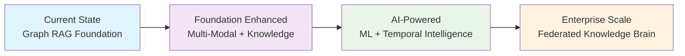
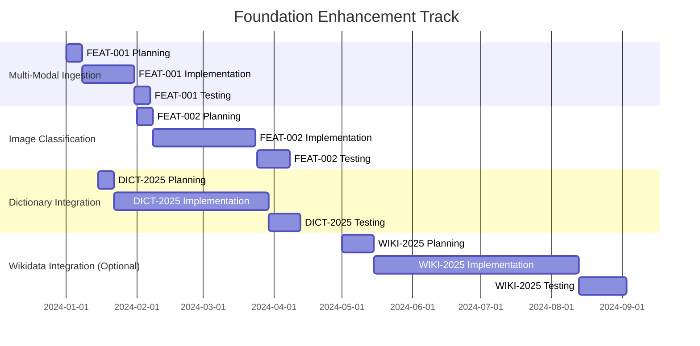
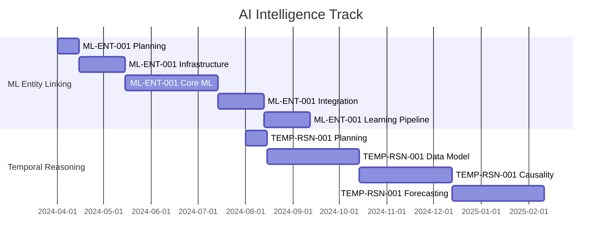
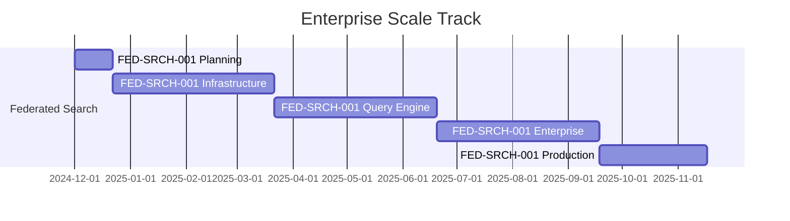
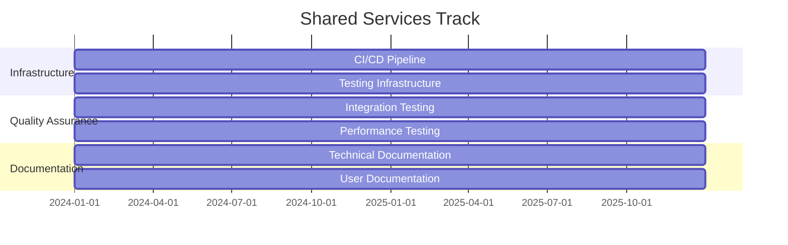
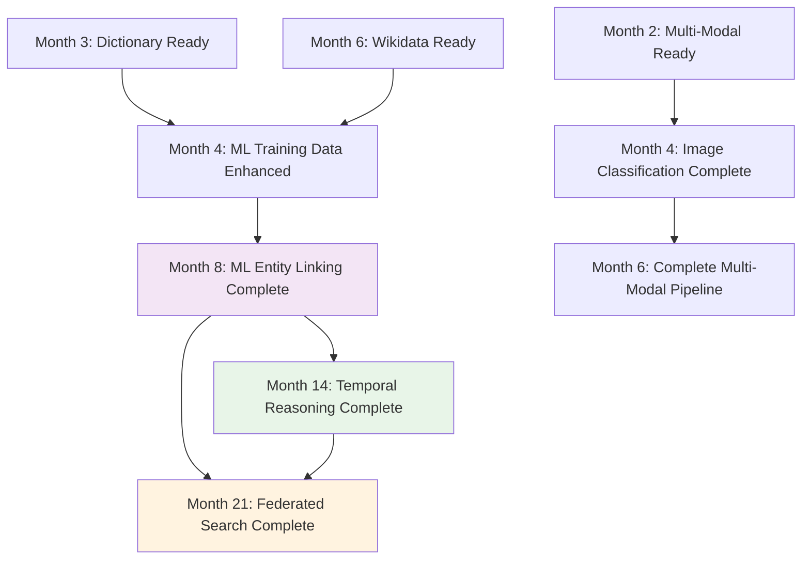
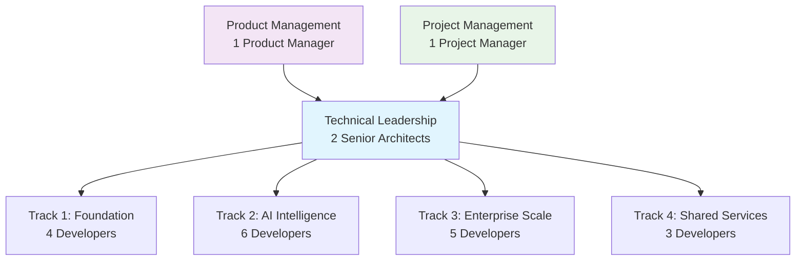

# Unified Implementation Roadmap: 24-Month Strategic Plan

## Executive Summary

This comprehensive roadmap coordinates the implementation of **8 major features** across **3 parallel development tracks**, transforming our Graph RAG system into an enterprise-grade knowledge intelligence platform.

**Total Timeline**: 24 months  
**Total Investment**: $5.6M  
**Expected ROI**: $35M+ annual value  
**Team Size**: 18 developers across 4 specialized teams

---

## 1. Strategic Overview

### 1.1 Transformation Journey



### 1.2 Value Progression

| Phase | Duration | Investment | Cumulative Value | Key Capabilities |
|-------|----------|------------|------------------|------------------|
| **Foundation** | Months 1-4 | $600K | $8M | Multi-modal ingestion, Dictionary enhancement |
| **AI Intelligence** | Months 7-12 | $1.6M | $20M | ML entity linking, Temporal reasoning |
| **Enterprise Scale** | Months 13-24 | $2M | $35M+ | Federated search, Cross-system intelligence |
| **Ongoing** | Continuous | $1.2M | Sustained | Quality assurance, Documentation, Support |

---

## 2. Parallel Development Tracks

### 2.1 Track 1: Foundation Enhancement

**Team**: 4 developers (TypeScript, PostgreSQL, Image Processing, Data Engineering)  
**Duration**: 4 months (optimized without Wikidata dependency)  
**Goal**: Enhance core ingestion and knowledge capabilities



#### Month-by-Month Breakdown

**Month 1 (January 2024)**
- **Week 1**: FEAT-001 planning and architecture design
- **Week 2-4**: FEAT-001 implementation (unified multi-modal ingestion)
- **Deliverables**: Unified ingestion script, image following capability

**Month 2 (February 2024)**
- **Week 1**: FEAT-002 planning and model selection
- **Week 2-4**: FEAT-002 implementation (image classification)
- **Parallel**: DICT-2025 planning and WordNet integration start
- **Deliverables**: Image scene classification, OCR enhancement

**Month 3 (March 2024)**
- **Week 1-4**: DICT-2025 implementation (dictionary integration)
- **Parallel**: WIKI-2025 planning and architecture
- **Deliverables**: WordNet integration, synonym enhancement

**Month 4 (April 2024)**
- **Focus**: Foundation feature optimization and testing
- **Parallel**: ML Entity Linking planning begins
- **Deliverables**: Complete foundation stack ready for ML enhancement
- **Optional**: Wikidata integration can begin as separate track if desired

### 2.2 Track 2: AI Intelligence

**Team**: 6 developers (ML Engineering, Python, Statistical Analysis, Time Series)  
**Duration**: 8 months (overlapping with Track 1)  
**Goal**: Transform system with ML and temporal capabilities



#### Detailed Implementation Schedule

**Months 4-7 (April-July 2024): ML Entity Linking**
- **Month 4**: Infrastructure setup, model selection, dictionary-based training data preparation
- **Month 5-6**: Core ML implementation, entity extraction, disambiguation (using dictionary data)
- **Month 7**: Integration testing, performance optimization
- **Note**: Can optionally integrate Wikidata data if available, but not required for core functionality

**Months 8-14 (August 2024-February 2025): Temporal Reasoning**
- **Month 8-9**: Temporal data model, time-series storage
- **Month 10-11**: Causality detection algorithms (Granger, CCM)
- **Month 12-14**: Trend analysis, forecasting, temporal queries

### 2.3 Track 3: Enterprise Scale

**Team**: 5 developers (Distributed Systems, Enterprise Integration, Security, DevOps)  
**Duration**: 12 months  
**Goal**: Enable enterprise-wide deployment



#### Enterprise Implementation Phases

**Months 12-15 (December 2024-March 2025): Federation Infrastructure**
- System registry and adapter framework
- Schema mapping and translation
- Health monitoring and circuit breakers

**Months 16-18 (April-June 2025): Distributed Query Engine**
- Query planning and routing
- Result aggregation engine
- Conflict resolution

**Months 19-21 (July-September 2025): Enterprise Integration**
- Security and access control
- Production deployment
- Monitoring and alerting

**Months 22-24 (October-December 2025): Optimization & Scale**
- Performance tuning
- Additional system integrations
- Advanced features

### 2.4 Track 4: Shared Services

**Team**: 3 developers (Testing, DevOps, Documentation, QA)  
**Duration**: 24 months (continuous)  
**Goal**: Quality assurance, infrastructure, and documentation



---

## 3. Integration Milestones & Dependencies

### 3.1 Critical Integration Points



### 3.2 Dependency Management

#### Hard Dependencies (Blocking)
1. **DICT-2025 → ML-ENT-001**: Dictionary data required for ML training
2. **WIKI-2025 → ML-ENT-001**: Wikidata entities needed for entity linking
3. **ML-ENT-001 → TEMP-RSN-001**: Accurate entities required for temporal analysis
4. **ML-ENT-001 + TEMP-RSN-001 → FED-SRCH-001**: Advanced features needed for federation

#### Soft Dependencies (Enhancing)
1. **FEAT-001 → FEAT-002**: Multi-modal ingestion enhances image classification
2. **All Features → FED-SRCH-001**: Each feature adds value to federation

### 3.3 Risk Mitigation for Dependencies

```typescript
// Dependency Risk Mitigation Strategy
interface DependencyRiskMitigation {
  // Parallel Development
  parallelTracks: {
    foundationAndAI: "Overlap ML planning with knowledge base implementation",
    aiAndEnterprise: "Begin federation planning during temporal development"
  };
  
  // Fallback Strategies
  fallbackPlans: {
    delayedDependency: "Continue with reduced functionality",
    qualityIssues: "Implement with lower confidence thresholds",
    performanceIssues: "Deploy with feature flags for gradual rollout"
  };
  
  // Integration Testing
  continuousIntegration: {
    dailyBuilds: "Detect integration issues early",
    weeklyIntegrationTests: "Validate cross-feature compatibility",
    monthlyPerformanceTests: "Ensure system performance under load"
  };
}
```

---

## 4. Resource Allocation & Team Structure

### 4.1 Team Organization



### 4.2 Skill Distribution

#### Track 1: Foundation Enhancement (4 developers)
- **Senior Full-Stack Developer** (TypeScript, Node.js, PostgreSQL)
- **Data Engineer** (ETL, Large-scale data processing, Performance optimization)
- **Computer Vision Engineer** (Image processing, OCR, Classification models)
- **Backend Developer** (API development, Database design, Integration)

#### Track 2: AI Intelligence (6 developers)
- **ML Engineering Lead** (Model architecture, Training pipelines, MLOps)
- **Senior ML Engineer** (NLP, Entity linking, Model optimization)
- **Data Scientist** (Statistical analysis, Time series, Causality detection)
- **ML Infrastructure Engineer** (Model serving, Monitoring, Scaling)
- **Python Developer** (ML pipeline development, Data processing)
- **Research Engineer** (Algorithm research, Experimental validation)

#### Track 3: Enterprise Scale (5 developers)
- **Distributed Systems Architect** (Federation design, System integration)
- **Senior Backend Developer** (Distributed queries, Performance optimization)
- **DevOps Engineer** (Infrastructure, Deployment, Monitoring)
- **Security Engineer** (Enterprise security, Access control, Compliance)
- **Integration Specialist** (Enterprise systems, API design, Protocols)

#### Track 4: Shared Services (3 developers)
- **QA Engineer** (Test automation, Integration testing, Quality gates)
- **DevOps Engineer** (CI/CD, Infrastructure as code, Monitoring)
- **Technical Writer** (Documentation, User guides, API documentation)

### 4.3 Budget Allocation

| Category | Annual Cost | 24-Month Total | Percentage |
|----------|-------------|----------------|------------|
| **Development Team** | $2.4M | $4.8M | 86% |
| **Infrastructure** | $200K | $400K | 7% |
| **Tools & Licenses** | $100K | $200K | 4% |
| **Training & Conferences** | $50K | $100K | 2% |
| **Contingency** | $50K | $100K | 2% |
| **Total** | $2.8M | $5.6M | 100% |

---

## 5. Quality Assurance & Testing Strategy

### 5.1 Comprehensive Testing Framework

```typescript
// Unified Testing Strategy
interface UnifiedTestingStrategy {
  // Feature-Level Testing
  featureTests: {
    unitTests: "≥80% branch coverage per feature",
    integrationTests: "End-to-end feature workflows",
    contractTests: "API compatibility across features",
    performanceTests: "Feature-specific performance requirements"
  };
  
  // Cross-Feature Integration Testing
  integrationTests: {
    foundationIntegration: "Multi-modal + Dictionary + Wikidata",
    aiIntegration: "ML + Temporal + Knowledge bases",
    enterpriseIntegration: "Federation + All enhanced features",
    endToEndWorkflows: "Complete user journeys across all features"
  };
  
  // System-Level Testing
  systemTests: {
    loadTesting: "System performance under realistic load",
    stressTesting: "Behavior under extreme conditions",
    reliabilityTesting: "System stability over extended periods",
    securityTesting: "Enterprise security requirements"
  };
}
```

### 5.2 Quality Gates

#### Monthly Quality Reviews
- **Code Quality**: Technical debt assessment, architecture review
- **Performance**: Latency, throughput, resource usage analysis
- **Integration**: Cross-feature compatibility validation
- **User Experience**: Usability testing, feedback incorporation

#### Quarterly Business Reviews
- **Value Delivery**: ROI measurement, business impact assessment
- **Risk Assessment**: Technical and business risk evaluation
- **Stakeholder Alignment**: Requirements validation, priority adjustment
- **Resource Optimization**: Team performance, budget utilization

---

## 6. Risk Management

### 6.1 Technical Risk Matrix

| Risk | Probability | Impact | Mitigation Strategy | Owner |
|------|-------------|--------|-------------------|-------|
| **Integration Complexity** | High | Very High | Incremental integration, extensive testing | Tech Lead |
| **Performance Degradation** | Medium | High | Performance budgets, continuous monitoring | All Tracks |
| **ML Model Performance** | Medium | High | A/B testing, fallback mechanisms | AI Track |
| **Dependency Delays** | Medium | Medium | Parallel development, fallback plans | Project Manager |
| **Resource Conflicts** | Low | Medium | Clear ownership, communication protocols | All Teams |

### 6.2 Business Risk Management

#### Market Risk
- **Competition**: Continuous innovation, unique value proposition
- **Technology Changes**: Flexible architecture, technology monitoring
- **User Adoption**: Training programs, gradual feature introduction

#### Operational Risk
- **Team Scaling**: Structured onboarding, knowledge transfer
- **Knowledge Loss**: Documentation, cross-training, redundancy
- **Quality Issues**: Comprehensive testing, quality gates, rollback plans

---

## 7. Success Metrics & KPIs

### 7.1 Technical Metrics Dashboard

```typescript
// Comprehensive Metrics Tracking
interface UnifiedMetrics {
  // System Performance
  performance: {
    searchLatency: "P95 ≤ 300ms across all features",
    systemAvailability: "≥99.5% uptime",
    throughput: "≥1000 queries/minute",
    resourceUtilization: "≤80% CPU, ≤16GB RAM"
  };
  
  // Feature Quality
  quality: {
    searchAccuracy: "≥95% precision with all enhancements",
    entityLinkingAccuracy: "≥90% precision, ≥85% recall",
    temporalPredictionAccuracy: "≥70% for 6-month forecasts",
    federationLatency: "≤2x single-system performance"
  };
  
  // Business Impact
  business: {
    userProductivity: "+75% improvement in research efficiency",
    knowledgeCoverage: "95% of enterprise data accessible",
    decisionSpeed: "+60% faster strategic decisions",
    enterpriseValue: "$35M+ annual value creation"
  };
}
```

### 7.2 Milestone Success Criteria

#### 6-Month Milestone (Foundation Complete)
- [ ] Multi-modal ingestion processing 95% of content types
- [ ] Dictionary integration improving entity canonicalization by 15%
- [ ] Wikidata integration adding 1M+ entities to knowledge base
- [ ] Image classification achieving 85% scene recognition accuracy
- [ ] System performance maintained within 10% of baseline

#### 12-Month Milestone (AI Intelligence Complete)
- [ ] ML entity linking achieving 95% precision, 85% recall
- [ ] Temporal reasoning detecting causality with 75% accuracy
- [ ] Predictive analytics forecasting trends with 70% accuracy
- [ ] Continuous learning showing measurable improvement
- [ ] User satisfaction score ≥8.5/10

#### 18-Month Milestone (Enterprise Scale Beta)
- [ ] Federated search integrating 5+ enterprise systems
- [ ] Cross-system queries completing within 2x single-system latency
- [ ] Enterprise security and access control fully implemented
- [ ] Pilot deployment with 100+ enterprise users
- [ ] Business value demonstration ≥$20M annually

#### 24-Month Milestone (Full Production)
- [ ] Complete enterprise deployment with 1000+ users
- [ ] 10+ federated systems integrated
- [ ] All features operating at production scale
- [ ] $35M+ annual value demonstrated
- [ ] Strategic competitive advantage established

---

## 8. Implementation Recommendations

### 8.1 Immediate Actions (Next 30 Days)

#### Week 1: Team Formation
- [ ] Recruit and onboard 18 developers across 4 tracks
- [ ] Establish team communication protocols and tools
- [ ] Set up development environments and shared infrastructure

#### Week 2: Technical Foundation
- [ ] Design unified entity schema and data model
- [ ] Create shared component architecture
- [ ] Establish CI/CD pipeline and testing framework

#### Week 3: Project Setup
- [ ] Define detailed project plans for each track
- [ ] Set up monitoring and metrics collection
- [ ] Create risk management and escalation procedures

#### Week 4: Development Launch
- [ ] Begin Track 1 implementation (FEAT-001)
- [ ] Start planning for Track 2 (ML infrastructure)
- [ ] Initiate shared services development

### 8.2 Critical Success Factors

1. **Technical Excellence**
   - Unified architecture preventing integration conflicts
   - Comprehensive testing ensuring quality and compatibility
   - Performance optimization maintaining user experience

2. **Team Coordination**
   - Clear communication protocols across all tracks
   - Shared component ownership and integration responsibility
   - Regular cross-team reviews and alignment sessions

3. **Risk Management**
   - Proactive identification and mitigation of technical risks
   - Flexible planning accommodating dependency changes
   - Quality gates preventing integration of substandard components

4. **Value Delivery**
   - Incremental value delivery throughout implementation
   - Clear business impact measurement and communication
   - User feedback integration and continuous improvement

### 8.3 Long-term Strategic Vision

#### Year 1: Foundation Excellence
- Robust multi-modal knowledge ingestion
- Enhanced entity accuracy and knowledge base integration
- ML-powered intelligence with continuous learning

#### Year 2: Predictive Intelligence
- Temporal reasoning enabling strategic forecasting
- Enterprise-scale federated search capabilities
- Mission-critical knowledge intelligence platform

#### Year 3+: Continuous Innovation
- Advanced AI capabilities and autonomous knowledge curation
- Global enterprise deployment and ecosystem integration
- Industry-leading knowledge intelligence platform

---

## 9. Conclusion

This unified implementation roadmap provides a comprehensive strategy for transforming our Graph RAG system into an enterprise-grade knowledge intelligence platform through coordinated development of 8 major features.

### Key Success Elements

1. **Parallel Development**: Three coordinated tracks maximizing velocity while managing dependencies
2. **Unified Architecture**: Shared components and data models preventing integration conflicts
3. **Quality Assurance**: Comprehensive testing and quality gates ensuring production readiness
4. **Risk Management**: Proactive mitigation strategies for technical and business risks
5. **Value Delivery**: Incremental business value throughout the 24-month journey

### Expected Transformation

- **Technical**: From 80% to 95% search accuracy with enterprise scalability
- **Business**: From $1M to $35M+ annual value through productivity and innovation
- **Strategic**: From departmental tool to mission-critical enterprise infrastructure

### Investment Return

- **Total Investment**: $5.6M over 24 months
- **Expected ROI**: 625% return through productivity gains and strategic value
- **Payback Period**: 18 months with accelerating returns thereafter

This roadmap positions us to deliver a transformational knowledge intelligence platform that establishes sustainable competitive advantage and enables data-driven decision making across the enterprise.
