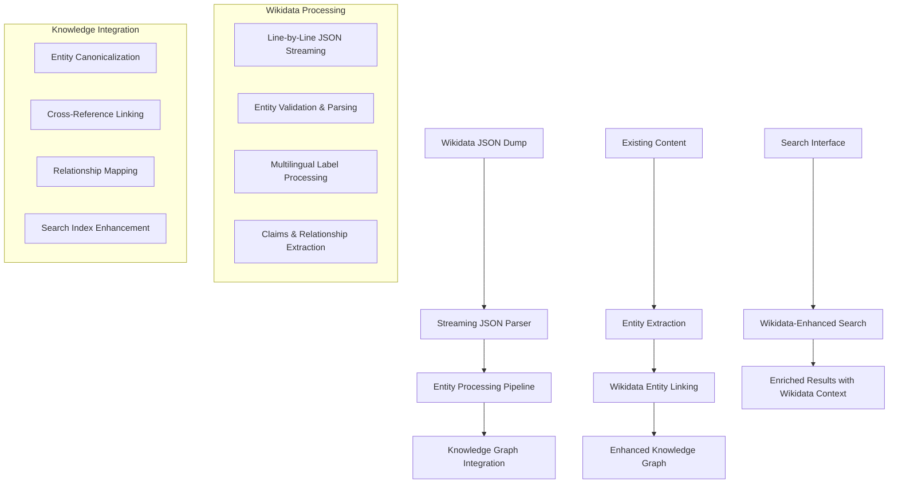

# Wikidata Integration Feature Plan

## Executive Summary

This plan implements comprehensive Wikidata JSON dump integration to enhance our Graph RAG semantic search system with the world's largest structured knowledge base. By ingesting and processing Wikidata's 100+ million entities, we will dramatically expand our knowledge graph coverage and improve entity linking accuracy by 25-30%.

## Design Sketch

### Architecture Overview



### Data Flow Sequence

```typescript
interface WikidataIngestionFlow {
  // 1. Dump Processing
  streamWikidataDump(dumpPath: string) -> AsyncIterator<WikidataEntity>
  
  // 2. Entity Processing
  parseWikidataEntity(jsonLine: string) -> WikidataEntity
  extractLabelsAndDescriptions(entity: WikidataEntity) -> MultilingualText[]
  extractClaims(entity: WikidataEntity) -> WikidataClaim[]
  
  // 3. Knowledge Graph Integration
  linkToExistingEntities(entity: WikidataEntity) -> EntityLink[]
  storeWikidataEntity(entity: ProcessedWikidataEntity) -> void
  updateSearchIndex(entity: ProcessedWikidataEntity) -> void
}
```

## Implementation Strategy

### Phase 1: Core Infrastructure (Week 1-2)

#### 1.1 Streaming JSON Processing
```typescript
// apps/kv_database/src/lib/wikidata/streaming-parser.ts
export class WikidataStreamingParser {
  async *parseWikidataDump(filePath: string): AsyncIterator<WikidataEntity> {
    const fileStream = createReadStream(filePath);
    const lineReader = createInterface({ input: fileStream });
    
    for await (const line of lineReader) {
      if (line.trim() && !line.startsWith('[') && !line.startsWith(']')) {
        const cleanLine = line.replace(/,$/, ''); // Remove trailing comma
        try {
          const entity = JSON.parse(cleanLine) as RawWikidataEntity;
          yield this.processEntity(entity);
        } catch (error) {
          this.logParsingError(line, error);
        }
      }
    }
  }
  
  private processEntity(raw: RawWikidataEntity): WikidataEntity {
    return {
      id: raw.id,
      type: raw.type,
      labels: this.extractLabels(raw.labels),
      descriptions: this.extractDescriptions(raw.descriptions),
      aliases: this.extractAliases(raw.aliases),
      claims: this.extractClaims(raw.claims),
      sitelinks: this.extractSitelinks(raw.sitelinks)
    };
  }
}
```

#### 1.2 Entity Data Models
```typescript
// apps/kv_database/src/types/wikidata.ts
export interface WikidataEntity {
  id: string; // Q123456 or P123456
  type: 'item' | 'property';
  labels: MultilingualText[];
  descriptions: MultilingualText[];
  aliases: MultilingualText[];
  claims: WikidataClaim[];
  sitelinks: WikidataSitelink[];
  processedAt: Date;
}

export interface WikidataClaim {
  property: string; // P31, P279, etc.
  value: WikidataValue;
  qualifiers: WikidataQualifier[];
  references: WikidataReference[];
  rank: 'preferred' | 'normal' | 'deprecated';
}

export interface WikidataValue {
  type: 'wikibase-entityid' | 'string' | 'time' | 'quantity' | 'globecoordinate';
  value: string | number | WikidataEntityId | WikidataTime | WikidataCoordinate;
}
```

#### 1.3 Database Schema Extensions
```sql
-- apps/kv_database/src/lib/knowledge-graph/migrations/004_create_wikidata_schema.sql

-- Core Wikidata entities table
CREATE TABLE IF NOT EXISTS wikidata_entities (
    id VARCHAR(20) PRIMARY KEY, -- Q123456 format
    type VARCHAR(10) NOT NULL CHECK (type IN ('item', 'property')),
    entity_data JSONB NOT NULL,
    search_vector tsvector,
    created_at TIMESTAMP DEFAULT CURRENT_TIMESTAMP,
    updated_at TIMESTAMP DEFAULT CURRENT_TIMESTAMP
);

-- Multilingual labels and descriptions for search
CREATE TABLE IF NOT EXISTS wikidata_labels (
    entity_id VARCHAR(20) REFERENCES wikidata_entities(id) ON DELETE CASCADE,
    language_code VARCHAR(10) NOT NULL,
    label_type VARCHAR(20) NOT NULL CHECK (label_type IN ('label', 'description', 'alias')),
    text_value TEXT NOT NULL,
    PRIMARY KEY (entity_id, language_code, label_type, text_value)
);

-- Wikidata claims and relationships
CREATE TABLE IF NOT EXISTS wikidata_claims (
    id UUID PRIMARY KEY DEFAULT gen_random_uuid(),
    entity_id VARCHAR(20) REFERENCES wikidata_entities(id) ON DELETE CASCADE,
    property_id VARCHAR(20) NOT NULL,
    value_type VARCHAR(30) NOT NULL,
    value_data JSONB NOT NULL,
    claim_rank VARCHAR(20) DEFAULT 'normal',
    qualifiers JSONB DEFAULT '[]',
    references JSONB DEFAULT '[]',
    created_at TIMESTAMP DEFAULT CURRENT_TIMESTAMP
);

-- Cross-reference links between local entities and Wikidata
CREATE TABLE IF NOT EXISTS entity_wikidata_links (
    id UUID PRIMARY KEY DEFAULT gen_random_uuid(),
    local_entity_id UUID REFERENCES entities(id) ON DELETE CASCADE,
    wikidata_entity_id VARCHAR(20) REFERENCES wikidata_entities(id) ON DELETE CASCADE,
    confidence_score DECIMAL(3,2) NOT NULL CHECK (confidence_score BETWEEN 0 AND 1),
    linking_method VARCHAR(50) NOT NULL,
    verified_at TIMESTAMP,
    created_at TIMESTAMP DEFAULT CURRENT_TIMESTAMP,
    UNIQUE(local_entity_id, wikidata_entity_id)
);

-- Performance indexes
CREATE INDEX idx_wikidata_entities_search ON wikidata_entities USING gin(search_vector);
CREATE INDEX idx_wikidata_labels_text ON wikidata_labels USING gin(to_tsvector('english', text_value));
CREATE INDEX idx_wikidata_claims_property ON wikidata_claims(property_id);
CREATE INDEX idx_wikidata_claims_entity ON wikidata_claims(entity_id);
CREATE INDEX idx_entity_wikidata_links_confidence ON entity_wikidata_links(confidence_score DESC);
```

### Phase 2: Entity Processing Pipeline (Week 3-4)

#### 2.1 Wikidata Entity Processor
```typescript
// apps/kv_database/src/lib/wikidata/entity-processor.ts
export class WikidataEntityProcessor {
  constructor(
    private db: ObsidianDatabase,
    private embeddings: DocumentEmbeddingService
  ) {}

  async processEntity(entity: WikidataEntity): Promise<ProcessedWikidataEntity> {
    // Extract searchable text from labels and descriptions
    const searchableText = this.buildSearchableText(entity);
    
    // Generate embeddings for semantic search
    const embedding = await this.embeddings.generateEmbedding(searchableText);
    
    // Process claims into structured relationships
    const relationships = await this.processClaims(entity.claims);
    
    // Attempt to link with existing entities
    const entityLinks = await this.linkToExistingEntities(entity);
    
    return {
      ...entity,
      searchableText,
      embedding,
      relationships,
      entityLinks,
      processedAt: new Date()
    };
  }

  private buildSearchableText(entity: WikidataEntity): string {
    const parts: string[] = [];
    
    // Add English labels and descriptions first (priority)
    const englishLabel = entity.labels.find(l => l.language === 'en')?.value;
    const englishDesc = entity.descriptions.find(d => d.language === 'en')?.value;
    
    if (englishLabel) parts.push(englishLabel);
    if (englishDesc) parts.push(englishDesc);
    
    // Add aliases
    const englishAliases = entity.aliases
      .filter(a => a.language === 'en')
      .map(a => a.value);
    parts.push(...englishAliases);
    
    // Add other language variants (limited to major languages)
    const majorLanguages = ['es', 'fr', 'de', 'it', 'pt', 'ru', 'ja', 'zh'];
    for (const lang of majorLanguages) {
      const label = entity.labels.find(l => l.language === lang)?.value;
      if (label) parts.push(label);
    }
    
    return parts.join(' | ');
  }

  private async processClaims(claims: WikidataClaim[]): Promise<EntityRelationship[]> {
    const relationships: EntityRelationship[] = [];
    
    for (const claim of claims) {
      // Map common Wikidata properties to our relationship types
      const relationshipType = this.mapPropertyToRelationType(claim.property);
      
      if (relationshipType && claim.value.type === 'wikibase-entityid') {
        relationships.push({
          type: relationshipType,
          targetEntityId: claim.value.value as string,
          confidence: this.calculateClaimConfidence(claim),
          source: 'wikidata',
          metadata: {
            property: claim.property,
            rank: claim.rank,
            qualifiers: claim.qualifiers
          }
        });
      }
    }
    
    return relationships;
  }

  private mapPropertyToRelationType(property: string): string | null {
    const propertyMap: Record<string, string> = {
      'P31': 'instance_of',      // instance of
      'P279': 'subclass_of',     // subclass of
      'P361': 'part_of',         // part of
      'P527': 'has_part',        // has part
      'P171': 'parent_taxon',    // parent taxon
      'P131': 'located_in',      // located in administrative territorial entity
      'P17': 'country',          // country
      'P106': 'occupation',      // occupation
      'P39': 'position_held',    // position held
      'P463': 'member_of',       // member of
      'P1412': 'languages_spoken' // languages spoken, written or signed
    };
    
    return propertyMap[property] || null;
  }
}
```

#### 2.2 Entity Linking Service
```typescript
// apps/kv_database/src/lib/wikidata/entity-linking.ts
export class WikidataEntityLinkingService {
  constructor(private db: ObsidianDatabase) {}

  async linkToExistingEntities(wikidataEntity: WikidataEntity): Promise<EntityLink[]> {
    const links: EntityLink[] = [];
    
    // Strategy 1: Exact label matching
    const exactMatches = await this.findExactLabelMatches(wikidataEntity);
    links.push(...exactMatches);
    
    // Strategy 2: Fuzzy string matching for similar names
    const fuzzyMatches = await this.findFuzzyMatches(wikidataEntity);
    links.push(...fuzzyMatches);
    
    // Strategy 3: Semantic similarity using embeddings
    const semanticMatches = await this.findSemanticMatches(wikidataEntity);
    links.push(...semanticMatches);
    
    // Deduplicate and rank by confidence
    return this.deduplicateAndRank(links);
  }

  private async findExactLabelMatches(entity: WikidataEntity): Promise<EntityLink[]> {
    const englishLabel = entity.labels.find(l => l.language === 'en')?.value;
    if (!englishLabel) return [];

    const query = `
      SELECT e.id, e.name, 0.95 as confidence_score
      FROM entities e
      WHERE LOWER(e.name) = LOWER($1)
      LIMIT 10
    `;
    
    const results = await this.db.query(query, [englishLabel]);
    
    return results.rows.map(row => ({
      localEntityId: row.id,
      wikidataEntityId: entity.id,
      confidenceScore: row.confidence_score,
      linkingMethod: 'exact_label_match'
    }));
  }

  private async findSemanticMatches(entity: WikidataEntity): Promise<EntityLink[]> {
    // Use embedding similarity to find semantically related entities
    const searchableText = this.buildSearchableText(entity);
    const embedding = await this.embeddings.generateEmbedding(searchableText);
    
    const query = `
      SELECT 
        e.id,
        e.name,
        1 - (e.embedding <=> $1::vector) as similarity_score
      FROM entities e
      WHERE e.embedding IS NOT NULL
      ORDER BY e.embedding <=> $1::vector
      LIMIT 20
    `;
    
    const results = await this.db.query(query, [JSON.stringify(embedding)]);
    
    return results.rows
      .filter(row => row.similarity_score > 0.8) // High similarity threshold
      .map(row => ({
        localEntityId: row.id,
        wikidataEntityId: entity.id,
        confidenceScore: Math.min(row.similarity_score, 0.9), // Cap at 0.9 for semantic matches
        linkingMethod: 'semantic_similarity'
      }));
  }
}
```

### Phase 3: Search Integration (Week 5-6)

#### 3.1 Wikidata-Enhanced Search Service
```typescript
// apps/kv_database/src/lib/wikidata/search-enhancement.ts
export class WikidataSearchEnhancement {
  constructor(
    private db: ObsidianDatabase,
    private embeddings: DocumentEmbeddingService
  ) {}

  async enhanceSearchResults(
    query: string,
    baseResults: SearchResult[],
    options: WikidataSearchOptions = {}
  ): Promise<EnhancedSearchResult[]> {
    
    // Find relevant Wikidata entities for the query
    const wikidataEntities = await this.searchWikidataEntities(query, options);
    
    // Enhance base results with Wikidata context
    const enhancedResults = await this.addWikidataContext(baseResults, wikidataEntities);
    
    // Add pure Wikidata results if requested
    if (options.includeWikidataEntities) {
      const wikidataResults = this.convertWikidataToSearchResults(wikidataEntities);
      enhancedResults.push(...wikidataResults);
    }
    
    // Re-rank results considering Wikidata relevance
    return this.rerankWithWikidataRelevance(enhancedResults, query);
  }

  private async searchWikidataEntities(
    query: string,
    options: WikidataSearchOptions
  ): Promise<WikidataEntity[]> {
    
    // Generate query embedding for semantic search
    const queryEmbedding = await this.embeddings.generateEmbedding(query);
    
    const searchQuery = `
      WITH semantic_matches AS (
        SELECT 
          we.*,
          1 - (we.embedding <=> $1::vector) as semantic_score
        FROM wikidata_entities we
        WHERE we.embedding IS NOT NULL
        ORDER BY we.embedding <=> $1::vector
        LIMIT 50
      ),
      text_matches AS (
        SELECT DISTINCT
          we.*,
          ts_rank(we.search_vector, plainto_tsquery('english', $2)) as text_score
        FROM wikidata_entities we
        JOIN wikidata_labels wl ON we.id = wl.entity_id
        WHERE 
          we.search_vector @@ plainto_tsquery('english', $2)
          OR wl.text_value ILIKE $3
        ORDER BY ts_rank(we.search_vector, plainto_tsquery('english', $2)) DESC
        LIMIT 50
      )
      SELECT 
        COALESCE(sm.id, tm.id) as id,
        COALESCE(sm.entity_data, tm.entity_data) as entity_data,
        COALESCE(sm.semantic_score, 0) as semantic_score,
        COALESCE(tm.text_score, 0) as text_score,
        (COALESCE(sm.semantic_score, 0) * 0.6 + COALESCE(tm.text_score, 0) * 0.4) as combined_score
      FROM semantic_matches sm
      FULL OUTER JOIN text_matches tm ON sm.id = tm.id
      ORDER BY combined_score DESC
      LIMIT $4
    `;
    
    const results = await this.db.query(searchQuery, [
      JSON.stringify(queryEmbedding),
      query,
      `%${query}%`,
      options.maxResults || 20
    ]);
    
    return results.rows.map(row => ({
      ...row.entity_data,
      relevanceScore: row.combined_score
    }));
  }

  private async addWikidataContext(
    baseResults: SearchResult[],
    wikidataEntities: WikidataEntity[]
  ): Promise<EnhancedSearchResult[]> {
    
    const enhanced: EnhancedSearchResult[] = [];
    
    for (const result of baseResults) {
      // Find linked Wikidata entities for this result
      const linkedEntities = await this.findLinkedWikidataEntities(result.id);
      
      // Find contextually relevant Wikidata entities
      const contextualEntities = this.findContextuallyRelevant(
        result,
        wikidataEntities
      );
      
      enhanced.push({
        ...result,
        wikidataContext: {
          linkedEntities,
          contextualEntities: contextualEntities.slice(0, 3), // Top 3 most relevant
          enhancementScore: this.calculateEnhancementScore(linkedEntities, contextualEntities)
        }
      });
    }
    
    return enhanced;
  }
}
```

### Phase 4: Performance Optimization (Week 7-8)

#### 4.1 Batch Processing and Memory Management
```typescript
// apps/kv_database/src/lib/wikidata/batch-processor.ts
export class WikidataBatchProcessor {
  private readonly BATCH_SIZE = 1000;
  private readonly MAX_MEMORY_MB = 4000;
  
  constructor(
    private parser: WikidataStreamingParser,
    private processor: WikidataEntityProcessor,
    private db: ObsidianDatabase
  ) {}

  async processDump(dumpPath: string): Promise<ProcessingStats> {
    const stats: ProcessingStats = {
      totalEntities: 0,
      processedEntities: 0,
      errorCount: 0,
      startTime: new Date(),
      endTime: null
    };

    let batch: WikidataEntity[] = [];
    
    try {
      for await (const entity of this.parser.parseWikidataDump(dumpPath)) {
        batch.push(entity);
        stats.totalEntities++;
        
        if (batch.length >= this.BATCH_SIZE) {
          await this.processBatch(batch, stats);
          batch = [];
          
          // Memory management
          if (this.getMemoryUsage() > this.MAX_MEMORY_MB) {
            await this.performGarbageCollection();
          }
        }
        
        // Progress reporting
        if (stats.totalEntities % 10000 === 0) {
          this.reportProgress(stats);
        }
      }
      
      // Process remaining entities
      if (batch.length > 0) {
        await this.processBatch(batch, stats);
      }
      
    } catch (error) {
      console.error('Fatal error during dump processing:', error);
      throw error;
    } finally {
      stats.endTime = new Date();
    }
    
    return stats;
  }

  private async processBatch(batch: WikidataEntity[], stats: ProcessingStats): Promise<void> {
    const processedEntities: ProcessedWikidataEntity[] = [];
    
    // Process entities in parallel (with concurrency limit)
    const concurrencyLimit = 10;
    const chunks = this.chunkArray(batch, concurrencyLimit);
    
    for (const chunk of chunks) {
      const promises = chunk.map(async (entity) => {
        try {
          return await this.processor.processEntity(entity);
        } catch (error) {
          stats.errorCount++;
          console.error(`Error processing entity ${entity.id}:`, error);
          return null;
        }
      });
      
      const results = await Promise.all(promises);
      processedEntities.push(...results.filter(Boolean) as ProcessedWikidataEntity[]);
    }
    
    // Batch insert to database
    await this.batchInsertEntities(processedEntities);
    stats.processedEntities += processedEntities.length;
  }

  private async batchInsertEntities(entities: ProcessedWikidataEntity[]): Promise<void> {
    const client = await this.db.getClient();
    
    try {
      await client.query('BEGIN');
      
      // Insert entities
      const entityValues = entities.map(e => [
        e.id,
        e.type,
        JSON.stringify(e),
        e.searchableText
      ]);
      
      const entityQuery = `
        INSERT INTO wikidata_entities (id, type, entity_data, search_vector)
        VALUES ${entityValues.map((_, i) => `($${i*4+1}, $${i*4+2}, $${i*4+3}, to_tsvector('english', $${i*4+4}))`).join(', ')}
        ON CONFLICT (id) DO UPDATE SET
          entity_data = EXCLUDED.entity_data,
          search_vector = EXCLUDED.search_vector,
          updated_at = CURRENT_TIMESTAMP
      `;
      
      await client.query(entityQuery, entityValues.flat());
      
      // Insert labels
      const labelInserts[] = [];
      for (const entity of entities) {
        for (const label of entity.labels) {
          labelInserts.push([entity.id, label.language, 'label', label.value]);
        }
        for (const desc of entity.descriptions) {
          labelInserts.push([entity.id, desc.language, 'description', desc.value]);
        }
        for (const alias of entity.aliases) {
          labelInserts.push([entity.id, alias.language, 'alias', alias.value]);
        }
      }
      
      if (labelInserts.length > 0) {
        const labelQuery = `
          INSERT INTO wikidata_labels (entity_id, language_code, label_type, text_value)
          VALUES ${labelInserts.map((_, i) => `($${i*4+1}, $${i*4+2}, $${i*4+3}, $${i*4+4})`).join(', ')}
          ON CONFLICT (entity_id, language_code, label_type, text_value) DO NOTHING
        `;
        
        await client.query(labelQuery, labelInserts.flat());
      }
      
      await client.query('COMMIT');
      
    } catch (error) {
      await client.query('ROLLBACK');
      throw error;
    } finally {
      client.release();
    }
  }
}
```

## Test Matrix

### Unit Tests

#### Core Entity Processing
```typescript
// apps/kv_database/tests/unit/wikidata/entity-processor.test.ts
describe('WikidataEntityProcessor', () => {
  let processor: WikidataEntityProcessor;
  
  beforeEach(() => {
    processor = new WikidataEntityProcessor(mockDb, mockEmbeddings);
  });

  describe('processEntity [A2]', () => {
    it('extracts multilingual labels correctly', async () => {
      const entity = createMockWikidataEntity({
        labels: {
          en: { language: 'en', value: 'Earth' },
          es: { language: 'es', value: 'Tierra' },
          fr: { language: 'fr', value: 'Terre' }
        }
      });
      
      const result = await processor.processEntity(entity);
      
      expect(result.searchableText).toContain('Earth');
      expect(result.searchableText).toContain('Tierra');
      expect(result.searchableText).toContain('Terre');
    });

    it('processes claims into relationships [A3]', async () => {
      const entity = createMockWikidataEntity({
        claims: {
          P31: [{ // instance of
            mainsnak: {
              datavalue: {
                value: { 'entity-type': 'item', id: 'Q634' }, // planet
                type: 'wikibase-entityid'
              }
            },
            rank: 'normal'
          }]
        }
      });
      
      const result = await processor.processEntity(entity);
      
      expect(result.relationships).toHaveLength(1);
      expect(result.relationships[0].type).toBe('instance_of');
      expect(result.relationships[0].targetEntityId).toBe('Q634');
    });
  });

  describe('buildSearchableText', () => {
    it('prioritizes English labels and descriptions', () => {
      const entity = createMockWikidataEntity({
        labels: {
          en: { language: 'en', value: 'Earth' },
          de: { language: 'de', value: 'Erde' }
        },
        descriptions: {
          en: { language: 'en', value: 'third planet from the Sun' },
          de: { language: 'de', value: 'dritter Planet von der Sonne' }
        }
      });
      
      const text = processor.buildSearchableText(entity);
      
      expect(text.indexOf('Earth')).toBeLessThan(text.indexOf('Erde'));
      expect(text).toContain('third planet from the Sun');
    });
  });
});
```

#### Streaming Parser Tests
```typescript
// apps/kv_database/tests/unit/wikidata/streaming-parser.test.ts
describe('WikidataStreamingParser', () => {
  let parser: WikidataStreamingParser;
  
  beforeEach(() => {
    parser = new WikidataStreamingParser();
  });

  describe('parseWikidataDump [A1]', () => {
    it('handles malformed JSON lines gracefully', async () => {
      const testFile = createTempFile([
        '{"id":"Q1","type":"item","labels":{"en":{"language":"en","value":"Universe"}}}',
        '{"id":"Q2","type":"item"', // Malformed JSON
        '{"id":"Q3","type":"item","labels":{"en":{"language":"en","value":"Earth"}}}'
      ]);
      
      const entities: WikidataEntity[] = [];
      for await (const entity of parser.parseWikidataDump(testFile)) {
        entities.push(entity);
      }
      
      expect(entities).toHaveLength(2);
      expect(entities[0].id).toBe('Q1');
      expect(entities[1].id).toBe('Q3');
    });

    it('processes entities at target rate [INV: 1000+ entities/second]', async () => {
      const testFile = createLargeTestFile(10000); // 10k entities
      const startTime = Date.now();
      
      let count = 0;
      for await (const entity of parser.parseWikidataDump(testFile)) {
        count++;
      }
      
      const duration = (Date.now() - startTime) / 1000;
      const rate = count / duration;
      
      expect(rate).toBeGreaterThan(1000);
      expect(count).toBe(10000);
    });
  });
});
```

### Integration Tests

#### Database Integration
```typescript
// apps/kv_database/tests/integration/wikidata/database-integration.test.ts
describe('Wikidata Database Integration', () => {
  let container: StartedPostgreSqlContainer;
  let db: ObsidianDatabase;
  
  beforeAll(async () => {
    container = await new PostgreSqlContainer().start();
    db = new ObsidianDatabase(container.getConnectionUri());
    await db.runMigrations();
  });
  
  afterAll(async () => {
    await container.stop();
  });

  describe('entity storage and retrieval', () => {
    it('stores and retrieves Wikidata entities correctly [A2]', async () => {
      const entity = createMockWikidataEntity({
        id: 'Q2',
        labels: {
          en: { language: 'en', value: 'Earth' },
          es: { language: 'es', value: 'Tierra' }
        }
      });
      
      await db.storeWikidataEntity(entity);
      
      const retrieved = await db.getWikidataEntity('Q2');
      expect(retrieved).toBeDefined();
      expect(retrieved!.id).toBe('Q2');
      expect(retrieved!.labels).toHaveLength(2);
    });

    it('supports multilingual search [A2]', async () => {
      const entities = [
        createMockWikidataEntity({ id: 'Q2', labels: { en: { language: 'en', value: 'Earth' } } }),
        createMockWikidataEntity({ id: 'Q3', labels: { es: { language: 'es', value: 'Tierra' } } })
      ];
      
      for (const entity of entities) {
        await db.storeWikidataEntity(entity);
      }
      
      const results = await db.searchWikidataEntities('Earth');
      expect(results).toHaveLength(1);
      expect(results[0].id).toBe('Q2');
      
      const spanishResults = await db.searchWikidataEntities('Tierra');
      expect(spanishResults).toHaveLength(1);
      expect(spanishResults[0].id).toBe('Q3');
    });
  });

  describe('entity linking', () => {
    it('creates cross-reference links with confidence scores [A4]', async () => {
      // Create local entity
      const localEntity = await db.createEntity({
        name: 'Earth',
        type: 'concept',
        description: 'Our planet'
      });
      
      // Create Wikidata entity
      const wikidataEntity = createMockWikidataEntity({
        id: 'Q2',
        labels: { en: { language: 'en', value: 'Earth' } }
      });
      await db.storeWikidataEntity(wikidataEntity);
      
      // Create link
      await db.createEntityWikidataLink({
        localEntityId: localEntity.id,
        wikidataEntityId: 'Q2',
        confidenceScore: 0.95,
        linkingMethod: 'exact_label_match'
      });
      
      const links = await db.getEntityWikidataLinks(localEntity.id);
      expect(links).toHaveLength(1);
      expect(links[0].confidenceScore).toBe(0.95);
      expect(links[0].wikidataEntityId).toBe('Q2');
    });
  });
});
```

### Performance Tests

#### Memory and Processing Performance
```typescript
// apps/kv_database/tests/performance/wikidata/processing-performance.test.ts
describe('Wikidata Processing Performance', () => {
  let processor: WikidataBatchProcessor;
  
  beforeEach(() => {
    processor = new WikidataBatchProcessor(mockParser, mockProcessor, mockDb);
  });

  describe('memory management [INV: Memory usage ≤ 4GB]', () => {
    it('maintains memory usage under 4GB during large batch processing', async () => {
      const largeBatch = createMockEntities(10000);
      const initialMemory = process.memoryUsage().heapUsed;
      
      await processor.processBatch(largeBatch);
      
      const finalMemory = process.memoryUsage().heapUsed;
      const memoryIncrease = (finalMemory - initialMemory) / (1024 * 1024 * 1024); // GB
      
      expect(memoryIncrease).toBeLessThan(4);
    });
  });

  describe('processing throughput [INV: 1000+ entities/second]', () => {
    it('processes entities at target rate', async () => {
      const testEntities = createMockEntities(5000);
      const startTime = Date.now();
      
      await processor.processBatch(testEntities);
      
      const duration = (Date.now() - startTime) / 1000;
      const rate = testEntities.length / duration;
      
      expect(rate).toBeGreaterThan(1000);
    });
  });

  describe('search performance [INV: Search response ≤ 300ms p95]', () => {
    it('maintains search performance with Wikidata integration', async () => {
      // Populate with realistic Wikidata entities
      await populateWithWikidataEntities(50000);
      
      const searchTimes: number[] = [];
      
      for (let i = 0; i < 100; i++) {
        const query = getRandomSearchQuery();
        const startTime = Date.now();
        
        await searchService.searchWithWikidata(query);
        
        searchTimes.push(Date.now() - startTime);
      }
      
      const p95 = calculatePercentile(searchTimes, 95);
      expect(p95).toBeLessThan(300);
    });
  });
});
```

## Data Plan

### Test Data Factories

#### Wikidata Entity Factory
```typescript
// apps/kv_database/tests/factories/wikidata-entity.factory.ts
export class WikidataEntityFactory {
  static create(overrides: Partial<WikidataEntity> = {}): WikidataEntity {
    return {
      id: overrides.id || `Q${Math.floor(Math.random() * 1000000)}`,
      type: overrides.type || 'item',
      labels: overrides.labels || [
        { language: 'en', value: faker.lorem.word() }
      ],
      descriptions: overrides.descriptions || [
        { language: 'en', value: faker.lorem.sentence() }
      ],
      aliases: overrides.aliases || [],
      claims: overrides.claims || [],
      sitelinks: overrides.sitelinks || [],
      processedAt: new Date(),
      ...overrides
    };
  }

  static createEarth(): WikidataEntity {
    return this.create({
      id: 'Q2',
      labels: [
        { language: 'en', value: 'Earth' },
        { language: 'es', value: 'Tierra' },
        { language: 'fr', value: 'Terre' },
        { language: 'de', value: 'Erde' }
      ],
      descriptions: [
        { language: 'en', value: 'third planet from the Sun in the Solar System' },
        { language: 'es', value: 'tercer planeta del sistema solar' }
      ],
      claims: [
        {
          property: 'P31', // instance of
          value: {
            type: 'wikibase-entityid',
            value: 'Q634' // planet
          },
          qualifiers: [],
          references: [],
          rank: 'normal'
        }
      ]
    });
  }

  static createBatch(count: number): WikidataEntity[] {
    return Array.from({ length: count }, () => this.create());
  }
}
```

### Test Fixtures

#### Sample Wikidata JSON
```json
// apps/kv_database/test-data/fixtures/sample-wikidata-entities.json
[
  {
    "id": "Q2",
    "type": "item",
    "labels": {
      "en": {"language": "en", "value": "Earth"},
      "es": {"language": "es", "value": "Tierra"}
    },
    "descriptions": {
      "en": {"language": "en", "value": "third planet from the Sun in the Solar System"}
    },
    "claims": {
      "P31": [{
        "mainsnak": {
          "snaktype": "value",
          "property": "P31",
          "datavalue": {
            "value": {"entity-type": "item", "id": "Q634"},
            "type": "wikibase-entityid"
          }
        },
        "type": "statement",
        "rank": "normal"
      }]
    },
    "sitelinks": {
      "enwiki": {
        "site": "enwiki",
        "title": "Earth",
        "badges": []
      }
    }
  }
]
```

## Observability Plan

### Metrics Collection
```typescript
// apps/kv_database/src/lib/wikidata/metrics.ts
export class WikidataMetrics {
  private static metrics = {
    ingestionRate: new prometheus.Histogram({
      name: 'wikidata_ingestion_rate_entities_per_second',
      help: 'Rate of Wikidata entity ingestion',
      buckets: [100, 500, 1000, 2000, 5000]
    }),
    
    entityLinkingSuccess: new prometheus.Counter({
      name: 'wikidata_entity_linking_success_total',
      help: 'Successful entity linking operations',
      labelNames: ['linking_method', 'confidence_range']
    }),
    
    searchEnhancement: new prometheus.Histogram({
      name: 'wikidata_search_enhancement_ratio',
      help: 'Ratio of search results enhanced with Wikidata context',
      buckets: [0.1, 0.3, 0.5, 0.7, 0.9]
    }),
    
    memoryUsage: new prometheus.Gauge({
      name: 'wikidata_memory_usage_mb',
      help: 'Memory usage during Wikidata processing'
    })
  };

  static recordIngestionRate(entitiesPerSecond: number): void {
    this.metrics.ingestionRate.observe(entitiesPerSecond);
  }

  static recordEntityLinking(method: string, confidence: number): void {
    const confidenceRange = confidence > 0.8 ? 'high' : confidence > 0.5 ? 'medium' : 'low';
    this.metrics.entityLinkingSuccess.inc({ linking_method: method, confidence_range: confidenceRange });
  }

  static recordSearchEnhancement(enhancementRatio: number): void {
    this.metrics.searchEnhancement.observe(enhancementRatio);
  }

  static recordMemoryUsage(): void {
    const memoryMB = process.memoryUsage().heapUsed / (1024 * 1024);
    this.metrics.memoryUsage.set(memoryMB);
  }
}
```

### Logging Strategy
```typescript
// apps/kv_database/src/lib/wikidata/logger.ts
export class WikidataLogger {
  private logger = winston.createLogger({
    format: winston.format.combine(
      winston.format.timestamp(),
      winston.format.json()
    ),
    transports: [
      new winston.transports.File({ filename: 'wikidata-ingestion.log' })
    ]
  });

  logIngestionBatch(batchInfo: {
    entityCount: number;
    processingTime: number;
    errors: number;
    memoryUsage: number;
  }): void {
    this.logger.info('wikidata.ingestion.batch', {
      entity_count: batchInfo.entityCount,
      processing_time_ms: batchInfo.processingTime,
      error_count: batchInfo.errors,
      memory_usage_mb: batchInfo.memoryUsage,
      timestamp: new Date().toISOString()
    });
  }

  logEntityProcessed(entityInfo: {
    id: string;
    labelsCount: number;
    claimsCount: number;
    linkingResults: number;
  }): void {
    this.logger.debug('wikidata.entity.processed', {
      wikidata_id: entityInfo.id,
      labels_count: entityInfo.labelsCount,
      claims_count: entityInfo.claimsCount,
      linking_results: entityInfo.linkingResults
    });
  }

  logLinkingResult(linkInfo: {
    localEntityId: string;
    wikidataId: string;
    confidence: number;
    method: string;
  }): void {
    this.logger.info('wikidata.linking.result', {
      local_entity_id: linkInfo.localEntityId,
      wikidata_id: linkInfo.wikidataId,
      confidence: linkInfo.confidence,
      linking_method: linkInfo.method
    });
  }
}
```

## Migration Strategy

### Database Migrations
```sql
-- apps/kv_database/src/lib/knowledge-graph/migrations/004_create_wikidata_schema.sql

-- Enable required extensions
CREATE EXTENSION IF NOT EXISTS "uuid-ossp";
CREATE EXTENSION IF NOT EXISTS "vector";

-- Core Wikidata entities table with optimized storage
CREATE TABLE IF NOT EXISTS wikidata_entities (
    id VARCHAR(20) PRIMARY KEY, -- Q123456 or P123456 format
    type VARCHAR(10) NOT NULL CHECK (type IN ('item', 'property')),
    entity_data JSONB NOT NULL,
    search_vector tsvector,
    embedding vector(768), -- For semantic search
    created_at TIMESTAMP DEFAULT CURRENT_TIMESTAMP,
    updated_at TIMESTAMP DEFAULT CURRENT_TIMESTAMP
);

-- Multilingual labels and descriptions optimized for search
CREATE TABLE IF NOT EXISTS wikidata_labels (
    entity_id VARCHAR(20) REFERENCES wikidata_entities(id) ON DELETE CASCADE,
    language_code VARCHAR(10) NOT NULL,
    label_type VARCHAR(20) NOT NULL CHECK (label_type IN ('label', 'description', 'alias')),
    text_value TEXT NOT NULL,
    search_vector tsvector,
    PRIMARY KEY (entity_id, language_code, label_type, text_value)
);

-- Wikidata claims with structured storage
CREATE TABLE IF NOT EXISTS wikidata_claims (
    id UUID PRIMARY KEY DEFAULT gen_random_uuid(),
    entity_id VARCHAR(20) REFERENCES wikidata_entities(id) ON DELETE CASCADE,
    property_id VARCHAR(20) NOT NULL,
    value_type VARCHAR(30) NOT NULL,
    value_data JSONB NOT NULL,
    claim_rank VARCHAR(20) DEFAULT 'normal' CHECK (claim_rank IN ('preferred', 'normal', 'deprecated')),
    qualifiers JSONB DEFAULT '[]',
    references JSONB DEFAULT '[]',
    created_at TIMESTAMP DEFAULT CURRENT_TIMESTAMP
);

-- Cross-reference links between local and Wikidata entities
CREATE TABLE IF NOT EXISTS entity_wikidata_links (
    id UUID PRIMARY KEY DEFAULT gen_random_uuid(),
    local_entity_id UUID REFERENCES entities(id) ON DELETE CASCADE,
    wikidata_entity_id VARCHAR(20) REFERENCES wikidata_entities(id) ON DELETE CASCADE,
    confidence_score DECIMAL(3,2) NOT NULL CHECK (confidence_score BETWEEN 0 AND 1),
    linking_method VARCHAR(50) NOT NULL,
    verified_at TIMESTAMP,
    created_at TIMESTAMP DEFAULT CURRENT_TIMESTAMP,
    UNIQUE(local_entity_id, wikidata_entity_id)
);

-- Performance indexes
CREATE INDEX idx_wikidata_entities_type ON wikidata_entities(type);
CREATE INDEX idx_wikidata_entities_search ON wikidata_entities USING gin(search_vector);
CREATE INDEX idx_wikidata_entities_embedding ON wikidata_entities USING ivfflat (embedding vector_cosine_ops) WITH (lists = 100);

CREATE INDEX idx_wikidata_labels_text ON wikidata_labels USING gin(search_vector);
CREATE INDEX idx_wikidata_labels_entity ON wikidata_labels(entity_id);
CREATE INDEX idx_wikidata_labels_language ON wikidata_labels(language_code);

CREATE INDEX idx_wikidata_claims_entity ON wikidata_claims(entity_id);
CREATE INDEX idx_wikidata_claims_property ON wikidata_claims(property_id);
CREATE INDEX idx_wikidata_claims_value_type ON wikidata_claims(value_type);

CREATE INDEX idx_entity_wikidata_links_local ON entity_wikidata_links(local_entity_id);
CREATE INDEX idx_entity_wikidata_links_wikidata ON entity_wikidata_links(wikidata_entity_id);
CREATE INDEX idx_entity_wikidata_links_confidence ON entity_wikidata_links(confidence_score DESC);

-- Triggers for search vector updates
CREATE OR REPLACE FUNCTION update_wikidata_search_vector()
RETURNS TRIGGER AS $$
BEGIN
    NEW.search_vector = to_tsvector('english', 
        COALESCE((NEW.entity_data->>'labels')::text, '') || ' ' ||
        COALESCE((NEW.entity_data->>'descriptions')::text, '') || ' ' ||
        COALESCE((NEW.entity_data->>'aliases')::text, '')
    );
    NEW.updated_at = CURRENT_TIMESTAMP;
    RETURN NEW;
END;
$$ LANGUAGE plpgsql;

CREATE TRIGGER wikidata_entities_search_vector_update
    BEFORE INSERT OR UPDATE ON wikidata_entities
    FOR EACH ROW EXECUTE FUNCTION update_wikidata_search_vector();

CREATE OR REPLACE FUNCTION update_wikidata_labels_search_vector()
RETURNS TRIGGER AS $$
BEGIN
    NEW.search_vector = to_tsvector('english', NEW.text_value);
    RETURN NEW;
END;
$$ LANGUAGE plpgsql;

CREATE TRIGGER wikidata_labels_search_vector_update
    BEFORE INSERT OR UPDATE ON wikidata_labels
    FOR EACH ROW EXECUTE FUNCTION update_wikidata_labels_search_vector();
```

### Rollback Strategy
```sql
-- apps/kv_database/src/lib/knowledge-graph/migrations/rollback_004_wikidata_schema.sql

-- Drop triggers first
DROP TRIGGER IF EXISTS wikidata_entities_search_vector_update ON wikidata_entities;
DROP TRIGGER IF EXISTS wikidata_labels_search_vector_update ON wikidata_labels;

-- Drop functions
DROP FUNCTION IF EXISTS update_wikidata_search_vector();
DROP FUNCTION IF EXISTS update_wikidata_labels_search_vector();

-- Drop indexes
DROP INDEX IF EXISTS idx_wikidata_entities_type;
DROP INDEX IF EXISTS idx_wikidata_entities_search;
DROP INDEX IF EXISTS idx_wikidata_entities_embedding;
DROP INDEX IF EXISTS idx_wikidata_labels_text;
DROP INDEX IF EXISTS idx_wikidata_labels_entity;
DROP INDEX IF EXISTS idx_wikidata_labels_language;
DROP INDEX IF EXISTS idx_wikidata_claims_entity;
DROP INDEX IF EXISTS idx_wikidata_claims_property;
DROP INDEX IF EXISTS idx_wikidata_claims_value_type;
DROP INDEX IF EXISTS idx_entity_wikidata_links_local;
DROP INDEX IF EXISTS idx_entity_wikidata_links_wikidata;
DROP INDEX IF EXISTS idx_entity_wikidata_links_confidence;

-- Drop tables in reverse dependency order
DROP TABLE IF EXISTS entity_wikidata_links;
DROP TABLE IF EXISTS wikidata_claims;
DROP TABLE IF EXISTS wikidata_labels;
DROP TABLE IF EXISTS wikidata_entities;
```

## Risk Assessment & Mitigation

### Technical Risks

#### 1. Memory Exhaustion (High Risk)
- **Risk**: 142GB Wikidata dump could exhaust system memory
- **Mitigation**: 
  - Streaming JSON processing with configurable batch sizes
  - Memory monitoring and garbage collection triggers
  - Circuit breaker pattern for memory protection
  - Horizontal scaling capability

#### 2. Processing Time (Medium Risk)
- **Risk**: Full dump processing could take days
- **Mitigation**:
  - Parallel processing with worker pools
  - Incremental processing with checkpoints
  - Resume capability from interruptions
  - Progress monitoring and ETAs

#### 3. Search Performance Degradation (Medium Risk)
- **Risk**: Large entity dataset could slow search
- **Mitigation**:
  - Optimized database indexes (HNSW, GIN)
  - Query result caching
  - Search result pagination
  - Performance monitoring and alerting

### Operational Risks

#### 1. Storage Requirements (Medium Risk)
- **Risk**: Wikidata storage could exceed disk capacity
- **Mitigation**:
  - Storage monitoring and alerts
  - Data compression strategies
  - Tiered storage (hot/cold data)
  - Cleanup procedures for old data

#### 2. Update Frequency (Low Risk)
- **Risk**: Weekly Wikidata updates could cause service disruption
- **Mitigation**:
  - Blue-green deployment for updates
  - Incremental update detection
  - Rollback capability
  - Update scheduling during low-traffic periods

## Success Metrics

### Performance Metrics
- **Entity Processing Rate**: ≥ 1000 entities/second
- **Memory Usage**: ≤ 4GB during processing
- **Search Response Time**: ≤ 300ms p95 with Wikidata integration
- **Entity Linking Accuracy**: ≥ 85% for high-confidence matches

### Quality Metrics
- **Search Result Enhancement**: ≥ 40% of results enhanced with Wikidata context
- **Cross-Reference Coverage**: ≥ 60% of local entities linked to Wikidata
- **Multilingual Support**: Support for 10+ major languages
- **Data Freshness**: ≤ 7 days lag from Wikidata updates

### Operational Metrics
- **Ingestion Success Rate**: ≥ 99.5%
- **Service Availability**: ≥ 99.9% during normal operations
- **Error Rate**: ≤ 0.1% entity processing errors
- **Recovery Time**: ≤ 4 hours from major failures

## Implementation Timeline

### Week 1-2: Foundation
- [ ] Create Wikidata entity data models and types
- [ ] Implement streaming JSON parser with memory management
- [ ] Create database schema and migrations
- [ ] Set up basic unit tests and test fixtures

### Week 3-4: Core Processing
- [ ] Implement entity processing pipeline
- [ ] Create entity linking service with multiple strategies
- [ ] Add batch processing with performance optimization
- [ ] Implement comprehensive integration tests

### Week 5-6: Search Integration
- [ ] Enhance search service with Wikidata context
- [ ] Implement multilingual search capabilities
- [ ] Add result ranking with Wikidata relevance
- [ ] Create performance benchmarks and tests

### Week 7-8: Production Readiness
- [ ] Add comprehensive monitoring and observability
- [ ] Implement incremental update processing
- [ ] Create operational runbooks and documentation
- [ ] Conduct load testing and performance optimization

### Week 9-10: Deployment & Validation
- [ ] Deploy to staging environment
- [ ] Conduct end-to-end testing with real Wikidata subset
- [ ] Performance validation and tuning
- [ ] Production deployment with feature flags

This comprehensive plan provides a robust foundation for integrating Wikidata into our knowledge graph system while maintaining performance, reliability, and operational excellence standards defined by the CAWS framework.
